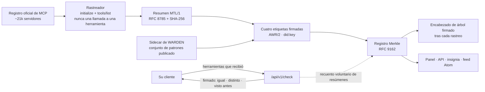

# HISTOR

<!-- aicom-readme-badges -->
<p align="center">
  <a href="https://github.com/alexar76/histor/actions/workflows/ci.yml"></a>
  <a href="https://github.com/alexar76/histor/actions/workflows/pages.yml"></a>
  <a href="https://histor.modelmarket.dev/"></a>
  <a href="https://histor.modelmarket.dev/log"></a>
  <a href="https://histor.modelmarket.dev/servers"></a>
  <a href="https://histor.modelmarket.dev/changes"></a>
  <a href="https://histor.modelmarket.dev/log"></a>
  <a href="https://github.com/alexar76/histor/actions/workflows/pages.yml"></a>
  <a href="https://github.com/alexar76/histor/actions/workflows/pages.yml"></a>
  =3.11" />
  
  
  
  
  <a href="https://github.com/alexar76/histor/blob/main/LICENSE"></a>
</p>
<!-- /aicom-readme-badges -->

<p align="center">
  <strong>HISTOR</strong> (ἵστωρ, «quien sabe porque lo vio») — un registro de transparencia público de las definiciones de herramientas MCP<br>
  Lo que anunció cada endpoint MCP remoto del registro oficial · cuándo cambió · firmado, añadido al registro, auditable
</p>

<p align="center">
  <a href="README.md">English</a> ·
  <a href="README.ru.md">Русский</a> ·
  <a href="README.es.md"><b>Español</b></a> ·
  <a href="README.fr.md">Français</a> ·
  <a href="README.zh.md">中文</a>
</p>

**En vivo:** [histor.modelmarket.dev](https://histor.modelmarket.dev) ·
**Sitio:** [alexar76.github.io/histor](https://alexar76.github.io/histor/) ·
**Capacidades:** `histor.check@v1` · `histor.server@v1` · `histor.changes@v1` ·
**Puerto:** `9490`

## El problema, en un párrafo

Un servidor MCP puede superar su revisión con descripciones de herramientas inofensivas y cambiarlas
más tarde: una frase nueva en una descripción es todo lo que necesita una inyección de prompt, y su
cliente se la pasará al modelo sin volver a preguntarle. MCP no tiene direccionamiento por contenido
para las definiciones de herramientas, el registro oficial de MCP verifica espacios de nombres y no
contenidos, y un escáner en su portátil solo ve lo que el servidor le muestra a su portátil. HISTOR
es la memoria pública que faltaba: deja constancia de lo que anunció cada servidor, lo firma y le
dice a quien pregunte si lo que recibió es lo mismo que está viendo todo el mundo.

## Qué hace



- **Lee** cada endpoint remoto del registro oficial de MCP: `initialize` y después `tools/list`,
  recorriendo todas las páginas. No se llama a ninguna herramienta, no se instala ni se ejecuta
  nada, y las direcciones privadas se rechazan antes de abrir una conexión.
- **Calcula el resumen criptográfico (digest)** del conjunto de herramientas exactamente como lo define [MTL/1](https://github.com/alexar76/aicom/blob/main/awr/adoption/mcp-trust-label/PROFILE.md):
  nombre, descripción, esquema de entrada y de salida, orden por unidades de código UTF-16, RFC 8785.
- **Firma** cuatro tipos de etiqueta, cada una un `VerificationVerdict` AWR/2 independiente: qué se
  observó, con qué coincidió el conjunto de patrones de WARDEN, si las definiciones cambiaron desde
  la etiqueta anterior y si el nombre figura en una lista de amenazas.
- **Añade** cada etiqueta a un registro Merkle RFC 9162 y firma un encabezado de árbol tras cada
  rastreo, de modo que una prueba de consistencia muestra que a la historia solo se le ha ido añadiendo contenido.
- **Responde** a `/check`: envíe las herramientas que recibió su cliente y obtendrá, con firma, si
  HISTOR observó ese mismo conjunto en ese endpoint, uno anterior o ninguno.

## Lo que una etiqueta no dice

El perfil prohíbe las palabras «seguro», «protegido», «auditado», «certificado», «aprobado» y «de
confianza», y este README también. Una coincidencia de patrón es un motivo para leer una definición,
no un hallazgo. Tres de los cuatro métodos nunca pueden devolver `fail`; el cuarto (continuidad)
solo falla en el sentido mecánico de que dos resúmenes difieren. No se lee código fuente, no se
resuelve ningún paquete, no se observa ningún comportamiento. Un cambio se muestra como una fecha y
un diff, nunca como una acusación. Detalles: [docs/labels.es.md](docs/labels.es.md).

## Inicio rápido

```bash
cd histor
npm ci --prefix scanner                     # the WARDEN sidecar (node >= 20)
uv sync --extra dev --project .
HISTOR_CRAWL_LIMIT=40 uv run --project . python -m histor crawl   # observe 40 endpoints
uv run --project . python -m histor serve   # desk + API on :9490 (SQLite under ./data)
```

En producción se usa Postgres, y `HISTOR_PROFILE=prod` se niega a arrancar sin él:

```bash
HISTOR_POSTGRES_PASSWORD=… HISTOR_OPERATOR_TOKEN=… HISTOR_PUBLIC_BASE=https://histor.example \
  docker compose -f docker-compose.yml -f docker-compose.postgres.yml up -d
```

Los cambios de esquema son migraciones numeradas (`python -m histor migrate up|status`) que se
aplican antes de que el servicio empiece a escuchar; consulte [docs/operations.es.md](docs/operations.es.md).

## Consultar el registro

```bash
# Is what my client received what HISTOR observed at that endpoint?
curl -sS https://histor.modelmarket.dev/api/v1/check -H 'Content-Type: application/json' \
  -d '{"endpoint":"https://example.com/mcp","tools":[ …the tools/list result… ]}'

# The signed tree head, and a proof that today's log extends yesterday's
curl -sS https://histor.modelmarket.dev/api/v1/log/sth
curl -sS "https://histor.modelmarket.dev/api/v1/log/proof/consistency?first=1000&second=1200"
```

Todos los endpoints están en [docs/api.es.md](docs/api.es.md). Cómo auditar el registro sin confiar
en HISTOR se explica en [docs/log.es.md](docs/log.es.md). El funcionamiento interno está en [docs/architecture.es.md](docs/architecture.es.md).

## Pruebas

```bash
make test          # unit tests; set HISTOR_TEST_DATABASE_URL to run each storage test on Postgres too
make integration   # real sockets: a loopback registry and MCP servers, uvicorn, the real WARDEN sidecar
```

Las insignias de pruebas y de cobertura de arriba las mide la CI en cada despliegue de Pages y se
leen a través de shields.io, y las insignias del registro leen el servicio en vivo, así que todas
las cifras que muestran están al día.

## Dónde encaja

| Componente | Función |
|---|---|
| [WARDEN](https://github.com/alexar76/warden) | comprueba las definiciones de herramientas al conectar, en el cliente |
| **HISTOR** | recuerda, públicamente, lo que anunciaron los servidores |
| [THEMIS](https://github.com/alexar76/themis) | admite una capacidad al publicarla en un Hub |
| [AIMarket Hub](https://modelmarket.dev) | ofrece `histor.check@v1` en el catálogo |
| [AWR](https://github.com/alexar76/aicom/tree/main/awr) | el formato de documento firmado que usa cada etiqueta |

## Licencia

MIT — consulte [LICENSE](LICENSE). Forma parte del [ecosistema AIMarket](https://modeldev.modelmarket.dev).
