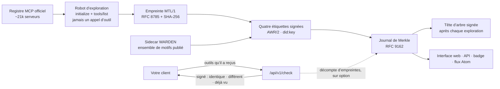

# HISTOR

<!-- aicom-readme-badges -->
<p align="center">
  <a href="https://github.com/alexar76/histor/actions/workflows/ci.yml"></a>
  <a href="https://github.com/alexar76/histor/actions/workflows/pages.yml"></a>
  <a href="https://histor.modelmarket.dev/"></a>
  <a href="https://histor.modelmarket.dev/log"></a>
  <a href="https://histor.modelmarket.dev/servers"></a>
  <a href="https://histor.modelmarket.dev/changes"></a>
  <a href="https://histor.modelmarket.dev/log"></a>
  <a href="https://github.com/alexar76/histor/actions/workflows/pages.yml"></a>
  <a href="https://github.com/alexar76/histor/actions/workflows/pages.yml"></a>
  =3.11" />
  
  
  
  
  <a href="https://github.com/alexar76/histor/blob/main/LICENSE"></a>
</p>
<!-- /aicom-readme-badges -->

<p align="center">
  <strong>HISTOR</strong> (ἵστωρ, « celui qui sait parce qu’il a vu ») — un journal de transparence public des définitions d’outils MCP<br>
  Ce qu’a annoncé chaque point de terminaison MCP distant du registre officiel · quand cela a changé · signé, ajouté au journal, auditable
</p>

<p align="center">
  <a href="README.md">English</a> ·
  <a href="README.ru.md">Русский</a> ·
  <a href="README.es.md">Español</a> ·
  <a href="README.fr.md"><b>Français</b></a> ·
  <a href="README.zh.md">中文</a>
</p>

**En ligne :** [histor.modelmarket.dev](https://histor.modelmarket.dev) ·
**Page d’accueil :** [alexar76.github.io/histor](https://alexar76.github.io/histor/) ·
**Capacités :** `histor.check@v1` · `histor.server@v1` · `histor.changes@v1` ·
**Port :** `9490`

## Le problème, en un paragraphe

Un serveur MCP peut passer votre relecture avec des descriptions d’outils inoffensives, puis les
modifier plus tard — une phrase de plus dans une description suffit à une injection de prompt, et
votre client la transmettra au modèle sans vous redemander votre avis. MCP n’offre aucun adressage
par contenu pour les définitions d’outils, le registre officiel contrôle les espaces de noms et non
les contenus, et un scanner sur votre portable ne voit que ce que le serveur montre à votre
portable. HISTOR est la mémoire publique qui manquait : il consigne ce que chaque serveur a annoncé,
le signe, et dit à quiconque le demande si ce qu’il a reçu est bien ce que tous les autres voient.

## Ce qu’il fait



- **Lit** chaque point de terminaison (endpoint) distant du registre officiel : `initialize`, puis
  `tools/list` parcouru sur toutes les pages. Aucun outil n’est appelé, rien n’est installé ni
  exécuté, les adresses privées sont refusées avant l’ouverture d’une connexion.
- **Calcule l’empreinte (digest)** de l’ensemble d’outils exactement selon la définition de [MTL/1](https://github.com/alexar76/aicom/blob/main/awr/adoption/mcp-trust-label/PROFILE.md)
  — nom, description, schémas d’entrée et de sortie, ordre des unités de code UTF-16, RFC 8785.
- **Signe** quatre types d’étiquette, chacune un `VerificationVerdict` AWR/2 autonome : ce qui a été
  observé, les correspondances trouvées par l’ensemble de motifs WARDEN, si les définitions ont
  changé depuis l’étiquette précédente, et si le nom figure sur une liste de menaces.
- **Ajoute** chaque étiquette à un journal de Merkle RFC 9162 et signe une tête d’arbre après chaque
  exploration (crawl), si bien qu’une preuve de cohérence montre que l’historique n’a jamais connu
  que des ajouts.
- **Répond** à `/check` : envoyez les outils que votre client a reçus ; vous obtenez, signée, une
  réponse indiquant si HISTOR a observé sur ce point de terminaison le même ensemble, un ensemble
  antérieur, ou aucun.

## Ce qu’une étiquette ne dit pas

Le profil interdit les mots « sûr », « sécurisé », « audité », « certifié », « approuvé » et « de
confiance », et ce README aussi. Une correspondance de motif est une raison de lire une définition,
pas un constat. Trois des quatre méthodes ne peuvent jamais renvoyer `fail` ; la quatrième
(continuité) n’échoue qu’au sens mécanique où deux empreintes diffèrent. Aucune source n’est lue,
aucun paquet résolu, aucun comportement observé. Un changement s’affiche comme une date et un diff,
jamais comme une accusation. Détails : [docs/labels.fr.md](docs/labels.fr.md).

## Démarrage rapide

```bash
cd histor
npm ci --prefix scanner                     # the WARDEN sidecar (node >= 20)
uv sync --extra dev --project .
HISTOR_CRAWL_LIMIT=40 uv run --project . python -m histor crawl   # observe 40 endpoints
uv run --project . python -m histor serve   # desk + API on :9490 (SQLite under ./data)
```

La production tourne sur Postgres, et `HISTOR_PROFILE=prod` refuse de démarrer sans lui :

```bash
HISTOR_POSTGRES_PASSWORD=… HISTOR_OPERATOR_TOKEN=… HISTOR_PUBLIC_BASE=https://histor.example \
  docker compose -f docker-compose.yml -f docker-compose.postgres.yml up -d
```

Les changements de schéma sont des migrations numérotées (`python -m histor migrate up|status`),
appliquées avant que le service ne se mette à l’écoute ; voir [docs/operations.fr.md](docs/operations.fr.md).

## Interroger le journal

```bash
# Is what my client received what HISTOR observed at that endpoint?
curl -sS https://histor.modelmarket.dev/api/v1/check -H 'Content-Type: application/json' \
  -d '{"endpoint":"https://example.com/mcp","tools":[ …the tools/list result… ]}'

# The signed tree head, and a proof that today's log extends yesterday's
curl -sS https://histor.modelmarket.dev/api/v1/log/sth
curl -sS "https://histor.modelmarket.dev/api/v1/log/proof/consistency?first=1000&second=1200"
```

Tous les points de terminaison de l’API sont décrits dans [docs/api.fr.md](docs/api.fr.md). Comment
auditer le journal sans faire confiance à HISTOR : [docs/log.fr.md](docs/log.fr.md). Les rouages
internes sont dans [docs/architecture.fr.md](docs/architecture.fr.md).

## Tests

```bash
make test          # unit tests; set HISTOR_TEST_DATABASE_URL to run each storage test on Postgres too
make integration   # real sockets: a loopback registry and MCP servers, uvicorn, the real WARDEN sidecar
```

Les badges de tests et de couverture ci-dessus sont mesurés par la CI à chaque déploiement Pages et
lus via shields.io, et les badges du journal interrogent le service en direct : chaque chiffre
affiché est donc à jour.

## Où il se situe

| Composant | Rôle |
|---|---|
| [WARDEN](https://github.com/alexar76/warden) | contrôle les définitions d’outils au moment de la connexion, côté client |
| **HISTOR** | se souvient, publiquement, de ce que les serveurs ont annoncé |
| [THEMIS](https://github.com/alexar76/themis) | admet une capacité au moment de la publication sur un Hub |
| [AIMarket Hub](https://modelmarket.dev) | liste `histor.check@v1` dans le catalogue |
| [AWR](https://github.com/alexar76/aicom/tree/main/awr) | le format de document signé qu’utilise chaque étiquette |

## Licence

MIT — voir [LICENSE](LICENSE). Fait partie de l’[écosystème AIMarket](https://modeldev.modelmarket.dev).
