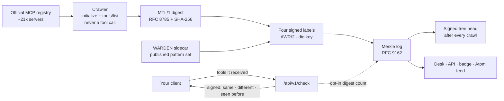

<!-- aicom-mirror-notice -->
> **🔄 Synced from a monorepo — but with a live history.** `histor` mirrors the
> canonical AI-Factory monorepo. History here is append-only (no force-push).
> **Pull requests are welcome** — merged PRs are imported back into the monorepo
> and re-synced here, so your contribution becomes canonical.
> 💬 **[Issues](https://github.com/alexar76/histor/issues)** · **[Pull requests](https://github.com/alexar76/histor/pulls)** both welcome.

# HISTOR

<!-- aicom-readme-badges -->
<p align="center">
  <a href="https://github.com/alexar76/histor/actions/workflows/ci.yml"></a>
  <a href="https://github.com/alexar76/histor/actions/workflows/pages.yml"></a>
  <a href="https://histor.modelmarket.dev/"></a>
  <a href="https://histor.modelmarket.dev/log"></a>
  <a href="https://histor.modelmarket.dev/servers"></a>
  <a href="https://histor.modelmarket.dev/changes"></a>
  <a href="https://histor.modelmarket.dev/log"></a>
  <a href="https://github.com/alexar76/histor/actions/workflows/pages.yml"></a>
  <a href="https://github.com/alexar76/histor/actions/workflows/pages.yml"></a>
  =3.11" />
  
  
  
  
  <a href="https://github.com/alexar76/histor/blob/main/LICENSE"></a>
</p>
<!-- /aicom-readme-badges -->

<p align="center">
  <strong>HISTOR</strong> (ἵστωρ, “the one who knows because they saw”) — a public transparency log of MCP tool definitions<br>
  What every remote MCP endpoint in the official registry advertised · when it changed · signed, appended, auditable
</p>

<p align="center">
  <a href="README.md"><b>English</b></a> ·
  <a href="README.ru.md">Русский</a> ·
  <a href="README.es.md">Español</a> ·
  <a href="README.fr.md">Français</a> ·
  <a href="README.zh.md">中文</a>
</p>

**Live:** [histor.modelmarket.dev](https://histor.modelmarket.dev) ·
**Landing:** [alexar76.github.io/histor](https://alexar76.github.io/histor/) ·
**Capabilities:** `histor.check@v1` · `histor.server@v1` · `histor.changes@v1` ·
**Port:** `9490`

## The problem, in one paragraph

An MCP server can pass your review with harmless tool descriptions and change them later —
a new sentence in a description is all a prompt injection needs, and your client will pass it
to the model without asking you again. MCP has no content addressing for tool definitions, the
official registry verifies namespaces rather than contents, and a scanner on your laptop sees
only what the server shows your laptop. HISTOR is the missing public memory: it records what
each server advertised, signs it, and tells anyone who asks whether what they received is what
everyone else is seeing.

## What it does



- **Reads** every remote endpoint in the official registry: `initialize`, then `tools/list`
  drained across pages. No tool is called, nothing is installed or executed, private addresses
  are refused before a connection opens.
- **Digests** the tool set exactly as [MTL/1](https://github.com/alexar76/aicom/blob/main/awr/adoption/mcp-trust-label/PROFILE.md)
  defines it — name, description, input and output schema, UTF-16 code-unit order, RFC 8785.
- **Signs** four kinds of label, each a standalone AWR/2 `VerificationVerdict`: what was observed,
  what the WARDEN pattern set matched, whether the definitions changed since the previous label,
  and whether the name is on a threat list.
- **Appends** every label to an RFC 9162 Merkle log and signs a tree head after each crawl, so a
  consistency proof shows the history was only ever appended to.
- **Answers** `/check`: send the tools your client received; get back, signed, whether HISTOR
  observed the same set at that endpoint, an earlier one, or none.

## What a label does not say

The profile forbids the words *safe, secure, audited, certified, approved* and *trusted*, and so
does this README. A pattern match is a reason to read a definition, not a finding. Three of the
four methods can never return `fail`; the fourth (continuity) fails only in the mechanical sense
that two digests differ. No source is read, no package resolved, no behaviour observed. A change
is shown as a date and a diff, never as an accusation. Details: [docs/labels.md](docs/labels.md).

## Quick start

```bash
cd histor
npm ci --prefix scanner                     # the WARDEN sidecar (node >= 20)
uv sync --extra dev --project .
HISTOR_CRAWL_LIMIT=40 uv run --project . python -m histor crawl   # observe 40 endpoints
uv run --project . python -m histor serve   # desk + API on :9490 (SQLite under ./data)
```

Production runs on Postgres, and `HISTOR_PROFILE=prod` refuses to start without it:

```bash
HISTOR_POSTGRES_PASSWORD=… HISTOR_OPERATOR_TOKEN=… HISTOR_PUBLIC_BASE=https://histor.example \
  docker compose -f docker-compose.yml -f docker-compose.postgres.yml up -d
```

Schema changes are numbered migrations (`python -m histor migrate up|status`), applied before the
service listens; see [docs/operations.md](docs/operations.md).

## Ask the log

```bash
# Is what my client received what HISTOR observed at that endpoint?
curl -sS https://histor.modelmarket.dev/api/v1/check -H 'Content-Type: application/json' \
  -d '{"endpoint":"https://example.com/mcp","tools":[ …the tools/list result… ]}'

# The signed tree head, and a proof that today's log extends yesterday's
curl -sS https://histor.modelmarket.dev/api/v1/log/sth
curl -sS "https://histor.modelmarket.dev/api/v1/log/proof/consistency?first=1000&second=1200"
```

Every endpoint is in [docs/api.md](docs/api.md). How to audit the log without trusting HISTOR is
in [docs/log.md](docs/log.md). The internals are in [docs/architecture.md](docs/architecture.md).

## Tests

```bash
make test          # unit tests; set HISTOR_TEST_DATABASE_URL to run each storage test on Postgres too
make integration   # real sockets: a loopback registry and MCP servers, uvicorn, the real WARDEN sidecar
```

The tests and coverage badges above are measured by CI on every Pages deploy and read through
shields.io, and the log badges read the live service, so every number there is current.

## Where it sits

| Component | Role |
|---|---|
| [WARDEN](https://github.com/alexar76/warden) | checks tool definitions at connect time, on the client |
| **HISTOR** | remembers what servers advertised, publicly |
| [THEMIS](https://github.com/alexar76/themis) | admits a capability at publish time on a Hub |
| [AIMarket Hub](https://modelmarket.dev) | lists `histor.check@v1` in the catalogue |
| [AWR](https://github.com/alexar76/aicom/tree/main/awr) | the signed document format every label uses |

## License

MIT — see [LICENSE](LICENSE). Part of the [AIMarket ecosystem](https://modeldev.modelmarket.dev).
