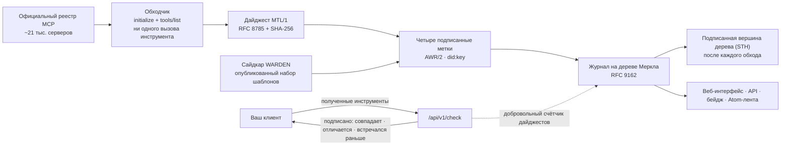

# HISTOR

<!-- aicom-readme-badges -->
<p align="center">
  <a href="https://github.com/alexar76/histor/actions/workflows/ci.yml"></a>
  <a href="https://github.com/alexar76/histor/actions/workflows/pages.yml"></a>
  <a href="https://histor.modelmarket.dev/"></a>
  <a href="https://histor.modelmarket.dev/log"></a>
  <a href="https://histor.modelmarket.dev/servers"></a>
  <a href="https://histor.modelmarket.dev/changes"></a>
  <a href="https://histor.modelmarket.dev/log"></a>
  <a href="https://github.com/alexar76/histor/actions/workflows/pages.yml"></a>
  <a href="https://github.com/alexar76/histor/actions/workflows/pages.yml"></a>
  =3.11" />
  
  
  
  
  <a href="https://github.com/alexar76/histor/blob/main/LICENSE"></a>
</p>
<!-- /aicom-readme-badges -->

<p align="center">
  <strong>HISTOR</strong> (ἵστωρ, «тот, кто знает, потому что видел») — публичный журнал прозрачности определений инструментов MCP<br>
  Что объявлял каждый удалённый MCP-эндпоинт из официального реестра · когда это изменилось · подписано, добавлено, открыто для аудита
</p>

<p align="center">
  <a href="README.md">English</a> ·
  <a href="README.ru.md"><b>Русский</b></a> ·
  <a href="README.es.md">Español</a> ·
  <a href="README.fr.md">Français</a> ·
  <a href="README.zh.md">中文</a>
</p>

**Сервис:** [histor.modelmarket.dev](https://histor.modelmarket.dev) ·
**Лендинг:** [alexar76.github.io/histor](https://alexar76.github.io/histor/) ·
**Capabilities:** `histor.check@v1` · `histor.server@v1` · `histor.changes@v1` ·
**Порт:** `9490`

## Проблема в одном абзаце

MCP-сервер может пройти вашу проверку с безобидными описаниями инструментов, а потом их поменять:
промпт-инъекции достаточно одного нового предложения в описании, и клиент передаст его модели,
не спрашивая вас ещё раз. В MCP нет адресации по содержимому для определений инструментов,
официальный реестр верифицирует пространства имён, а не содержимое, а сканер на вашем ноутбуке
видит только то, что сервер показывает вашему ноутбуку. HISTOR — недостающая публичная память: он
записывает, что объявлял каждый сервер, подписывает это и отвечает любому, кто спросит, совпадает
ли полученное им с тем, что видят все остальные.

## Что он делает



- **Читает** каждый удалённый эндпоинт официального реестра: `initialize`, затем `tools/list`
  со всеми страницами. Ни один инструмент не вызывается, ничего не устанавливается и не
  запускается, частные адреса отклоняются до открытия соединения.
- **Вычисляет дайджест** набора инструментов ровно так, как его определяет [MTL/1](https://github.com/alexar76/aicom/blob/main/awr/adoption/mcp-trust-label/PROFILE.md):
  имя, описание, схемы входа и выхода, порядок по кодовым единицам UTF-16, RFC 8785.
- **Подписывает** метки четырёх видов, каждая — самостоятельный `VerificationVerdict` AWR/2: что
  наблюдалось, с чем совпал набор шаблонов WARDEN, изменились ли определения с предыдущей метки
  и есть ли имя в списке угроз.
- **Добавляет** каждую метку в журнал на дереве Меркла по RFC 9162 и после каждого обхода
  подписывает вершину дерева, так что доказательство согласованности показывает: история только
  пополнялась.
- **Отвечает** на `/check`: отправьте инструменты, которые получил ваш клиент, и получите
  подписанный ответ — наблюдал ли HISTOR на этом эндпоинте тот же набор, один из прежних или никакой.

## Чего метка не утверждает

Профиль запрещает слова *«безопасный», «защищённый», «проверенный аудитом», «сертифицированный»,
«одобренный»* и *«доверенный»*, и этот README их тоже не использует. Совпадение шаблона — повод
прочитать определение, а не находка. Три метода из четырёх никогда не могут вернуть `fail`;
четвёртый (непрерывность) возвращает его только в механическом смысле: два дайджеста различаются.
Исходники не читаются, пакеты не разрешаются, поведение не наблюдается. Изменение показывается
датой и диффом, а не обвинением. Подробности: [docs/labels.ru.md](docs/labels.ru.md).

## Быстрый старт

```bash
cd histor
npm ci --prefix scanner                     # the WARDEN sidecar (node >= 20)
uv sync --extra dev --project .
HISTOR_CRAWL_LIMIT=40 uv run --project . python -m histor crawl   # observe 40 endpoints
uv run --project . python -m histor serve   # desk + API on :9490 (SQLite under ./data)
```

В продакшене используется Postgres, и с `HISTOR_PROFILE=prod` сервис без него не запускается:

```bash
HISTOR_POSTGRES_PASSWORD=… HISTOR_OPERATOR_TOKEN=… HISTOR_PUBLIC_BASE=https://histor.example \
  docker compose -f docker-compose.yml -f docker-compose.postgres.yml up -d
```

Изменения схемы — нумерованные миграции (`python -m histor migrate up|status`), которые
применяются до того, как сервис начинает слушать порт; см. [docs/operations.ru.md](docs/operations.ru.md).

## Спросить журнал

```bash
# Is what my client received what HISTOR observed at that endpoint?
curl -sS https://histor.modelmarket.dev/api/v1/check -H 'Content-Type: application/json' \
  -d '{"endpoint":"https://example.com/mcp","tools":[ …the tools/list result… ]}'

# The signed tree head, and a proof that today's log extends yesterday's
curl -sS https://histor.modelmarket.dev/api/v1/log/sth
curl -sS "https://histor.modelmarket.dev/api/v1/log/proof/consistency?first=1000&second=1200"
```

Все эндпоинты описаны в [docs/api.ru.md](docs/api.ru.md). Как провести аудит журнала, не доверяя
HISTOR, — в [docs/log.ru.md](docs/log.ru.md). Внутреннее устройство — в [docs/architecture.ru.md](docs/architecture.ru.md).

## Тесты

```bash
make test          # unit tests; set HISTOR_TEST_DATABASE_URL to run each storage test on Postgres too
make integration   # real sockets: a loopback registry and MCP servers, uvicorn, the real WARDEN sidecar
```

Бейджи тестов и покрытия выше измеряет CI при каждом деплое Pages, а читаются они через
shields.io; бейджи журнала читают работающий сервис, так что все цифры там актуальны.

## Место в экосистеме

| Компонент | Роль |
|---|---|
| [WARDEN](https://github.com/alexar76/warden) | проверяет определения инструментов при подключении, на стороне клиента |
| **HISTOR** | публично помнит, что объявляли серверы |
| [THEMIS](https://github.com/alexar76/themis) | допускает capability при публикации в Hub |
| [AIMarket Hub](https://modelmarket.dev) | держит `histor.check@v1` в каталоге |
| [AWR](https://github.com/alexar76/aicom/tree/main/awr) | формат подписанного документа, в котором выпускается каждая метка |

## Лицензия

MIT — см. [LICENSE](LICENSE). Часть [экосистемы AIMarket](https://modeldev.modelmarket.dev).
