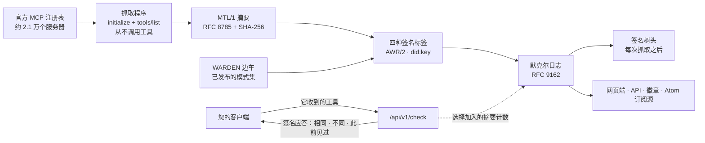

# HISTOR

<!-- aicom-readme-badges -->
<p align="center">
  <a href="https://github.com/alexar76/histor/actions/workflows/ci.yml"></a>
  <a href="https://github.com/alexar76/histor/actions/workflows/pages.yml"></a>
  <a href="https://histor.modelmarket.dev/"></a>
  <a href="https://histor.modelmarket.dev/log"></a>
  <a href="https://histor.modelmarket.dev/servers"></a>
  <a href="https://histor.modelmarket.dev/changes"></a>
  <a href="https://histor.modelmarket.dev/log"></a>
  <a href="https://github.com/alexar76/histor/actions/workflows/pages.yml"></a>
  <a href="https://github.com/alexar76/histor/actions/workflows/pages.yml"></a>
  =3.11" />
  
  
  
  
  <a href="https://github.com/alexar76/histor/blob/main/LICENSE"></a>
</p>
<!-- /aicom-readme-badges -->

<p align="center">
  <strong>HISTOR</strong>（ἵστωρ，“因亲眼所见而知晓的人”）—— MCP 工具定义的公开透明日志<br>
  官方注册表中每个远程 MCP 端点公布过什么 · 何时发生了变更 · 已签名、仅追加、可审计
</p>

<p align="center">
  <a href="README.md">English</a> ·
  <a href="README.ru.md">Русский</a> ·
  <a href="README.es.md">Español</a> ·
  <a href="README.fr.md">Français</a> ·
  <a href="README.zh.md"><b>中文</b></a>
</p>

**在线服务：** [histor.modelmarket.dev](https://histor.modelmarket.dev) ·
**落地页：** [alexar76.github.io/histor](https://alexar76.github.io/histor/) ·
**能力：** `histor.check@v1` · `histor.server@v1` · `histor.changes@v1` ·
**端口：** `9490`

## 一段话说清问题

一个 MCP 服务器可以先用无害的工具描述通过您的审查，之后再改掉它们——提示注入只需要描述里多出一句话，而您的客户端会把它原样交给模型，不会再问您一次。MCP 没有针对工具定义的内容寻址，官方注册表验证的是命名空间而不是内容，而您笔记本电脑上的扫描器只能看到服务器展示给这台电脑的东西。HISTOR 就是缺失的那份公共记忆：它记录每个服务器公布过什么，对其签名，并告诉任何来问的人：他们收到的，是否就是其他所有人看到的。

## 它做什么



- **读取**官方注册表中的每个远程端点：先 `initialize`，再 `tools/list`，并翻完所有分页。
  不调用任何工具，不安装也不执行任何东西，私有地址在建立连接之前即被拒绝。
- **计算摘要**：严格按 [MTL/1](https://github.com/alexar76/aicom/blob/main/awr/adoption/mcp-trust-label/PROFILE.md)
  的定义处理工具集——名称、描述、输入与输出 schema，按 UTF-16 码元排序，RFC 8785。
- **签名**四种标签，每种都是一份独立的 AWR/2 `VerificationVerdict`：观测到了什么、WARDEN 模式集
  匹配到了什么、定义自上一个标签以来是否变更，以及名称是否在威胁列表上。
- **追加**：每个标签都追加进 RFC 9162 默克尔日志，每次抓取之后签发一个签名树头（STH），因此
  一致性证明可以表明这段历史只被追加过。
- **应答** `/check`：发来您的客户端收到的工具，取回一份签名应答，说明 HISTOR 在该端点观测到的
  是同一个工具集、更早的某个工具集，还是都不是。

## 标签不说明什么

该一致性档次（profile）禁止使用“安全”“受保护”“已审计”“已认证”“已批准”和“可信”这些词，本 README
同样不用。模式匹配是去阅读定义的理由，而不是一项发现。四种方法中有三种永远不会返回 `fail`；第四种
（连续性）只在两个摘要不同这一机械意义上返回 `fail`。不读取源码，不解析软件包，不观测行为。变更以
日期和差异呈现，绝不作为指控。详见：[docs/labels.zh.md](docs/labels.zh.md)。

## 快速开始

```bash
cd histor
npm ci --prefix scanner                     # the WARDEN sidecar (node >= 20)
uv sync --extra dev --project .
HISTOR_CRAWL_LIMIT=40 uv run --project . python -m histor crawl   # observe 40 endpoints
uv run --project . python -m histor serve   # desk + API on :9490 (SQLite under ./data)
```

生产环境运行在 Postgres 上，没有 Postgres 时 `HISTOR_PROFILE=prod` 拒绝启动：

```bash
HISTOR_POSTGRES_PASSWORD=… HISTOR_OPERATOR_TOKEN=… HISTOR_PUBLIC_BASE=https://histor.example \
  docker compose -f docker-compose.yml -f docker-compose.postgres.yml up -d
```

Schema 变更以编号迁移的形式进行（`python -m histor migrate up|status`），在服务开始监听之前应用；
见 [docs/operations.zh.md](docs/operations.zh.md)。

## 向日志提问

```bash
# Is what my client received what HISTOR observed at that endpoint?
curl -sS https://histor.modelmarket.dev/api/v1/check -H 'Content-Type: application/json' \
  -d '{"endpoint":"https://example.com/mcp","tools":[ …the tools/list result… ]}'

# The signed tree head, and a proof that today's log extends yesterday's
curl -sS https://histor.modelmarket.dev/api/v1/log/sth
curl -sS "https://histor.modelmarket.dev/api/v1/log/proof/consistency?first=1000&second=1200"
```

所有端点见 [docs/api.zh.md](docs/api.zh.md)。如何在不信任 HISTOR 的前提下审计日志，见
[docs/log.zh.md](docs/log.zh.md)。内部结构见 [docs/architecture.zh.md](docs/architecture.zh.md)。

## 测试

```bash
make test          # unit tests; set HISTOR_TEST_DATABASE_URL to run each storage test on Postgres too
make integration   # real sockets: a loopback registry and MCP servers, uvicorn, the real WARDEN sidecar
```

上方的测试与覆盖率徽章由 CI 在每次 Pages 部署时测得，经 shields.io 读取；日志徽章读取的是在线
服务，因此那里的每个数字都是最新的。

## 所处位置

| 组件 | 角色 |
|---|---|
| [WARDEN](https://github.com/alexar76/warden) | 在客户端、于连接时检查工具定义 |
| **HISTOR** | 公开地记住服务器公布过什么 |
| [THEMIS](https://github.com/alexar76/themis) | 在 Hub 上于发布时准入一项能力 |
| [AIMarket Hub](https://modelmarket.dev) | 在目录中上架 `histor.check@v1` |
| [AWR](https://github.com/alexar76/aicom/tree/main/awr) | 每个标签所用的签名文档格式 |

## 许可证

MIT——见 [LICENSE](LICENSE)。属于 [AIMarket 生态](https://modeldev.modelmarket.dev)的一部分。
