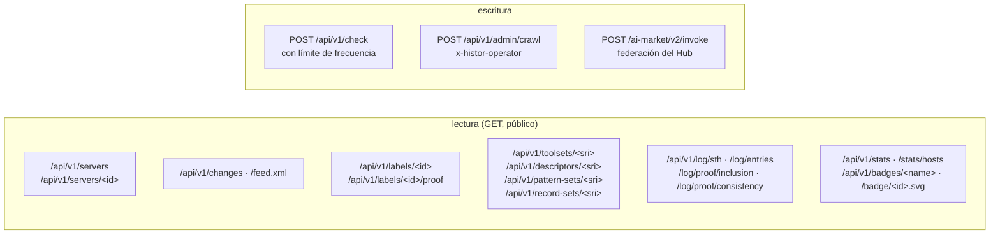

# API

> 🌐 [English](api.md) · [Русский](api.ru.md) · **Español** · [Français](api.fr.md) · [中文](api.zh.md)

URL base: `https://histor.modelmarket.dev`. Todo es público, sin autenticación y de solo lectura,
excepto `POST /api/v1/check` (con límite de frecuencia) y la ruta del operador. Las lecturas públicas
envían `Access-Control-Allow-Origin: *`. OpenAPI: [`/api/openapi.json`](https://histor.modelmarket.dev/api/openapi.json).



## Servidores

| Método | Ruta | Devuelve |
|---|---|---|
| GET | `/api/v1/servers?q=&state=&limit=&offset=` | endpoints; `state` ∈ `all`, `pinned`, `changed`, `flagged`, `unobserved`; `q` busca en el nombre, el endpoint y el título |
| GET | `/api/v1/servers/<id>` | un endpoint: conjunto de herramientas actual, coincidencias de WARDEN con sus fragmentos, etiquetas, cronología compactada, cambios e informes de clientes de 30 días |
| GET | `/badge/<id>.svg` | insignia para README: `pinned ‹date›`, `unchanged Nd`, `changed ‹date›`, `not observed`, `not listed` |

`<id>` son los primeros 16 caracteres hexadecimales de `sha256(name + "\n" + endpoint)`: estable, uno por remoto.

## Cambios

| Método | Ruta | Devuelve |
|---|---|---|
| GET | `/api/v1/changes?limit=&before=` | primero los más recientes; cada uno con `summary.added`, `summary.removed`, `summary.modified[].fields` (diff por palabras de las descripciones, diff por JSON-path de los esquemas) |
| GET | `/api/v1/changes/<id>` | un cambio |
| GET | `/feed.xml` | feed Atom de los últimos 50 cambios |

## Etiquetas y evidencia

| Método | Ruta | Devuelve |
|---|---|---|
| GET | `/api/v1/labels/<id>` | la etiqueta firmada, `application/vc`, inmutable |
| GET | `/api/v1/labels/<id>/proof?tree_size=` | el índice de la hoja, el encabezado de árbol firmado (STH) y la prueba de inclusión |
| GET | `/api/v1/toolsets/<sri>` · `/descriptors/<sri>` · `/pattern-sets/<sri>` · `/record-sets/<sri>` | evidencia direccionada por contenido, inmutable |
| GET | `/api/v1/issuer` | el `did:key` del registro, la clave pública en bruto, los resúmenes criptográficos (digests) actuales del conjunto de patrones y del conjunto de registros, y el paquete de WARDEN |

## Registro

| Método | Ruta | Devuelve |
|---|---|---|
| GET | `/api/v1/log/sth` | el último encabezado de árbol firmado |
| GET | `/api/v1/log/sth/<size>` | el encabezado firmado con ese tamaño |
| GET | `/api/v1/log/entries?start=&end=` | hojas en orden (≤ 1000 por llamada) |
| GET | `/api/v1/log/proof/inclusion?leaf_index=&tree_size=` | prueba de inclusión RFC 9162, en hex |
| GET | `/api/v1/log/proof/consistency?first=&second=` | prueba de consistencia RFC 9162, en hex |

## /check

```http
POST /api/v1/check
Content-Type: application/json

{
  "endpoint": "https://example.com/mcp",      // or "name": "io.github.org/server"
  "tools": [ … ],                             // the tools array you received, or:
  "toolSetDigest": "sha256-…",                // its MTL/1 digest
  "contribute": true                          // optional: add (endpoint, digest, day) to a count
}
```

```json
{
  "type": "histor.check/v1",
  "checkedAt": "2026-09-23T10:02:11Z",
  "issuer": "did:key:z6Mk…",
  "query": { "endpoint": "…", "toolSetDigest": "sha256-…" },
  "target": { "id": "9c7f2af79fa057b2", "page": "…/s/9c7f2af79fa057b2", "badge": "…", "lastStatus": "ok" },
  "observed": { "toolSetDigest": "sha256-…", "unchangedSince": "…", "observations": 12, "changes": 0 },
  "match": "same",
  "note": "The tool definitions you sent are the set HISTOR currently observes at this endpoint.",
  "patternScan": { "status": "scanned", "block": 0, "advise": 1, "matches": [ … ] },
  "log": { "treeSize": 21480, "rootHash": "…", "timestamp": "…" },
  "signature": { "alg": "Ed25519", "verificationMethod": "…", "value": "…" }
}
```

`match` es uno de `same`, `different`, `previously-observed` (con `seenBefore`), `not-observed`,
`not-listed`, `no-digest`. La respuesta se firma igual que un encabezado de árbol (`type` `histor.check/v1`).
Si el conjunto nunca se escaneó y su dirección aún tiene presupuesto de escaneo, el sidecar de WARDEN
lo escanea en el acto. Límites: 30 comprobaciones por minuto y 20 escaneos nuevos por hora por
dirección; los cuerpos de más de 2 MiB se rechazan. Con `contribute` no se guarda nada salvo el
recuento del día para ese resumen.

## Estadísticas e insignias en vivo

| Ruta | Devuelve |
|---|---|
| `/api/v1/stats` | el último rastreo (tamaño del registro de MCP, qué respondieron los endpoints, qué no se contactó, etiquetas emitidas), recuentos actuales, cambios en las últimas 24 h / 7 d / 30 d, tamaño del registro de transparencia, informes de clientes en 7 d |
| `/api/v1/stats/hosts?limit=` | endpoints por host entre los contactados |
| `/api/v1/badges/log` · `pinned` · `changes` · `sth` | JSON de [endpoint de shields.io](https://shields.io/badges/endpoint-badge) para insignias de README |
| `/health` | estado de vida (liveness), backend de almacenamiento, tamaño del árbol, si hay un rastreo en curso, último error de rastreo |

## Federación (AIMarket Hub)

HISTOR es un peer de AIMarket: `/.well-known/ai-market.json` (firmado entero), `/ai-market/v2/manifest`
(firmado con la forma canónica de manifiesto del Hub) y `POST /ai-market/v2/invoke` con tres
capacidades gratuitas:

| Capacidad | Entrada | Resultado |
|---|---|---|
| `histor.check@v1` | el cuerpo de `/check` | la respuesta firmada de `/check` |
| `histor.server@v1` | `{"endpoint": …}` o `{"name": …}` | hasta 10 endpoints coincidentes |
| `histor.changes@v1` | `{"limit": 1–100}` | los cambios más recientes |

Cada respuesta lleva un recibo de interoperabilidad que un Hub verifica con la clave de `.well-known`,
híbrido Ed25519 + ML-DSA-65 cuando `HISTOR_PQC=1`.

## Operador

`POST /api/v1/admin/crawl` con `x-histor-operator: $HISTOR_OPERATOR_TOKEN` inicia un rastreo en ese
momento (202), o responde 409 si ya hay uno en curso. Sin un token configurado, la ruta responde 503.
