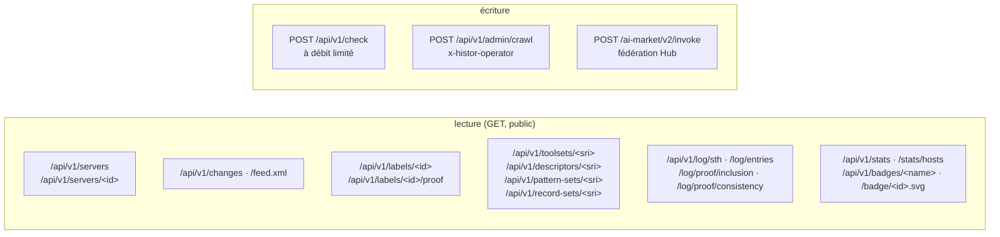

# API

> 🌐 [English](api.md) · [Русский](api.ru.md) · [Español](api.es.md) · **Français** · [中文](api.zh.md)

URL de base : `https://histor.modelmarket.dev`. Tout est public, sans authentification et en lecture
seule, sauf `POST /api/v1/check` (à débit limité) et la route opérateur. Les lectures publiques
envoient `Access-Control-Allow-Origin: *`. OpenAPI : [`/api/openapi.json`](https://histor.modelmarket.dev/api/openapi.json).



## Serveurs

| Méthode | Chemin | Renvoie |
|---|---|---|
| GET | `/api/v1/servers?q=&state=&limit=&offset=` | des points de terminaison (endpoints) ; `state` ∈ `all`, `pinned`, `changed`, `flagged`, `unobserved` ; `q` cherche dans le nom, le point de terminaison et le titre |
| GET | `/api/v1/servers/<id>` | un point de terminaison : ensemble d’outils actuel, correspondances WARDEN avec leurs positions, étiquettes, chronologie condensée, changements, signalements de clients sur 30 jours |
| GET | `/badge/<id>.svg` | badge pour README : `pinned ‹date›`, `unchanged Nd`, `changed ‹date›`, `not observed`, `not listed` |

`<id>` est formé des 16 premiers caractères hexadécimaux de `sha256(name + "\n" + endpoint)` —
stable, un par entrée distante.

## Changements

| Méthode | Chemin | Renvoie |
|---|---|---|
| GET | `/api/v1/changes?limit=&before=` | du plus récent au plus ancien ; chacun avec `summary.added`, `summary.removed`, `summary.modified[].fields` (diff mot à mot des descriptions, diff par chemin JSON des schémas) |
| GET | `/api/v1/changes/<id>` | un changement |
| GET | `/feed.xml` | flux Atom des 50 derniers changements |

## Étiquettes et éléments de preuve

| Méthode | Chemin | Renvoie |
|---|---|---|
| GET | `/api/v1/labels/<id>` | l’étiquette signée, `application/vc`, immuable |
| GET | `/api/v1/labels/<id>/proof?tree_size=` | l’index de la feuille, la tête d’arbre signée (STH) et la preuve d’inclusion |
| GET | `/api/v1/toolsets/<sri>` · `/descriptors/<sri>` · `/pattern-sets/<sri>` · `/record-sets/<sri>` | éléments de preuve adressés par contenu, immuables |
| GET | `/api/v1/issuer` | le `did:key` du journal, la clé publique brute, les empreintes (digest) actuelles de l’ensemble de motifs et de l’ensemble d’enregistrements, le paquet WARDEN |

## Journal

| Méthode | Chemin | Renvoie |
|---|---|---|
| GET | `/api/v1/log/sth` | la dernière tête d’arbre signée |
| GET | `/api/v1/log/sth/<size>` | la tête signée à cette taille |
| GET | `/api/v1/log/entries?start=&end=` | les feuilles dans l’ordre (≤ 1000 par appel) |
| GET | `/api/v1/log/proof/inclusion?leaf_index=&tree_size=` | preuve d’inclusion RFC 9162, en hexadécimal |
| GET | `/api/v1/log/proof/consistency?first=&second=` | preuve de cohérence RFC 9162, en hexadécimal |

## /check

```http
POST /api/v1/check
Content-Type: application/json

{
  "endpoint": "https://example.com/mcp",      // or "name": "io.github.org/server"
  "tools": [ … ],                             // the tools array you received, or:
  "toolSetDigest": "sha256-…",                // its MTL/1 digest
  "contribute": true                          // optional: add (endpoint, digest, day) to a count
}
```

```json
{
  "type": "histor.check/v1",
  "checkedAt": "2026-09-23T10:02:11Z",
  "issuer": "did:key:z6Mk…",
  "query": { "endpoint": "…", "toolSetDigest": "sha256-…" },
  "target": { "id": "9c7f2af79fa057b2", "page": "…/s/9c7f2af79fa057b2", "badge": "…", "lastStatus": "ok" },
  "observed": { "toolSetDigest": "sha256-…", "unchangedSince": "…", "observations": 12, "changes": 0 },
  "match": "same",
  "note": "The tool definitions you sent are the set HISTOR currently observes at this endpoint.",
  "patternScan": { "status": "scanned", "block": 0, "advise": 1, "matches": [ … ] },
  "log": { "treeSize": 21480, "rootHash": "…", "timestamp": "…" },
  "signature": { "alg": "Ed25519", "verificationMethod": "…", "value": "…" }
}
```

`match` vaut `same`, `different`, `previously-observed` (avec `seenBefore`), `not-observed`,
`not-listed` ou `no-digest`. La réponse est signée comme une tête d’arbre (`type` `histor.check/v1`).
Si l’ensemble n’a jamais été analysé et que votre adresse dispose encore d’un budget d’analyse, le
sidecar WARDEN l’analyse sur-le-champ. Limites : 30 contrôles par minute et 20 nouvelles analyses par
heure, par adresse ; les corps de plus de 2 MiB sont refusés. Avec `contribute`, rien d’autre que le
décompte du jour pour cette empreinte n’est stocké.

## Statistiques et badges en direct

| Chemin | Renvoie |
|---|---|
| `/api/v1/stats` | la dernière exploration (crawl) — taille du registre, ce qu’ont répondu les points de terminaison, ce qui n’a pas été contacté, étiquettes émises —, les décomptes actuels, les changements des dernières 24 h / 7 j / 30 j, la taille du journal, les signalements de clients sur 7 j |
| `/api/v1/stats/hosts?limit=` | points de terminaison par hôte, parmi ceux contactés |
| `/api/v1/badges/log` · `pinned` · `changes` · `sth` | JSON au format [endpoint de shields.io](https://shields.io/badges/endpoint-badge) pour les badges de README |
| `/health` | vivacité, backend de stockage, taille de l’arbre, exploration en cours ou non, dernière erreur d’exploration |

## Fédération (AIMarket Hub)

HISTOR est un peer AIMarket : `/.well-known/ai-market.json` (signé en entier), `/ai-market/v2/manifest`
(signé selon la forme canonique de manifeste du Hub) et `POST /ai-market/v2/invoke` avec trois
capacités gratuites :

| Capacité | Entrée | Résultat |
|---|---|---|
| `histor.check@v1` | le corps de `/check` | la réponse `/check` signée |
| `histor.server@v1` | `{"endpoint": …}` ou `{"name": …}` | jusqu’à 10 points de terminaison correspondants |
| `histor.changes@v1` | `{"limit": 1–100}` | les changements les plus récents |

Chaque réponse porte un reçu d’interopérabilité qu’un Hub vérifie avec la clé publiée dans
`.well-known`, en hybride Ed25519 + ML-DSA-65 quand `HISTOR_PQC=1`.

## Opérateur

`POST /api/v1/admin/crawl` avec `x-histor-operator: $HISTOR_OPERATOR_TOKEN` lance une exploration
immédiatement (202), ou répond 409 si une exploration est déjà en cours. Sans jeton configuré, la
route répond 503.
