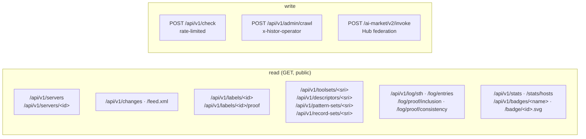

# API

> 🌐 **English** · [Русский](api.ru.md) · [Español](api.es.md) · [Français](api.fr.md) · [中文](api.zh.md)

Base URL: `https://histor.modelmarket.dev`. Everything is public, unauthenticated and read-only
except `POST /api/v1/check` (rate-limited) and the operator route. Public reads send
`Access-Control-Allow-Origin: *`. OpenAPI: [`/api/openapi.json`](https://histor.modelmarket.dev/api/openapi.json).



## Servers

| Method | Path | Returns |
|---|---|---|
| GET | `/api/v1/servers?q=&state=&limit=&offset=` | endpoints; `state` ∈ `all`, `pinned`, `changed`, `flagged`, `unobserved`; `q` matches name, endpoint, title |
| GET | `/api/v1/servers/<id>` | one endpoint: current tool set, WARDEN matches with spans, labels, collapsed timeline, changes, 30-day client reports |
| GET | `/badge/<id>.svg` | README badge: `pinned ‹date›`, `unchanged Nd`, `changed ‹date›`, `not observed`, `not listed` |

`<id>` is the first 16 hex characters of `sha256(name + "\n" + endpoint)` — stable, one per remote.

## Changes

| Method | Path | Returns |
|---|---|---|
| GET | `/api/v1/changes?limit=&before=` | newest first; each with `summary.added`, `summary.removed`, `summary.modified[].fields` (word diff of descriptions, JSON-path diff of schemas) |
| GET | `/api/v1/changes/<id>` | one change |
| GET | `/feed.xml` | Atom feed of the latest 50 changes |

## Labels and evidence

| Method | Path | Returns |
|---|---|---|
| GET | `/api/v1/labels/<id>` | the signed label, `application/vc`, immutable |
| GET | `/api/v1/labels/<id>/proof?tree_size=` | leaf index, the STH, and the inclusion proof |
| GET | `/api/v1/toolsets/<sri>` · `/descriptors/<sri>` · `/pattern-sets/<sri>` · `/record-sets/<sri>` | content-addressed evidence, immutable |
| GET | `/api/v1/issuer` | the log's `did:key`, raw public key, current pattern-set and record-set digests, WARDEN package |

## Log

| Method | Path | Returns |
|---|---|---|
| GET | `/api/v1/log/sth` | latest signed tree head |
| GET | `/api/v1/log/sth/<size>` | the head signed at that size |
| GET | `/api/v1/log/entries?start=&end=` | leaves in order (≤ 1000 per call) |
| GET | `/api/v1/log/proof/inclusion?leaf_index=&tree_size=` | RFC 9162 inclusion proof, hex |
| GET | `/api/v1/log/proof/consistency?first=&second=` | RFC 9162 consistency proof, hex |

## /check

```http
POST /api/v1/check
Content-Type: application/json

{
  "endpoint": "https://example.com/mcp",      // or "name": "io.github.org/server"
  "tools": [ … ],                             // the tools array you received, or:
  "toolSetDigest": "sha256-…",                // its MTL/1 digest
  "contribute": true                          // optional: add (endpoint, digest, day) to a count
}
```

```json
{
  "type": "histor.check/v1",
  "checkedAt": "2026-09-23T10:02:11Z",
  "issuer": "did:key:z6Mk…",
  "query": { "endpoint": "…", "toolSetDigest": "sha256-…" },
  "target": { "id": "9c7f2af79fa057b2", "page": "…/s/9c7f2af79fa057b2", "badge": "…", "lastStatus": "ok" },
  "observed": { "toolSetDigest": "sha256-…", "unchangedSince": "…", "observations": 12, "changes": 0 },
  "match": "same",
  "note": "The tool definitions you sent are the set HISTOR currently observes at this endpoint.",
  "patternScan": { "status": "scanned", "block": 0, "advise": 1, "matches": [ … ] },
  "log": { "treeSize": 21480, "rootHash": "…", "timestamp": "…" },
  "signature": { "alg": "Ed25519", "verificationMethod": "…", "value": "…" }
}
```

`match` is one of `same`, `different`, `previously-observed` (with `seenBefore`), `not-observed`,
`not-listed`, `no-digest`. The answer is signed like a tree head (`type` `histor.check/v1`). If the
set was never scanned and your address still has scan budget, the WARDEN sidecar scans it on the
spot. Limits: 30 checks a minute and 20 fresh scans an hour per address; bodies over 2 MiB are
refused. With `contribute`, nothing but the day's count for that digest is stored.

## Stats and live badges

| Path | Returns |
|---|---|
| `/api/v1/stats` | the last crawl (registry size, what the endpoints answered, what was not dialled, labels issued), current counts, changes in the last 24 h / 7 d / 30 d, log size, client reports in 7 d |
| `/api/v1/stats/hosts?limit=` | endpoints per host among dialled ones |
| `/api/v1/badges/log` · `pinned` · `changes` · `sth` | [shields.io endpoint](https://shields.io/badges/endpoint-badge) JSON for README badges |
| `/health` | liveness, store backend, tree size, whether a crawl is running, last crawl error |

## Federation (AIMarket Hub)

HISTOR is an AIMarket peer: `/.well-known/ai-market.json` (signed whole), `/ai-market/v2/manifest`
(signed with the Hub's manifest canonical), and `POST /ai-market/v2/invoke` with three free
capabilities:

| Capability | Input | Result |
|---|---|---|
| `histor.check@v1` | the `/check` body | the signed `/check` answer |
| `histor.server@v1` | `{"endpoint": …}` or `{"name": …}` | up to 10 matching endpoints |
| `histor.changes@v1` | `{"limit": 1–100}` | the newest changes |

Every reply carries an interop receipt a Hub verifies against the key in `.well-known`, hybrid
Ed25519 + ML-DSA-65 when `HISTOR_PQC=1`.

## Operator

`POST /api/v1/admin/crawl` with `x-histor-operator: $HISTOR_OPERATOR_TOKEN` starts a crawl now
(202), or answers 409 if one is running. Without a configured token the route answers 503.
