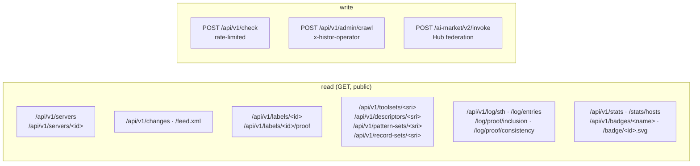

# API

> 🌐 **English** · [Русский](api.ru.md) · [Español](api.es.md) · [Français](api.fr.md) · [中文](api.zh.md)

Base URL: `https://histor.modelmarket.dev`. Everything is public, unauthenticated and read-only
except `POST /api/v1/check` (rate-limited) and the operator route. Public reads send
`Access-Control-Allow-Origin: *`. OpenAPI: [`/api/openapi.json`](https://histor.modelmarket.dev/api/openapi.json).


```mermaid
flowchart LR
    subgraph Read["read (GET, public)"]
        S["/api/v1/servers<br/>/api/v1/servers/&lt;id&gt;"]
        C["/api/v1/changes · /feed.xml"]
        L["/api/v1/labels/&lt;id&gt;<br/>/api/v1/labels/&lt;id&gt;/proof"]
        E["/api/v1/toolsets/&lt;sri&gt;<br/>/api/v1/descriptors/&lt;sri&gt;<br/>/api/v1/pattern-sets/&lt;sri&gt;<br/>/api/v1/record-sets/&lt;sri&gt;"]
        G["/api/v1/log/sth · /log/entries<br/>/log/proof/inclusion · /log/proof/consistency"]
        ST["/api/v1/stats · /stats/hosts<br/>/api/v1/badges/&lt;name&gt; · /badge/&lt;id&gt;.svg"]
    end
    subgraph Write["write"]
        K["POST /api/v1/check<br/>rate-limited"]
        A["POST /api/v1/admin/crawl<br/>x-histor-operator"]
        F["POST /ai-market/v2/invoke<br/>Hub federation"]
    end
```

## Servers

| Method | Path | Returns |
|---|---|---|
| GET | `/api/v1/servers?q=&state=&limit=&offset=` | endpoints; `state` ∈ `all`, `pinned`, `changed`, `flagged`, `unobserved`; `q` matches name, endpoint, title |
| GET | `/api/v1/servers/<id>` | one endpoint: current tool set, WARDEN matches with spans, labels, collapsed timeline, changes, 30-day client reports |
| GET | `/badge/<id>.svg` | README badge: `pinned ‹date›`, `unchanged Nd`, `changed ‹date›`, `not observed`, `not listed` |

`<id>` is the first 16 hex characters of `sha256(name + "\n" + endpoint)` — stable, one per remote.

## Changes

| Method | Path | Returns |
|---|---|---|
| GET | `/api/v1/changes?limit=&before=` | newest first; each with `summary.added`, `summary.removed`, `summary.modified[].fields` (word diff of descriptions, JSON-path diff of schemas) |
| GET | `/api/v1/changes/<id>` | one change |
| GET | `/feed.xml` | Atom feed of the latest 50 changes; `?watch=<id>,<id>,…` (up to 100 target ids, as `/check` and the server pages give them) keeps only those servers and packages — a subscription in any feed reader |

## Labels and evidence

| Method | Path | Returns |
|---|---|---|
| GET | `/api/v1/labels/<id>` | the signed label, `application/vc`, immutable |
| GET | `/api/v1/labels/<id>/proof?tree_size=` | leaf index, the STH, and the inclusion proof |
| GET | `/api/v1/toolsets/<sri>` · `/descriptors/<sri>` · `/pattern-sets/<sri>` · `/record-sets/<sri>` | content-addressed evidence, immutable |
| GET | `/api/v1/issuer` | the log's `did:key`, raw public key, current pattern-set and record-set digests, WARDEN package |

## Log

| Method | Path | Returns |
|---|---|---|
| GET | `/api/v1/log/sth` | latest signed tree head |
| GET | `/api/v1/log/sth/<size>` | the head signed at that size |
| GET | `/api/v1/log/entries?start=&end=` | leaves in order (≤ 1000 per call) |
| GET | `/api/v1/log/proof/inclusion?leaf_index=&tree_size=` | RFC 9162 inclusion proof, hex |
| GET | `/api/v1/log/proof/consistency?first=&second=` | RFC 9162 consistency proof, hex |

## Receipts log

A second, independent log: anchors of market work receipts (AWR/2), submitted by the hubs that
issued them. An anchor carries four facts — the receipt's digest, the issuer's `did:key`, the
issue time, and the issuer's signature over them — and never the receipt itself. Its heads are
`histor.receipts-sth/v1`, signed by the same key as the label log's, over a separate tree.

| Method | Path | Returns |
|---|---|---|
| POST | `/api/v1/receipts/anchors` | `{"anchors": [...]}` (1–100) → one result per anchor: `logged`, `duplicate` or `refused` with a reason |
| GET | `/api/v1/receipts/sth` | latest signed head of the receipts log |
| GET | `/api/v1/receipts/sth/<size>` | the head signed at that size |
| GET | `/api/v1/receipts/proof?digest=&tree_size=` | the anchor, its leaf index and an RFC 9162 inclusion proof against a signed head |
| GET | `/api/v1/receipts/proof/consistency?first=&second=` | RFC 9162 consistency proof, hex |

Submissions are accepted only from the issuers listed in `HISTOR_RECEIPT_ISSUERS`
(comma-separated `did:key`s; empty = closed, the default) and only over the issuer's own
Ed25519 signature on the RFC 8785 bytes of `type`, `issuer`, `receiptDigest` and `issuedAt`.
`issuedAt` may lag by up to 30 days (a backlog after an outage) and lead by at most 5 minutes.

## /check

```http
POST /api/v1/check
Content-Type: application/json

{
  "endpoint": "https://example.com/mcp",      // or "name": "io.github.org/server"
  // a stdio server instead: "package": "npm:@scope/name" or "pypi:name"
  "tools": [ … ],                             // the tools array you received, or:
  "toolSetDigest": "sha256-…",                // its MTL/1 digest
  "contribute": true                          // optional: add (endpoint, digest, day) to a count
}
```

```json
{
  "type": "histor.check/v1",
  "checkedAt": "2026-09-23T10:02:11Z",
  "issuer": "did:key:z6Mk…",
  "query": { "endpoint": "…", "toolSetDigest": "sha256-…" },
  "target": { "id": "9c7f2af79fa057b2", "page": "…/s/9c7f2af79fa057b2", "badge": "…", "lastStatus": "ok" },
  "observed": { "toolSetDigest": "sha256-…", "unchangedSince": "…", "observations": 12, "changes": 0 },
  "match": "same",
  "note": "The tool definitions you sent are the set HISTOR currently observes at this endpoint.",
  "patternScan": { "status": "scanned", "block": 0, "advise": 1, "matches": [ … ] },
  "log": { "treeSize": 21480, "rootHash": "…", "timestamp": "…" },
  "signature": { "alg": "Ed25519", "verificationMethod": "…", "value": "…" }
}
```

`match` is one of `same`, `different`, `previously-observed` (with `seenBefore`), `not-observed`,
`not-listed`, `no-digest`. The answer is signed like a tree head (`type` `histor.check/v1`). If the
set was never scanned and your address still has scan budget, the WARDEN sidecar scans it on the
spot. Limits: 30 checks a minute and 20 fresh scans an hour per address; bodies over 2 MiB are
refused. With `contribute`, nothing but the day's count for that digest is stored.

For a stdio server (an npm or PyPI package your client starts), send `package` — `npm:<name>` or `pypi:<name>` — instead of `endpoint`; PyPI names are normalised for you. `target.packageVersion` is the version HISTOR last observed in its [package sandbox](operations.md#package-sandbox). A package name is never counted as an unlisted host. Two more answers for a package. `packageLookalike` (`of`, `weekly`, `how`, `ownWeekly`), for any package asked about, listed or not, names the popular package this one is named like — one character away, the same name under another scope, or other separators — when that one is downloaded at least 100 times more; generic names such as `mcp-server` are nobody's to imitate. `target.packageSignals` is what the registry says about the version HISTOR observed: `provenance` (an attested CI build), `publisher` (never an email), `installScripts`, and `flags` for what changed since the version observed before it — `provenance-lost`, `publisher-changed`, `install-scripts-added`, `new-dependencies` — the marks of a stolen publishing token.

## Stats and live badges

| Path | Returns |
|---|---|
| `/api/v1/stats` | the last crawl (registry size, what the endpoints answered, what was not dialled, labels issued), current counts, changes in the last 24 h / 7 d / 30 d, log size, client reports in 7 d |
| `/api/v1/stats/hosts?limit=` | endpoints per host among dialled ones |
| `/api/v1/badges/log` · `pinned` · `changes` · `sth` | [shields.io endpoint](https://shields.io/badges/endpoint-badge) JSON for README badges |
| `/health` | liveness, store backend, tree size, whether a crawl is running, last crawl error |

## Federation (AIMarket Hub)

HISTOR is an AIMarket peer: `/.well-known/ai-market.json` (signed whole), `/ai-market/v2/manifest`
(signed with the Hub's manifest canonical), and `POST /ai-market/v2/invoke` with three free
capabilities:

| Capability | Input | Result |
|---|---|---|
| `histor.check@v1` | the `/check` body | the signed `/check` answer |
| `histor.server@v1` | `{"endpoint": …}` or `{"name": …}` | up to 10 matching endpoints |
| `histor.changes@v1` | `{"limit": 1–100}` | the newest changes |

Every reply carries an interop receipt a Hub verifies against the key in `.well-known`, hybrid
Ed25519 + ML-DSA-65 when `HISTOR_PQC=1`.

## Operator

`POST /api/v1/admin/crawl` with `x-histor-operator: $HISTOR_OPERATOR_TOKEN` starts a crawl now
(202), or answers 409 if one is running. Without a configured token the route answers 503.

`GET /api/v1/admin/unlisted?days=7&limit=100` (same header) lists the hosts `/check` was asked about that HISTOR does not list, most asked first: `host`, `queries`, `days`, `first_day`, `last_day`. Only the host name of an https endpoint with a public DNS name is counted — never the path or query, the caller's address or any tool — once per address, host and day; days older than 90 are pruned. This is how the curated list (`histor/curated.json`) grows from the servers people actually use.
