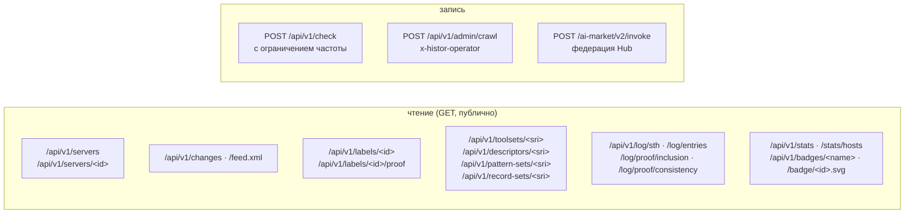

# API

> 🌐 [English](api.md) · **Русский** · [Español](api.es.md) · [Français](api.fr.md) · [中文](api.zh.md)

Базовый URL: `https://histor.modelmarket.dev`. Всё публично, без аутентификации и только для
чтения, кроме `POST /api/v1/check` (с ограничением частоты) и маршрута оператора. Публичные чтения
отдают `Access-Control-Allow-Origin: *`. OpenAPI: [`/api/openapi.json`](https://histor.modelmarket.dev/api/openapi.json).



## Серверы

| Метод | Путь | Возвращает |
|---|---|---|
| GET | `/api/v1/servers?q=&state=&limit=&offset=` | эндпоинты; `state` ∈ `all`, `pinned`, `changed`, `flagged`, `unobserved`; `q` ищет по имени, эндпоинту и заголовку |
| GET | `/api/v1/servers/<id>` | один эндпоинт: текущий набор инструментов, совпадения WARDEN с позициями в тексте, метки, свёрнутая хронология, изменения, сообщения клиентов за 30 дней |
| GET | `/badge/<id>.svg` | бейдж для README: `pinned ‹date›`, `unchanged Nd`, `changed ‹date›`, `not observed`, `not listed` |

`<id>` — первые 16 шестнадцатеричных символов `sha256(name + "\n" + endpoint)`: стабильный, по
одному на удалённый эндпоинт.

## Изменения

| Метод | Путь | Возвращает |
|---|---|---|
| GET | `/api/v1/changes?limit=&before=` | сначала новые; у каждого `summary.added`, `summary.removed`, `summary.modified[].fields` (пословный дифф описаний, дифф схем по JSON-путям) |
| GET | `/api/v1/changes/<id>` | одно изменение |
| GET | `/feed.xml` | Atom-лента последних 50 изменений |

## Метки и свидетельства

| Метод | Путь | Возвращает |
|---|---|---|
| GET | `/api/v1/labels/<id>` | подписанная метка, `application/vc`, неизменяемая |
| GET | `/api/v1/labels/<id>/proof?tree_size=` | индекс листа, подписанная вершина дерева (STH) и доказательство включения |
| GET | `/api/v1/toolsets/<sri>` · `/descriptors/<sri>` · `/pattern-sets/<sri>` · `/record-sets/<sri>` | свидетельства с адресацией по содержимому, неизменяемые |
| GET | `/api/v1/issuer` | `did:key` журнала, сырой открытый ключ, текущие дайджесты набора шаблонов и набора записей, пакет WARDEN |

## Журнал

| Метод | Путь | Возвращает |
|---|---|---|
| GET | `/api/v1/log/sth` | последняя подписанная вершина дерева |
| GET | `/api/v1/log/sth/<size>` | вершина, подписанная при этом размере |
| GET | `/api/v1/log/entries?start=&end=` | листья по порядку (≤ 1000 за вызов) |
| GET | `/api/v1/log/proof/inclusion?leaf_index=&tree_size=` | доказательство включения по RFC 9162, hex |
| GET | `/api/v1/log/proof/consistency?first=&second=` | доказательство согласованности по RFC 9162, hex |

## /check

```http
POST /api/v1/check
Content-Type: application/json

{
  "endpoint": "https://example.com/mcp",      // or "name": "io.github.org/server"
  "tools": [ … ],                             // the tools array you received, or:
  "toolSetDigest": "sha256-…",                // its MTL/1 digest
  "contribute": true                          // optional: add (endpoint, digest, day) to a count
}
```

```json
{
  "type": "histor.check/v1",
  "checkedAt": "2026-09-23T10:02:11Z",
  "issuer": "did:key:z6Mk…",
  "query": { "endpoint": "…", "toolSetDigest": "sha256-…" },
  "target": { "id": "9c7f2af79fa057b2", "page": "…/s/9c7f2af79fa057b2", "badge": "…", "lastStatus": "ok" },
  "observed": { "toolSetDigest": "sha256-…", "unchangedSince": "…", "observations": 12, "changes": 0 },
  "match": "same",
  "note": "The tool definitions you sent are the set HISTOR currently observes at this endpoint.",
  "patternScan": { "status": "scanned", "block": 0, "advise": 1, "matches": [ … ] },
  "log": { "treeSize": 21480, "rootHash": "…", "timestamp": "…" },
  "signature": { "alg": "Ed25519", "verificationMethod": "…", "value": "…" }
}
```

`match` принимает одно из значений `same`, `different`, `previously-observed` (с `seenBefore`),
`not-observed`, `not-listed`, `no-digest`. Ответ подписан так же, как вершина дерева (`type`
`histor.check/v1`). Если набор ещё ни разу не сканировался, а у вашего адреса остался бюджет
сканирований, сайдкар WARDEN сканирует его на месте. Лимиты: 30 проверок в минуту и 20 новых
сканирований в час на адрес; тела запросов больше 2 MiB отклоняются. С `contribute` не хранится
ничего, кроме дневного счётчика для этого дайджеста.

## Статистика и живые бейджи

| Путь | Возвращает |
|---|---|
| `/api/v1/stats` | последний обход (размер реестра, что ответили эндпоинты, к чему не подключались, сколько меток выпущено), текущие счётчики, изменения за последние 24 ч / 7 дн / 30 дн, размер журнала, сообщения клиентов за 7 дн |
| `/api/v1/stats/hosts?limit=` | число эндпоинтов на хост среди тех, к которым подключались |
| `/api/v1/badges/log` · `pinned` · `changes` · `sth` | JSON для [эндпоинт-бейджа shields.io](https://shields.io/badges/endpoint-badge) в README |
| `/health` | liveness, бэкенд хранилища, размер дерева, идёт ли обход, последняя ошибка обхода |

## Федерация (AIMarket Hub)

HISTOR — пир AIMarket: `/.well-known/ai-market.json` (подписан целиком), `/ai-market/v2/manifest`
(подписан по канонической форме манифеста Hub) и `POST /ai-market/v2/invoke` с тремя бесплатными
capability:

| Capability | Вход | Результат |
|---|---|---|
| `histor.check@v1` | тело `/check` | подписанный ответ `/check` |
| `histor.server@v1` | `{"endpoint": …}` или `{"name": …}` | до 10 подходящих эндпоинтов |
| `histor.changes@v1` | `{"limit": 1–100}` | самые новые изменения |

Каждый ответ несёт interop-квитанцию, которую Hub верифицирует по ключу из `.well-known`; при
`HISTOR_PQC=1` это гибридная подпись Ed25519 + ML-DSA-65.

## Оператор

`POST /api/v1/admin/crawl` с `x-histor-operator: $HISTOR_OPERATOR_TOKEN` сразу запускает обход
(202) или отвечает 409, если обход уже идёт. Без настроенного токена маршрут отвечает 503.
