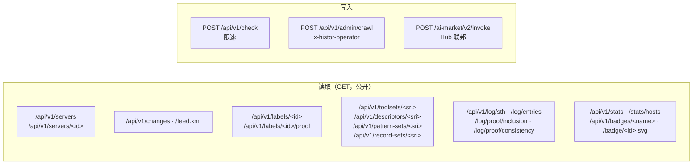

# API

> 🌐 [English](api.md) · [Русский](api.ru.md) · [Español](api.es.md) · [Français](api.fr.md) · **中文**

基础 URL：`https://histor.modelmarket.dev`。除 `POST /api/v1/check`（限速）和运营方路由外，一切都是
公开、无需鉴权且只读的。公开读取接口会发送 `Access-Control-Allow-Origin: *`。OpenAPI：
[`/api/openapi.json`](https://histor.modelmarket.dev/api/openapi.json)。



## 服务器

| 方法 | 路径 | 返回 |
|---|---|---|
| GET | `/api/v1/servers?q=&state=&limit=&offset=` | 端点列表；`state` ∈ `all`、`pinned`、`changed`、`flagged`、`unobserved`；`q` 匹配名称、端点、标题 |
| GET | `/api/v1/servers/<id>` | 单个端点：当前工具集、带匹配区间的 WARDEN 匹配项、标签、折叠后的时间线、变更、30 天内的客户端报告 |
| GET | `/badge/<id>.svg` | README 徽章：`pinned ‹date›`、`unchanged Nd`、`changed ‹date›`、`not observed`、`not listed` |

`<id>` 是 `sha256(name + "\n" + endpoint)` 的前 16 个十六进制字符——稳定不变，每个远程端点一个。

## 变更

| 方法 | 路径 | 返回 |
|---|---|---|
| GET | `/api/v1/changes?limit=&before=` | 最新的在前；每条含 `summary.added`、`summary.removed`、`summary.modified[].fields`（描述按词比较差异，schema 按 JSON 路径比较差异） |
| GET | `/api/v1/changes/<id>` | 单条变更 |
| GET | `/feed.xml` | 最近 50 条变更的 Atom 订阅源 |

## 标签与证据

| 方法 | 路径 | 返回 |
|---|---|---|
| GET | `/api/v1/labels/<id>` | 签名标签，`application/vc`，不可变 |
| GET | `/api/v1/labels/<id>/proof?tree_size=` | 叶子索引、签名树头（STH）以及包含证明 |
| GET | `/api/v1/toolsets/<sri>` · `/descriptors/<sri>` · `/pattern-sets/<sri>` · `/record-sets/<sri>` | 内容寻址的证据，不可变 |
| GET | `/api/v1/issuer` | 日志的 `did:key`、原始公钥、当前模式集与记录集的摘要、WARDEN 软件包 |

## 日志

| 方法 | 路径 | 返回 |
|---|---|---|
| GET | `/api/v1/log/sth` | 最新的签名树头 |
| GET | `/api/v1/log/sth/<size>` | 在该大小时签发的树头 |
| GET | `/api/v1/log/entries?start=&end=` | 按顺序排列的叶子（每次调用 ≤ 1000 条） |
| GET | `/api/v1/log/proof/inclusion?leaf_index=&tree_size=` | RFC 9162 包含证明，十六进制 |
| GET | `/api/v1/log/proof/consistency?first=&second=` | RFC 9162 一致性证明，十六进制 |

## /check

```http
POST /api/v1/check
Content-Type: application/json

{
  "endpoint": "https://example.com/mcp",      // or "name": "io.github.org/server"
  "tools": [ … ],                             // the tools array you received, or:
  "toolSetDigest": "sha256-…",                // its MTL/1 digest
  "contribute": true                          // optional: add (endpoint, digest, day) to a count
}
```

```json
{
  "type": "histor.check/v1",
  "checkedAt": "2026-09-23T10:02:11Z",
  "issuer": "did:key:z6Mk…",
  "query": { "endpoint": "…", "toolSetDigest": "sha256-…" },
  "target": { "id": "9c7f2af79fa057b2", "page": "…/s/9c7f2af79fa057b2", "badge": "…", "lastStatus": "ok" },
  "observed": { "toolSetDigest": "sha256-…", "unchangedSince": "…", "observations": 12, "changes": 0 },
  "match": "same",
  "note": "The tool definitions you sent are the set HISTOR currently observes at this endpoint.",
  "patternScan": { "status": "scanned", "block": 0, "advise": 1, "matches": [ … ] },
  "log": { "treeSize": 21480, "rootHash": "…", "timestamp": "…" },
  "signature": { "alg": "Ed25519", "verificationMethod": "…", "value": "…" }
}
```

`match` 取值为 `same`、`different`、`previously-observed`（附 `seenBefore`）、`not-observed`、
`not-listed`、`no-digest` 之一。应答像树头一样签名（`type` 为 `histor.check/v1`）。如果该工具集从未
被扫描过，而您的地址仍有扫描预算，WARDEN 边车会当场扫描它。限制：每个地址每分钟 30 次检查、每小时
20 次新扫描；超过 2 MiB 的请求体会被拒绝。使用 `contribute` 时，除了该摘要当天的计数之外，不存储
任何内容。

## 统计与实时徽章

| 路径 | 返回 |
|---|---|
| `/api/v1/stats` | 最近一次抓取（注册表规模、各端点如何应答、哪些未连接、签发了多少标签）、当前计数、最近 24 小时 / 7 天 / 30 天的变更、日志大小、7 天内的客户端报告 |
| `/api/v1/stats/hosts?limit=` | 在已连接的端点中，按主机统计的端点数 |
| `/api/v1/badges/log` · `pinned` · `changes` · `sth` | 供 README 徽章使用的 [shields.io endpoint](https://shields.io/badges/endpoint-badge) JSON |
| `/health` | 存活状态、存储后端、树大小、是否正在抓取、上次抓取的错误 |

## 联邦（AIMarket Hub）

HISTOR 是一个 AIMarket peer：`/.well-known/ai-market.json`（整体签名）、`/ai-market/v2/manifest`
（按 Hub 的 manifest 规范化形式签名），以及提供三项免费能力的 `POST /ai-market/v2/invoke`：

| 能力 | 输入 | 结果 |
|---|---|---|
| `histor.check@v1` | `/check` 的请求体 | 签名的 `/check` 应答 |
| `histor.server@v1` | `{"endpoint": …}` 或 `{"name": …}` | 最多 10 个匹配的端点 |
| `histor.changes@v1` | `{"limit": 1–100}` | 最新的变更 |

每个回复都附带一份互操作收据，Hub 用 `.well-known` 中的密钥验证它；在 `HISTOR_PQC=1` 时为
Ed25519 + ML-DSA-65 混合签名。

## 运营方

带上 `x-histor-operator: $HISTOR_OPERATOR_TOKEN` 调用 `POST /api/v1/admin/crawl`，会立即启动一次
抓取（202）；如果已有抓取在运行，则返回 409。未配置令牌时，该路由返回 503。
