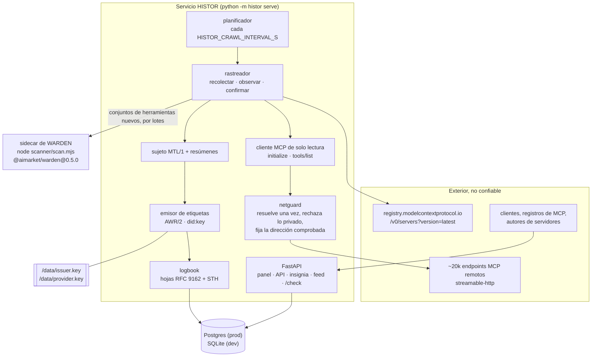
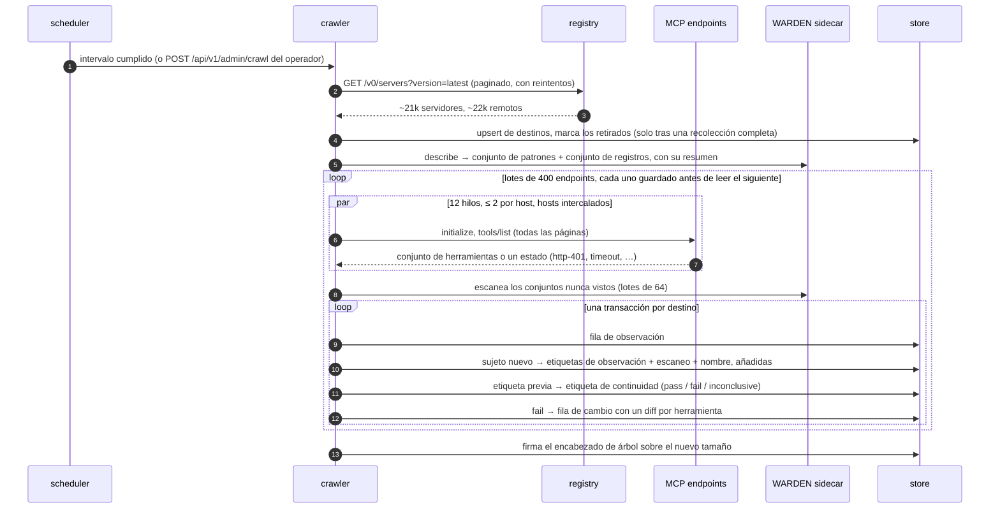
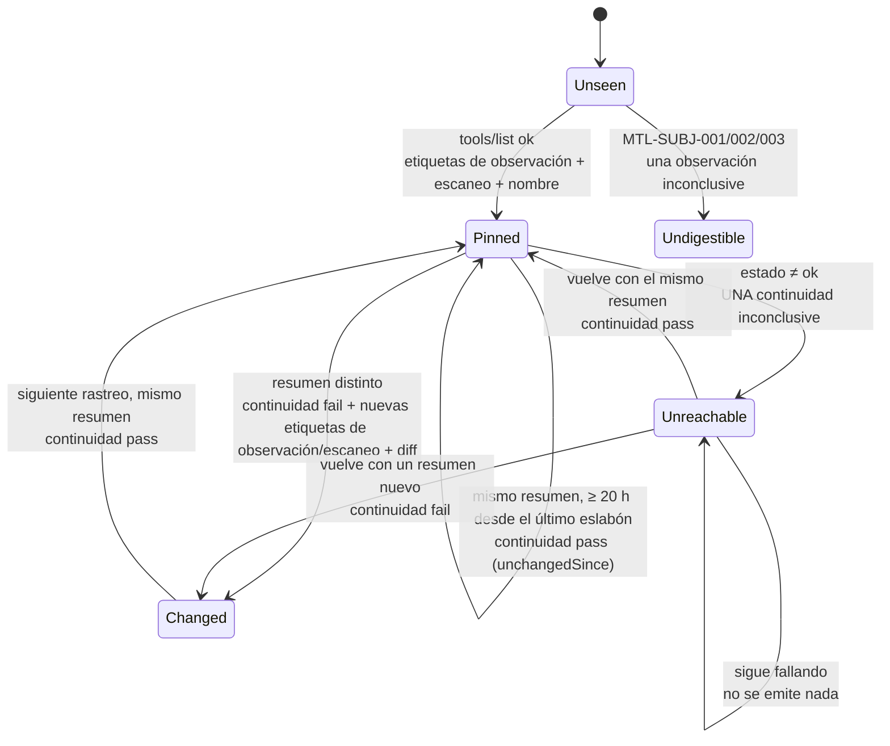
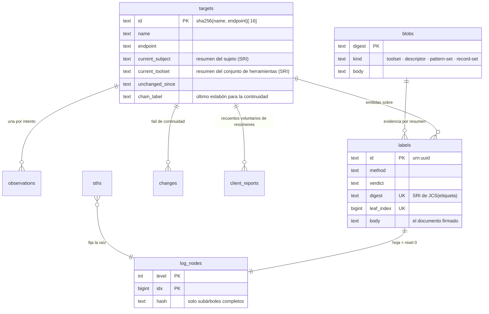

# Arquitectura

> 🌐 [English](architecture.md) · [Русский](architecture.ru.md) · **Español** · [Français](architecture.fr.md) · [中文](architecture.zh.md)

HISTOR es un único servicio Python con un proceso auxiliar. Todo lo que sabe procede de dos
lecturas —el registro oficial de MCP y el `tools/list` de cada servidor listado— y todo lo que
publica lo firma una sola clave y se añade a un único registro de transparencia.

## Módulos

| Módulo | Responsabilidad |
|---|---|
| `histor/registry.py` | Recorre las páginas del registro oficial de MCP (`version=latest`, con reintentos: cada página tarda de 1 a 50 s), conserva una entrada por nombre y convierte cada remoto en un destino. Los endpoints que no contactará se conservan con un motivo (`transport-not-observed`, `templated-url`, `cleartext-url`), para que las cifras públicas nunca reduzcan su denominador. |
| `histor/netguard.py` | Resuelve el host una sola vez, rechaza el destino si **cualquiera** de las respuestas no es pública y después se conecta a la dirección comprobada, con `Host` y el SNI de TLS fijados al nombre. El DNS rebinding nunca obtiene una segunda consulta. |
| `histor/mcpclient.py` | `initialize` → `notifications/initialized` → `tools/list` recorrido por completo mediante `nextCursor`. Streaming con límite de tamaño, SSE leído hasta nuestro id de respuesta, sin redirecciones, miembros JSON duplicados rechazados. No tiene ninguna ruta de código que llame a una herramienta. |
| `histor/subject.py` | El descriptor MTL/1 y ambos resúmenes criptográficos (digests), sobre el canonicalizador de referencia de AWR/2. Una prueba de paridad byte a byte lo contrasta con el propio `mtl_subject.py` del perfil. |
| `histor/scanner.py` + `scanner/scan.mjs` | Ejecuta las puertas **publicadas** de WARDEN. Al arrancar, el sidecar describe su propio conjunto de patrones y su conjunto de registros, de modo que una etiqueta nombra el resumen de las reglas que realmente se ejecutaron. |
| `histor/labels.py` | Cuatro métodos de etiqueta, cada uno un documento AWR/2 firmado. Las reglas de veredicto de MTL/1 se imponen en el código (`MTL-METH-002`). |
| `histor/logbook.py` + `histor/merkle.py` | Adición de hojas, encabezados de árbol, pruebas de inclusión y de consistencia. Solo se almacenan subárboles completos, así que cada prueba cuesta O(log n) lecturas. |
| `histor/crawler.py` | Un rastreo: recolectar → observar (pool de hilos, límite por host, hosts intercalados) → escanear los conjuntos de herramientas nuevos → una transacción por destino, en lotes de `HISTOR_CRAWL_BATCH` guardados antes de leer el siguiente → firmar un encabezado de árbol. |
| `histor/check.py` | `/check`: compara el conjunto de herramientas de un cliente con lo observado; recuento de resúmenes opcional y voluntario. |
| `histor/app.py` | La interfaz HTTP: panel, API, insignias, feed Atom, ruta del operador y el peer de federación de AIMarket. |
| `histor/db.py` + `histor/migrations.py` + `histor/store.py` | Almacenamiento independiente del backend: un solo dialecto SQL para SQLite y Postgres, migraciones numeradas y un contrato de columnas que se comprueba al arrancar. |

## Un rastreo

## Cuándo se emite una etiqueta

El registro debe recoger hechos, no ruido, así que los resultados deterministas idénticos no se
vuelven a emitir cada día.

Un nuevo conjunto de patrones o de registros de WARDEN (un nuevo paquete publicado) vuelve a emitir
las etiquetas de escaneo de todos los sujetos actuales, porque dos etiquetas de escaneo solo son
comparables bajo el mismo conjunto.

## Modelo de datos

## Almacenamiento y migraciones

SQLite es el almacén de desarrollo: un archivo bajo `HISTOR_DATA_DIR`, modo WAL y una conexión por
lectura, para que ningún lector se quede anclado en una instantánea antigua bloqueando los
checkpoints. Postgres es el de producción: `HISTOR_PROFILE=prod` se niega a arrancar sin una URL
`postgresql://`. Todo el SQL se escribe una sola vez en el subconjunto que comparten ambos motores;
donde discrepan (columnas de identidad), una migración lleva una sentencia por backend. Las
adiciones al registro toman un bloqueo consultivo (advisory lock) de Postgres dentro de su
transacción, de modo que dos procesos apuntados a una misma base de datos siguen añadiendo hojas de
una en una.

Las migraciones siguen el estilo de la casa, compartido con HESTIA y el Hub: una tabla
`schema_migrations`, una lista numerada de revisiones, cada revisión en su propia transacción y
fallos ruidosos (fail-loud). Una revisión ya publicada nunca se edita; se rechaza una base de datos
que haya aplicado una revisión que esta compilación no conoce.

## Claves

| Archivo | Firma | Por qué por separado |
|---|---|---|
| `issuer.key` | cada etiqueta (AWR/2, `did:key`), cada encabezado de árbol firmado o STH (`histor.sth/v1`), cada respuesta de `/check` (`histor.check/v1`) | una sola identidad para todo lo que verifica un lector; el `type` dentro de los bytes firmados impide que una firma sobre un tipo de documento se reutilice como si fuera de otro |
| `provider.key` (+ `_mldsa`) | los documentos de federación de AIMarket (`.well-known`, manifiesto, recibos de interoperabilidad), híbridos Ed25519 + ML-DSA-65 cuando `HISTOR_PQC=1` | habla el protocolo del Hub; ninguna de las dos claves puede firmar por la otra |

Ambas residen en el volumen de datos, con modo 0600, nunca en variables de entorno ni en la base de
datos; los enlaces y los archivos corruptos se rechazan al arrancar.
