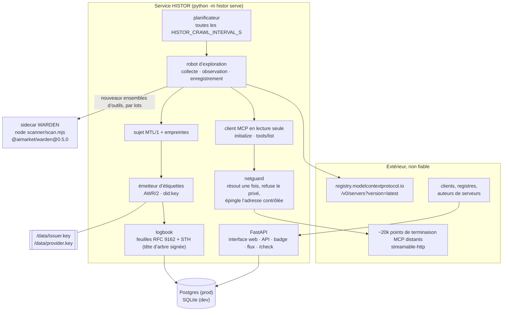
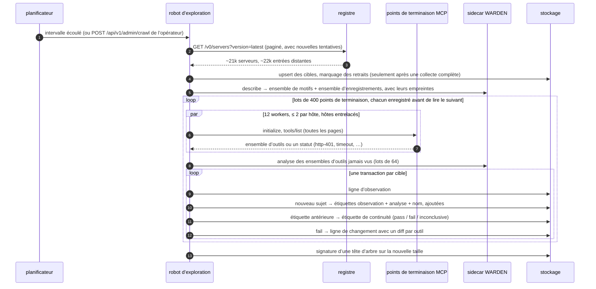
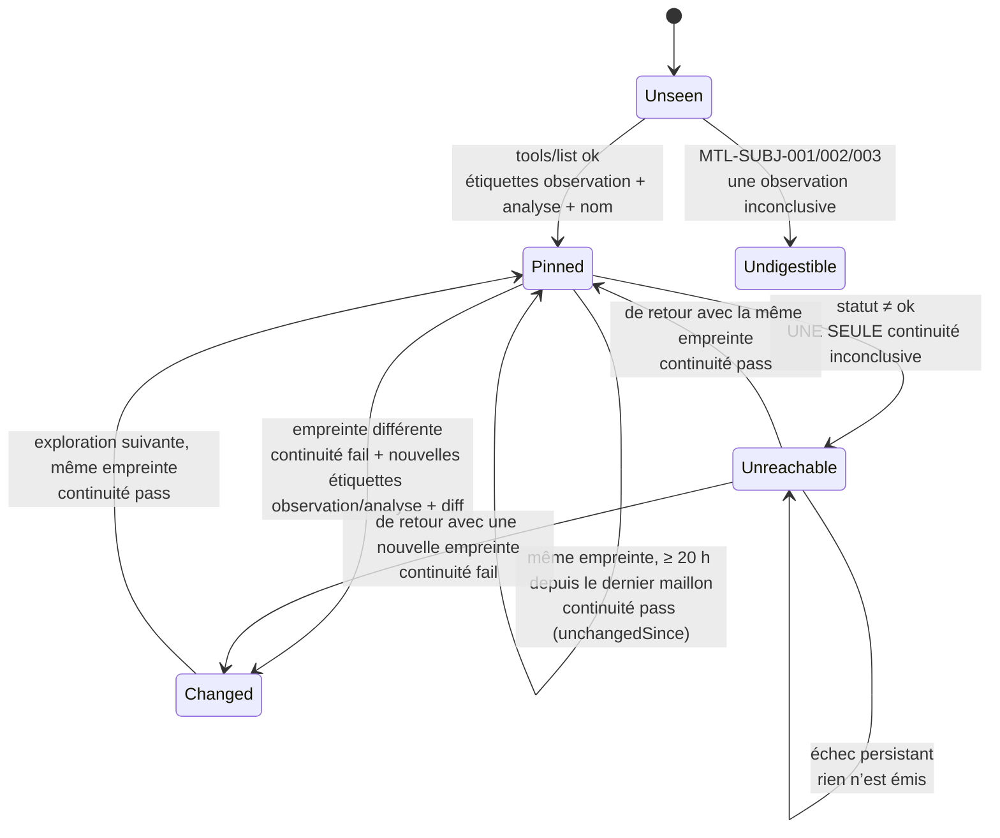
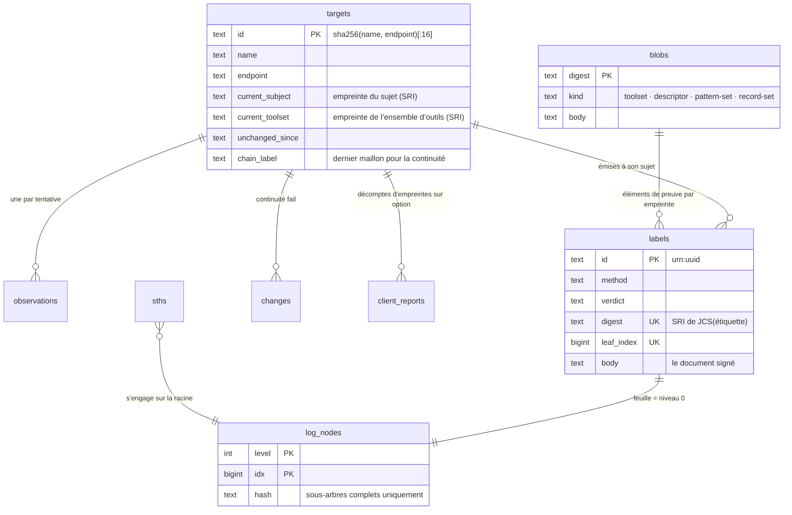

# Architecture

> 🌐 [English](architecture.md) · [Русский](architecture.ru.md) · [Español](architecture.es.md) · **Français** · [中文](architecture.zh.md)

HISTOR est un service Python unique accompagné d’un processus auxiliaire. Tout ce qu’il sait provient
de deux lectures — le registre MCP officiel et le `tools/list` de chaque serveur répertorié — et tout
ce qu’il publie est signé par une seule clé et ajouté à un seul journal.

## Modules

| Module | Responsabilité |
|---|---|
| `histor/registry.py` | Parcourt les pages du registre officiel (`version=latest`, avec nouvelles tentatives : une page prend de 1 à 50 s), garde un enregistrement par nom et fait de chaque entrée distante une cible. Les points de terminaison (endpoints) qu’il ne contactera pas sont conservés avec une raison (`transport-not-observed`, `templated-url`, `cleartext-url`), pour que les chiffres publics ne réduisent jamais leur dénominateur. |
| `histor/netguard.py` | Résout l’hôte une seule fois, refuse la cible si **une seule** des réponses n’est pas publique, puis se connecte à l’adresse contrôlée avec `Host` et le SNI TLS réglés sur le nom. Le DNS rebinding n’obtient jamais de seconde résolution. |
| `histor/mcpclient.py` | `initialize` → `notifications/initialized` → `tools/list` parcouru via `nextCursor`. Flux plafonné en taille, SSE lu jusqu’à notre identifiant de réponse, aucune redirection, membres JSON en double refusés. Il ne contient aucun chemin de code qui appelle un outil. |
| `histor/subject.py` | Le descripteur MTL/1 et les deux empreintes (digest), calculés avec le canonicaliseur de référence AWR/2. Un test de parité octet par octet le confronte au `mtl_subject.py` du profil lui-même. |
| `histor/scanner.py` + `scanner/scan.mjs` | Exécute les contrôles WARDEN **publiés**. Au démarrage, le sidecar décrit son propre ensemble de motifs et son ensemble d’enregistrements, si bien qu’une étiquette nomme l’empreinte des règles réellement exécutées. |
| `histor/labels.py` | Quatre méthodes d’étiquetage, chacune produisant un document AWR/2 signé. Les règles de verdict de MTL/1 sont appliquées dans le code (`MTL-METH-002`). |
| `histor/logbook.py` + `histor/merkle.py` | Ajout de feuilles, têtes d’arbre, preuves d’inclusion et de cohérence. Seuls les sous-arbres complets sont stockés, donc chaque preuve coûte O(log n) lectures. |
| `histor/crawler.py` | Une exploration (crawl) : collecte → observation (pool de threads, limite par hôte, hôtes entrelacés) → analyse des nouveaux ensembles d’outils → une transaction par cible, par lots de `HISTOR_CRAWL_BATCH` enregistrés avant de lire le suivant → signature d’une tête d’arbre. |
| `histor/check.py` | `/check` : compare l’ensemble d’outils d’un client avec ce qui a été observé ; décompte d’empreintes facultatif, sur option. |
| `histor/app.py` | La surface HTTP : interface web, API, badges, flux Atom, route opérateur et le peer de fédération AIMarket. |
| `histor/db.py` + `histor/migrations.py` + `histor/store.py` | Stockage indépendant du backend : un seul dialecte SQL pour SQLite et Postgres, des migrations numérotées, un contrat de colonnes contrôlé au démarrage. |

## Une exploration

## Quand une étiquette est émise

Le journal doit consigner des faits, pas du bruit : des résultats déterministes identiques ne sont
donc pas réémis chaque jour.

Un nouvel ensemble de motifs ou d’enregistrements WARDEN (un nouveau paquet publié) réémet les
étiquettes d’analyse de chaque sujet courant, car deux étiquettes d’analyse ne sont comparables que
sous le même ensemble.

## Modèle de données

## Stockage et migrations

SQLite est le stockage de développement : un fichier unique sous `HISTOR_DATA_DIR`, en mode WAL, une
connexion par lecture, pour qu’aucun lecteur ne reste bloqué sur un ancien instantané et n’empêche les
checkpoints. Postgres est le stockage de production : `HISTOR_PROFILE=prod` refuse de démarrer sans
URL `postgresql://`. Tout le SQL est écrit une seule fois, dans le sous-ensemble commun aux deux
moteurs ; là où ils divergent (colonnes d’identité), une migration porte une instruction par backend.
Les ajouts au journal prennent un verrou consultatif (advisory lock) Postgres à l’intérieur de leur
transaction : deux processus pointés vers la même base ajoutent donc quand même les feuilles une par
une.

Les migrations suivent le style maison partagé avec HESTIA et le Hub : une table `schema_migrations`,
une liste de révisions numérotées, chaque révision dans sa propre transaction, échec bruyant
(fail-loud). Une révision livrée n’est jamais modifiée ; une base qui a appliqué une révision que ce
build ne connaît pas est refusée.

## Clés

| Fichier | Signe | Pourquoi séparé |
|---|---|---|
| `issuer.key` | chaque étiquette (AWR/2, `did:key`), chaque tête d’arbre (`histor.sth/v1`), chaque réponse `/check` (`histor.check/v1`) | une seule identité pour tout ce qu’un lecteur vérifie ; le `type` inclus dans les octets signés empêche qu’une signature portant sur un type de document soit rejouée comme un autre |
| `provider.key` (+ `_mldsa`) | les documents de fédération AIMarket (`.well-known`, manifeste, reçus d’interopérabilité), en hybride Ed25519 + ML-DSA-65 quand `HISTOR_PQC=1` | parle le protocole du Hub ; aucune des deux clés ne peut signer pour l’autre |

Les deux résident sur le volume de données, en mode 0600, jamais dans l’environnement ni dans la base
de données ; les liens et les fichiers corrompus sont refusés au démarrage.
