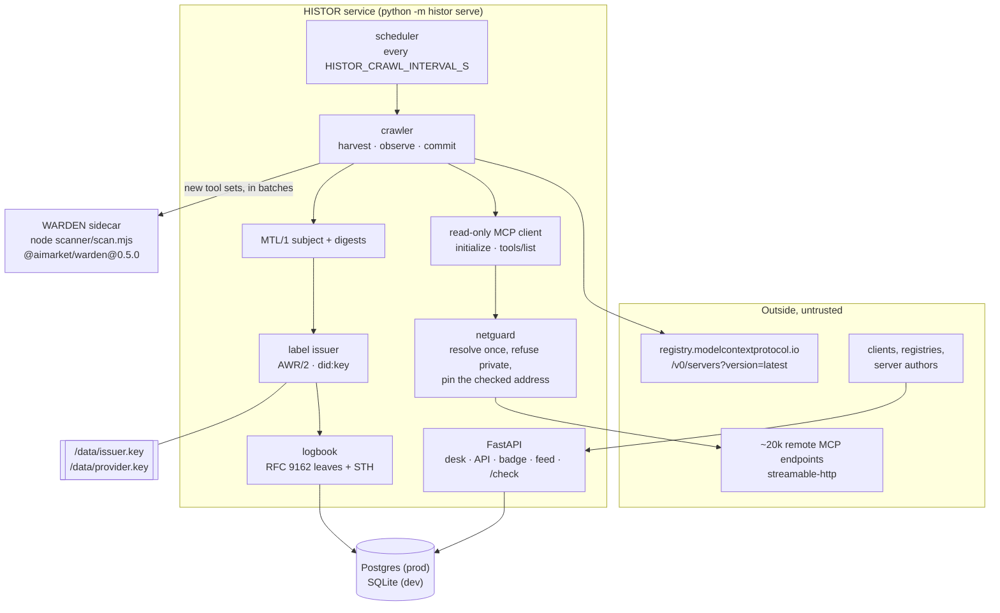
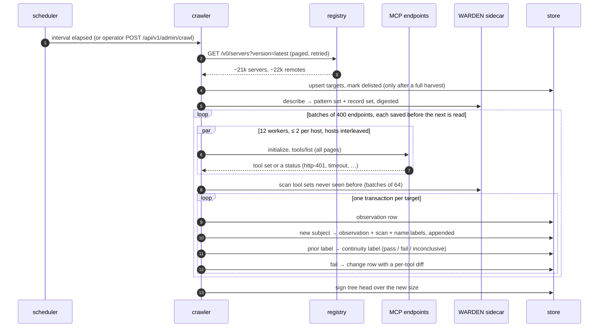
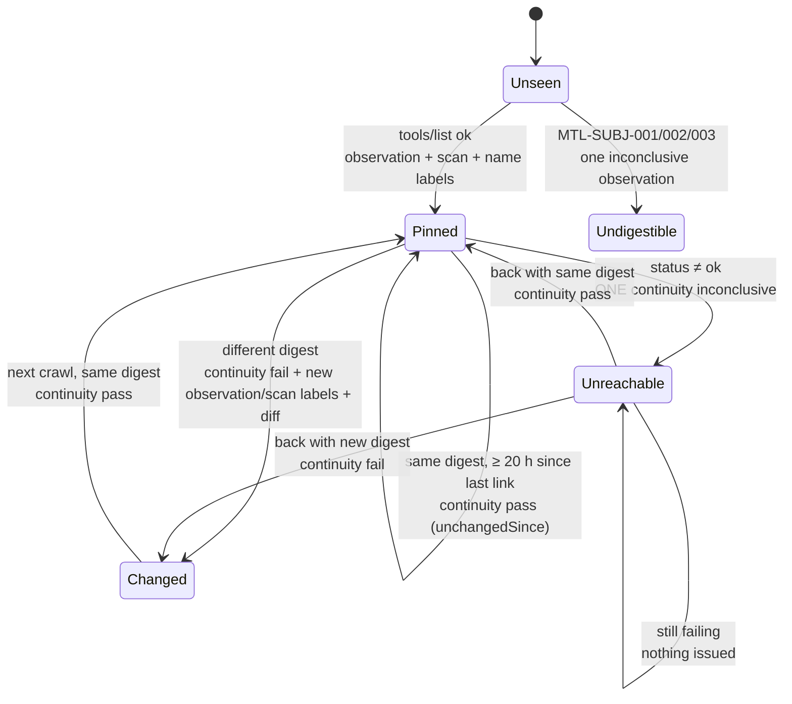
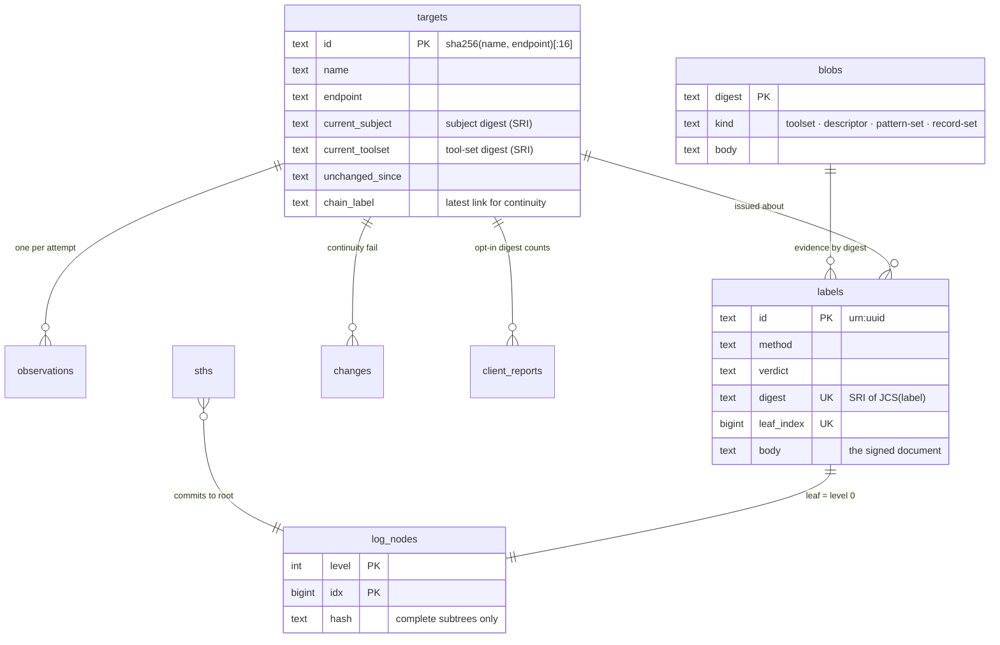

# Architecture

> 🌐 **English** · [Русский](architecture.ru.md) · [Español](architecture.es.md) · [Français](architecture.fr.md) · [中文](architecture.zh.md)

HISTOR is one Python service with one helper process. Everything it knows comes from two reads —
the official MCP registry and each listed server's `tools/list` — and everything it publishes is
signed by one key and appended to one log.

## Modules

| Module | Responsibility |
|---|---|
| `histor/registry.py` | Pages the official registry (`version=latest`, retried: pages take 1–50 s), keeps one record per name, turns every remote into a target. Endpoints it will not dial are kept with a reason (`transport-not-observed`, `templated-url`, `cleartext-url`) so the public numbers never shrink their denominator. |
| `histor/netguard.py` | Resolves the host once, refuses the target if **any** answer is non-public, then connects to the checked address with `Host` and TLS SNI set to the name. DNS rebinding never gets a second lookup. |
| `histor/mcpclient.py` | `initialize` → `notifications/initialized` → `tools/list` drained over `nextCursor`. Size-capped streaming, SSE read up to our response id, no redirects, duplicate JSON members refused. It has no code path that calls a tool. |
| `histor/subject.py` | The MTL/1 descriptor and both digests, over the AWR/2 reference canonicalizer. A byte-for-byte parity test runs it against the profile's own `mtl_subject.py`. |
| `histor/scanner.py` + `scanner/scan.mjs` | Runs the **published** WARDEN gates. The sidecar describes its own pattern set and record set at startup, so a label names the digest of the rules that actually ran. |
| `histor/labels.py` | Four label methods, each one signed AWR/2 document. The verdict rules of MTL/1 are enforced in code (`MTL-METH-002`). |
| `histor/logbook.py` + `histor/merkle.py` | Leaf append, tree heads, inclusion and consistency proofs. Only complete subtrees are stored, so every proof is O(log n) reads. |
| `histor/crawler.py` | One crawl: harvest → observe (thread pool, per-host limit, hosts interleaved) → scan new tool sets → one transaction per target, in batches of `HISTOR_CRAWL_BATCH` saved before the next is read → sign a tree head. |
| `histor/check.py` | `/check`: compare a client's tool set with what was observed; optional opt-in digest count. |
| `histor/app.py` | The HTTP surface: desk, API, badges, Atom feed, operator route, and the AIMarket federation peer. |
| `histor/db.py` + `histor/migrations.py` + `histor/store.py` | Backend-neutral storage: one SQL dialect for SQLite and Postgres, numbered migrations, a column contract checked at startup. |

## One crawl

## When a label is issued

The log should record facts, not noise, so identical deterministic results are not re-issued daily.

A new WARDEN pattern set or record set (a new published package) re-issues the scan labels of
every current subject, because two scan labels are comparable only under the same set.

## Data model

## Storage and migrations

SQLite is the development store: one file under `HISTOR_DATA_DIR`, WAL mode, a connection per
read so no reader parks on an old snapshot and blocks checkpoints. Postgres is production:
`HISTOR_PROFILE=prod` refuses to start without a `postgresql://` URL. All SQL is written once in
the subset both engines share; where they disagree (identity columns) a migration carries one
statement per backend. Log appends take a Postgres advisory lock inside their transaction, so two
processes pointed at one database still append leaves one at a time.

Migrations follow the house style shared with HESTIA and the Hub: a `schema_migrations` table, a
numbered revision list, each revision in its own transaction, fail-loud. A shipped revision is
never edited; a database that has applied a revision this build does not know is refused.

## Keys

| File | Signs | Why separate |
|---|---|---|
| `issuer.key` | every label (AWR/2, `did:key`), every tree head (`histor.sth/v1`), every `/check` answer (`histor.check/v1`) | one identity for everything a reader verifies; the `type` inside the signed bytes stops a signature over one document type being replayed as another |
| `provider.key` (+ `_mldsa`) | the AIMarket federation documents (`.well-known`, manifest, interop receipts), hybrid Ed25519 + ML-DSA-65 when `HISTOR_PQC=1` | speaks the Hub's protocol; neither key can sign for the other |

Both live on the data volume, mode 0600, never in env or in the database; links and corrupted files
are refused at startup.
