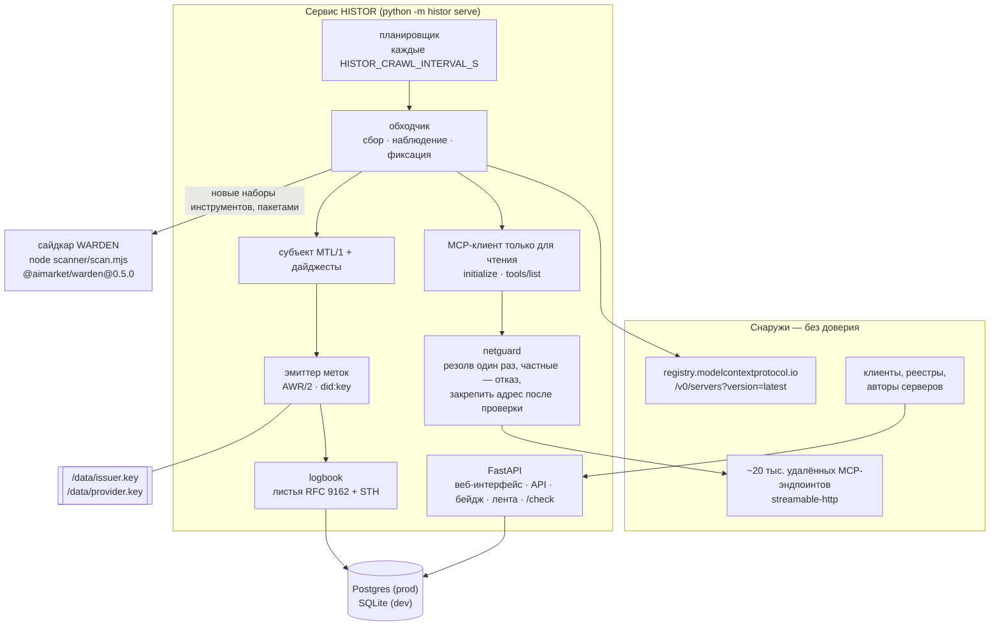
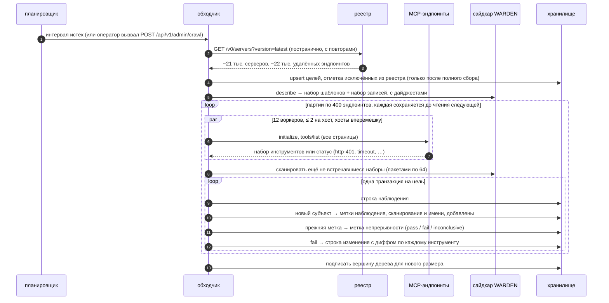
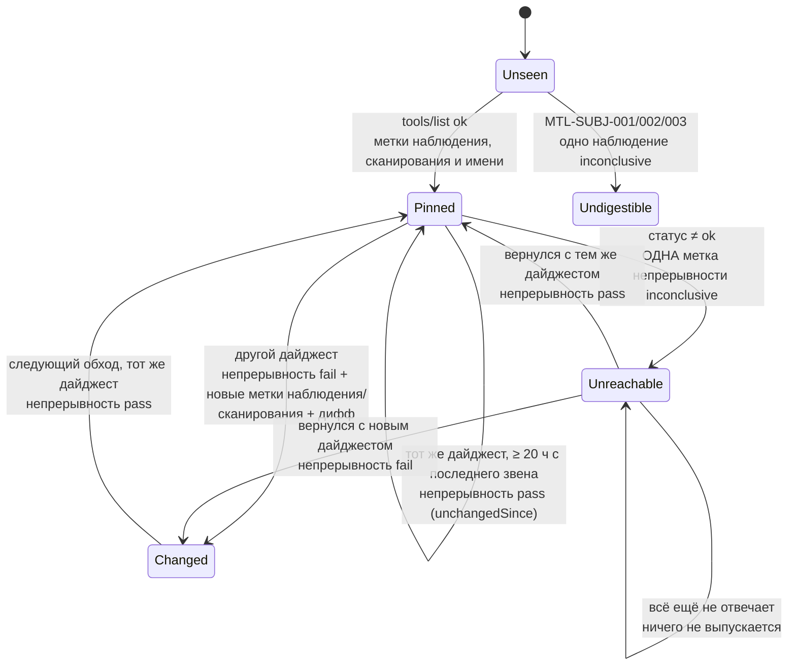
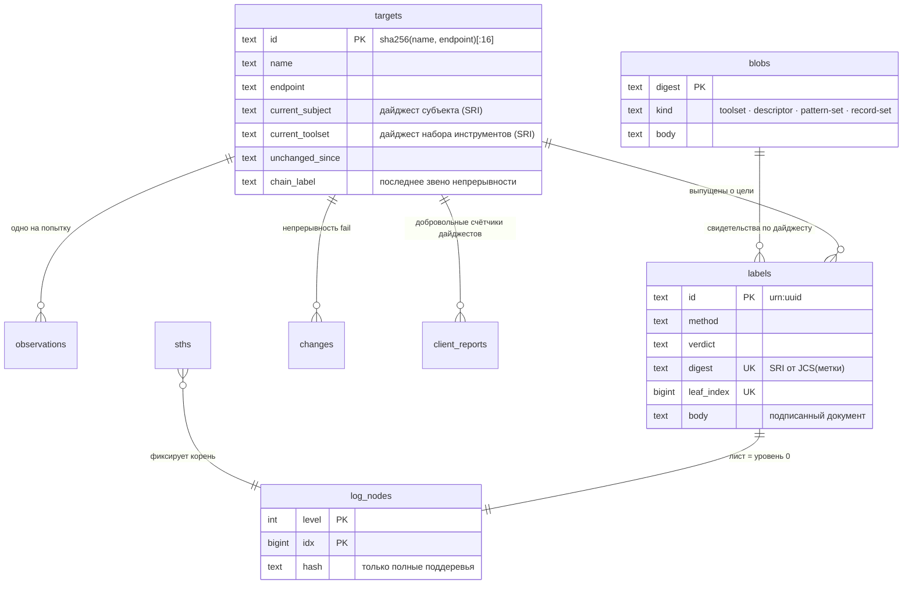

# Архитектура

> 🌐 [English](architecture.md) · **Русский** · [Español](architecture.es.md) · [Français](architecture.fr.md) · [中文](architecture.zh.md)

HISTOR — один сервис на Python и один вспомогательный процесс. Всё, что он знает, берётся из двух
чтений — официального реестра MCP и `tools/list` каждого сервера из этого реестра, — а всё, что он
публикует, подписано одним ключом и добавлено в один журнал.

## Модули

| Модуль | Ответственность |
|---|---|
| `histor/registry.py` | Постранично читает официальный реестр (`version=latest`, с повторами: страница отвечает от 1 до 50 с), оставляет одну запись на имя и превращает каждый удалённый эндпоинт в цель. Эндпоинты, к которым он подключаться не будет, сохраняются с причиной (`transport-not-observed`, `templated-url`, `cleartext-url`), чтобы у публичных цифр никогда не уменьшался знаменатель. |
| `histor/netguard.py` | Резолвит хост один раз, отклоняет цель, если **хоть один** ответ не публичный, и подключается именно к адресу, прошедшему проверку, с `Host` и TLS SNI, выставленными на имя. Второго резолва для DNS rebinding не бывает. |
| `histor/mcpclient.py` | `initialize` → `notifications/initialized` → `tools/list` со всеми страницами по `nextCursor`. Потоковое чтение с ограничением размера, SSE читается до нашего id ответа, без редиректов, повторяющиеся члены JSON отклоняются. В нём нет ни одного пути кода, который вызывает инструмент. |
| `histor/subject.py` | Дескриптор MTL/1 и оба дайджеста поверх эталонного канонизатора AWR/2. Тест побайтового соответствия прогоняет его против `mtl_subject.py` из самого профиля. |
| `histor/scanner.py` + `scanner/scan.mjs` | Запускает **опубликованные** гейты WARDEN. Сайдкар при старте описывает собственные набор шаблонов и набор записей, поэтому метка называет дайджест именно тех правил, которые реально отработали. |
| `histor/labels.py` | Четыре метода меток, каждая метка — один подписанный документ AWR/2. Правила вердиктов MTL/1 соблюдаются в коде (`MTL-METH-002`). |
| `histor/logbook.py` + `histor/merkle.py` | Добавление листьев, вершины дерева, доказательства включения и согласованности. Хранятся только полные поддеревья, поэтому любое доказательство — это O(log n) чтений. |
| `histor/crawler.py` | Один обход: сбор → наблюдение (пул потоков, лимит на хост, хосты вперемешку) → сканирование новых наборов инструментов → одна транзакция на цель, партиями по `HISTOR_CRAWL_BATCH`, каждая сохраняется до чтения следующей → подпись вершины дерева. |
| `histor/check.py` | `/check`: сравнивает набор инструментов клиента с наблюдавшимся; необязательный добровольный счётчик дайджестов. |
| `histor/app.py` | HTTP-слой: веб-интерфейс, API, бейджи, Atom-лента, маршрут оператора и пир федерации AIMarket. |
| `histor/db.py` + `histor/migrations.py` + `histor/store.py` | Хранилище, не зависящее от бэкенда: один диалект SQL для SQLite и Postgres, нумерованные миграции, контракт столбцов, который проверяется при старте. |

## Один обход

## Когда выпускается метка

Журнал должен записывать факты, а не шум, поэтому одинаковые детерминированные результаты не
перевыпускаются каждый день.

Новый набор шаблонов или набор записей WARDEN (новый опубликованный пакет) перевыпускает метки
сканирования для каждого текущего субъекта: две метки сканирования сравнимы только при одном и том же наборе.

## Модель данных

## Хранилище и миграции

SQLite — хранилище для разработки: один файл в `HISTOR_DATA_DIR`, режим WAL, отдельное соединение
на каждое чтение, чтобы ни один читатель не застревал на старом снимке и не блокировал чекпойнты.
Postgres — для продакшена: с `HISTOR_PROFILE=prod` сервис не запускается без URL `postgresql://`.
Весь SQL написан один раз на подмножестве, общем для обоих движков; там, где они расходятся
(identity-столбцы), миграция несёт по одному выражению на каждый бэкенд. Добавление в журнал берёт
advisory lock Postgres внутри своей транзакции, так что даже два процесса, направленные на одну
базу, добавляют листья строго по одному.

Миграции устроены в общем стиле с HESTIA и Hub: таблица `schema_migrations`, нумерованный список
ревизий, каждая ревизия в своей транзакции, ошибки — громко. Выпущенная ревизия никогда не
редактируется; база, в которой применена ревизия, неизвестная этой сборке, отклоняется.

## Ключи

| Файл | Что подписывает | Почему отдельно |
|---|---|---|
| `issuer.key` | каждую метку (AWR/2, `did:key`), каждую вершину дерева (`histor.sth/v1`), каждый ответ `/check` (`histor.check/v1`) | одна идентичность для всего, что верифицирует читатель; `type` внутри подписанных байтов не даёт выдать подпись под документом одного типа за подпись под другим |
| `provider.key` (+ `_mldsa`) | документы федерации AIMarket (`.well-known`, манифест, interop-квитанции); при `HISTOR_PQC=1` — гибридная подпись Ed25519 + ML-DSA-65 | говорит на протоколе Hub; ни один из ключей не может подписывать за другой |

Оба лежат на томе данных с правами 0600 — никогда в env и никогда в базе; ссылки и повреждённые
файлы отклоняются при старте.
