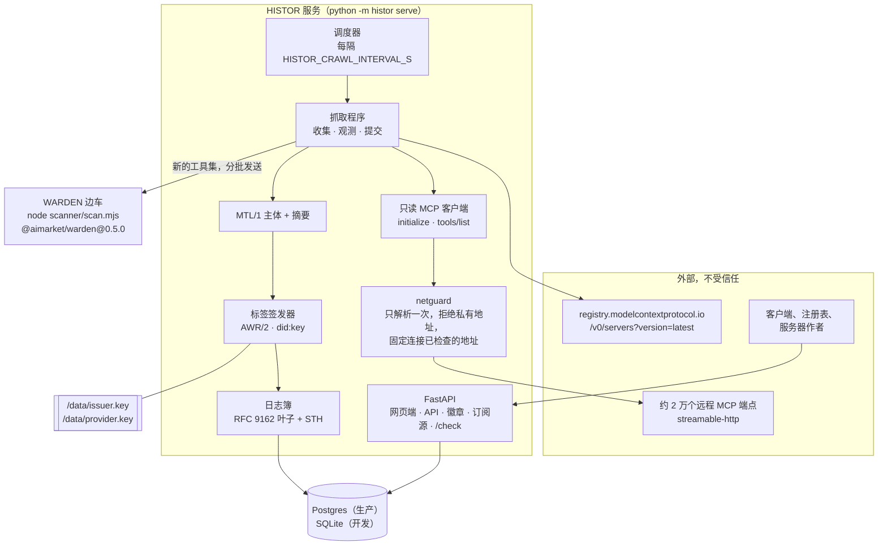
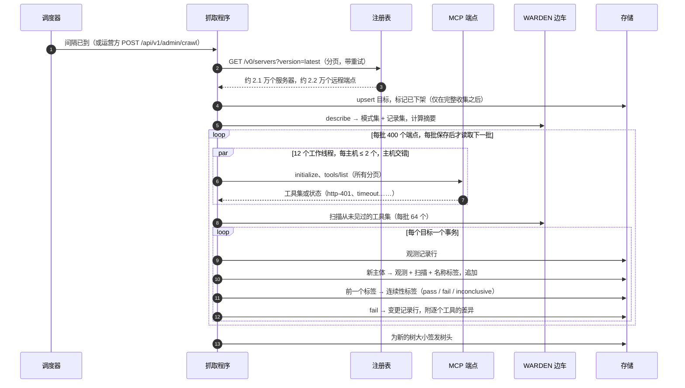
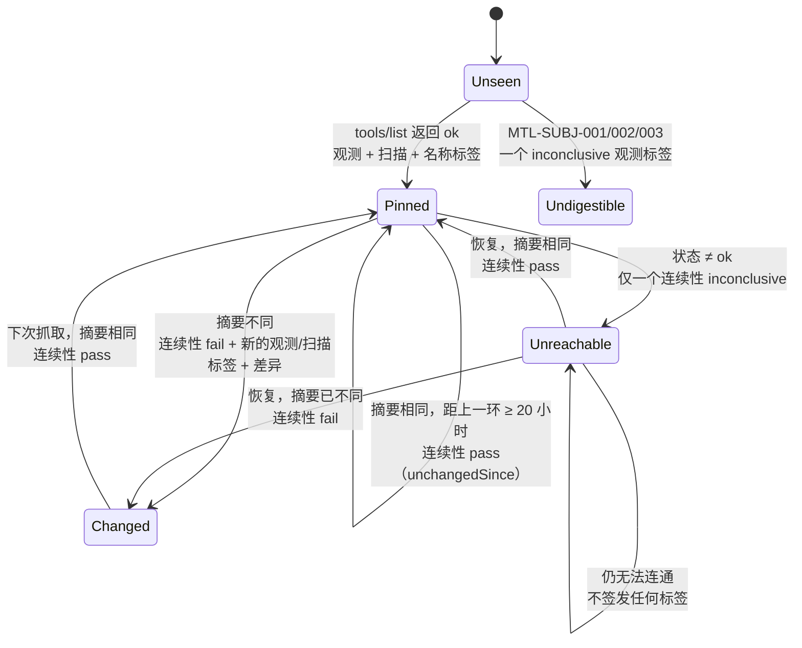
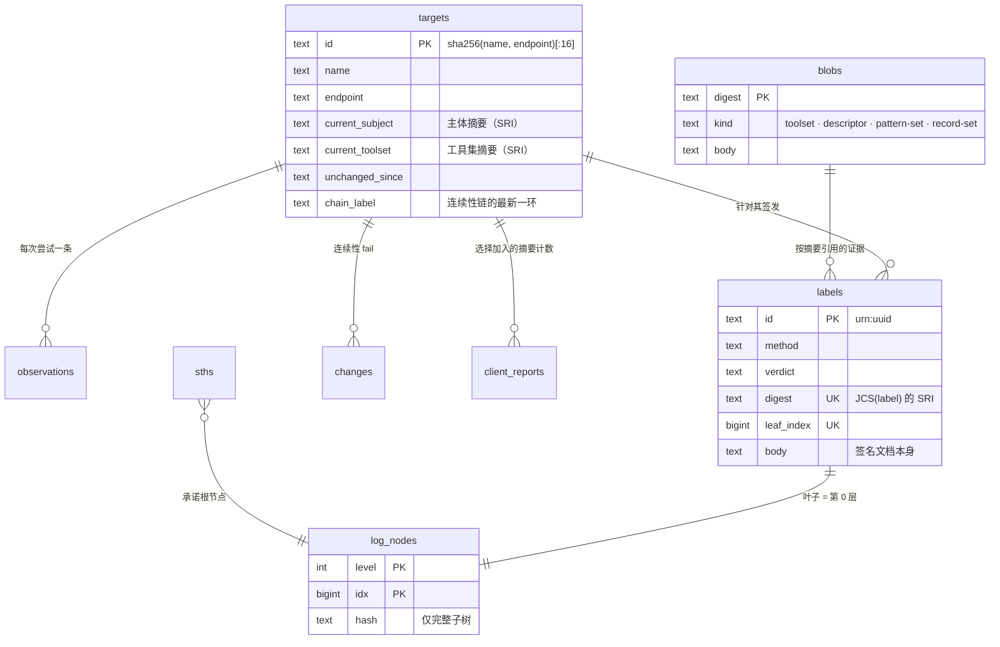

# 架构

> 🌐 [English](architecture.md) · [Русский](architecture.ru.md) · [Español](architecture.es.md) · [Français](architecture.fr.md) · **中文**

HISTOR 是一个 Python 服务加一个辅助进程。它知道的一切都来自两处读取——官方 MCP 注册表，以及每个
已列出服务器的 `tools/list`——而它发布的一切都由同一把密钥签名，并追加到同一份日志中。

## 模块

| 模块 | 职责 |
|---|---|
| `histor/registry.py` | 分页读取官方注册表（`version=latest`，带重试：每页耗时 1–50 秒），每个名称只保留一条记录，并把每个远程端点转为一个目标。它不会连接的端点也连同原因一起保留（`transport-not-observed`、`templated-url`、`cleartext-url`），这样公开数字的分母永远不会缩小。 |
| `histor/netguard.py` | 只解析一次主机名，只要**任何**一条解析结果不是公网地址就拒绝该目标，然后连接已检查的地址，并把 `Host` 和 TLS SNI 设为该主机名。DNS 重绑定永远得不到第二次查询的机会。 |
| `histor/mcpclient.py` | `initialize` → `notifications/initialized` → `tools/list`，沿 `nextCursor` 翻完所有分页。流式读取有大小上限，SSE 只读到我们的响应 id 为止，不跟随重定向，拒绝重复的 JSON 成员。它没有任何调用工具的代码路径。 |
| `histor/subject.py` | MTL/1 描述符与两个摘要，基于 AWR/2 参考规范化器实现。一项逐字节对等测试把它与该一致性档次（profile）自带的 `mtl_subject.py` 对照运行。 |
| `histor/scanner.py` + `scanner/scan.mjs` | 运行**已发布的** WARDEN 门控。边车（sidecar）在启动时描述自己的模式集和记录集，因此标签写明的是实际运行的那套规则的摘要。 |
| `histor/labels.py` | 四种标签方法，每种产出一份签名的 AWR/2 文档。MTL/1 的裁定规则在代码中强制执行（`MTL-METH-002`）。 |
| `histor/logbook.py` + `histor/merkle.py` | 叶子追加、树头、包含证明与一致性证明。只存储完整子树，因此每个证明只需 O(log n) 次读取。 |
| `histor/crawler.py` | 一次抓取：收集 → 观测（线程池，按主机限流，主机交错）→ 扫描新工具集 → 每个目标一个事务，按 `HISTOR_CRAWL_BATCH` 分批，每批保存后才读取下一批 → 签发树头。 |
| `histor/check.py` | `/check`：把客户端的工具集与观测结果比对；可选的、选择加入的摘要计数。 |
| `histor/app.py` | HTTP 接口：网页端、API、徽章、Atom 订阅源、运营方路由，以及 AIMarket 联邦 peer。 |
| `histor/db.py` + `histor/migrations.py` + `histor/store.py` | 与后端无关的存储：SQLite 与 Postgres 共用一种 SQL 方言，编号迁移，启动时检查列契约。 |

## 一次抓取

## 何时签发标签

日志应当记录事实，而不是噪声，因此相同的确定性结果不会每天重复签发。

新的 WARDEN 模式集或记录集（即新发布的软件包）会为每个当前主体重新签发扫描标签，因为两个扫描标签
只有在同一个集合下才可比较。

## 数据模型

## 存储与迁移

SQLite 是开发用存储：`HISTOR_DATA_DIR` 下的一个文件，WAL 模式，每次读取使用一个新连接，因此不会有
读取方停留在旧快照上、阻塞检查点。Postgres 用于生产：没有 `postgresql://` URL 时，
`HISTOR_PROFILE=prod` 拒绝启动。所有 SQL 只写一遍，限定在两种引擎共有的子集内；两者有分歧之处
（标识列），迁移会为每个后端各带一条语句。日志追加在其事务内获取 Postgres 咨询锁（advisory lock），
因此即使两个进程指向同一个数据库，叶子也仍然逐个追加。

迁移遵循与 HESTIA 和 Hub 共用的内部惯例：一张 `schema_migrations` 表、一个编号修订列表、每个修订
各在自己的事务中执行、出错即明确报错（fail-loud）。已发布的修订永不修改；如果数据库已应用了本构建
不认识的修订，就拒绝使用该数据库。

## 密钥

| 文件 | 签名对象 | 为何分开 |
|---|---|---|
| `issuer.key` | 每个标签（AWR/2，`did:key`）、每个树头（`histor.sth/v1`）、每个 `/check` 应答（`histor.check/v1`） | 读者要验证的一切共用一个身份；签名字节内的 `type` 可防止针对一种文档类型的签名被重放为另一种 |
| `provider.key`（+ `_mldsa`） | AIMarket 联邦文档（`.well-known`、manifest、互操作收据），在 `HISTOR_PQC=1` 时为 Ed25519 + ML-DSA-65 混合签名 | 使用 Hub 的协议；任何一把密钥都不能代替另一把签名 |

两把密钥都存放在数据卷上，权限 0600，从不放在环境变量或数据库中；启动时会拒绝符号链接和损坏的文件。
