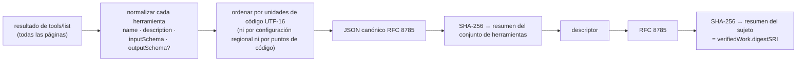

# Qué dice una etiqueta — y qué no

> 🌐 [English](labels.md) · [Русский](labels.ru.md) · **Español** · [Français](labels.fr.md) · [中文](labels.zh.md)

Cada etiqueta que emite HISTOR es una etiqueta [MTL/1](https://github.com/alexar76/aicom/blob/main/awr/adoption/mcp-trust-label/PROFILE.md):
un `VerificationVerdict` AWR/2 independiente, firmado con el `did:key` del registro y verificable
sin conexión con cualquier verificador AWR/2. Hasta donde sabemos, HISTOR es el primer emisor de ese
perfil sobre servidores reales.

## El sujeto

Una etiqueta trata sobre el par **(identidad del servidor, conjunto de herramientas anunciado)**: no
sobre el código, ni sobre el paquete, ni sobre quien lo publica. El sujeto es un MCP Server Descriptor:

```json
{
  "mtl": "1",
  "server": { "name": "io.example/weather", "registry": "urn:awr:mtl:1:registry:registry.modelcontextprotocol.io" },
  "toolSet": { "count": 2, "names": ["get_weather", "list_cities"], "digestSRI": "sha256-…" },
  "artifact": { "transport": "streamable-http", "endpoint": "https://example.com/mcp" }
}
```

El descriptor no lleva hora y, en HISTOR, tampoco versión: un servidor sin cambios produce cada día
el mismo resumen criptográfico (digest) del sujeto, así que detectar un cambio consiste en comparar
dos resúmenes. (Una subida de versión en el registro de MCP con herramientas idénticas no debe
leerse como «las definiciones cambiaron».)



Un conjunto de herramientas con un número fraccionario en cualquier parte de sus esquemas **no tiene
resumen calculable** según MTL/1: dos implementaciones podrían serializarlo de forma distinta. En
ese caso la etiqueta no lleva resumen y dice `inconclusive` con `MTL-NUM-001`, en lugar de fijar
unos bytes que nadie más puede reproducir.

## Los cuatro métodos

| Método | Se emite | `pass` | `fail` | `inconclusive` |
|---|---|---|---|---|
| `tool-set-observation` | la primera vez que un destino muestra un conjunto de herramientas | conjunto recorrido por completo, no vacío, con resumen | **nunca** | conjunto vacío, nombres duplicados, entrada malformada, número no entero |
| `tool-def-pattern-scan` | con cada observación nueva, y de nuevo cuando cambia el conjunto de patrones de WARDEN | ningún patrón coincidió | **nunca** | una o más coincidencias, cada una listada con su nivel |
| `tool-set-continuity` | en cada rastreo (con ≥ 20 h de separación) una vez que existe una etiqueta previa | el mismo resumen del sujeto que la etiqueta previa | los resúmenes difieren | falta el resumen en uno de los lados; la observación actual falló |
| `name-threat-match` | con cada observación nueva | el nombre y el endpoint no figuran en ningún registro | **nunca** | coincidió un registro (una señal sobre el nombre, no evidencia sobre el código) |

`fail` solo existe para la continuidad, porque es una afirmación mecánica sobre dos resúmenes ya
consignados. Una coincidencia de patrón no puede establecer que una definición sea incorrecta —el
conjunto de patrones distribuido marca una herramienta que recibe legítimamente un `api_key`—, así
que el resultado honesto distinto de `pass` es `inconclusive`, y cada coincidencia lleva su nivel de
WARDEN: las reglas `block` pueden rechazar una conexión en WARDEN; las reglas `advise`, nunca. Las
etiquetas **no llevan puntuación**: el único número disponible sería un producto de constantes de
las puertas, y publicarlo como una puntuación de seguridad de 0 a 1 sería lo más engañoso que podría
hacer una etiqueta.

## Cómo las muestra el panel

MTL/1 §9.2 obliga a cualquier registro de MCP que muestre etiquetas, y el propio panel y las
insignias de HISTOR lo cumplen.

| Resultado | Se muestra como | Nunca como |
|---|---|---|
| observación `pass` | «Definiciones de herramientas fijadas ‹fecha›» | «Verificado», «Auditado» |
| continuidad `pass` | «sin cambios desde ‹fecha›» | «Estable y seguro» |
| continuidad `fail` | «las definiciones de herramientas cambiaron ‹fecha›», en ámbar, con el diff | «Comprometido», «rug pull detectado» |
| escaneo `inconclusive` | «N patrones coincidieron — lea la definición», en tono neutro | «Fallido», «Peligroso», en rojo |
| sin etiqueta | «no observado» + el estado | «Fallido», o clasificado por debajo de un `inconclusive` |

## Verificar una etiqueta por su cuenta

```bash
curl -sS https://histor.modelmarket.dev/api/v1/labels/<label-id> -o label.json
pip install awr                                 # the AWR/2 reference implementation
python -m awr verify label.json                 # "valid": true, "profile": null (a verdict is not a receipt)

# Recompute the subject digest from the evidence, as MTL/1 §4.6 asks a registry to:
curl -sS https://histor.modelmarket.dev/api/v1/descriptors/<subject-digest> -o msd.json
python -m awr digest msd.json                    # must equal credentialSubject.verifiedWork.digestSRI
```

La evidencia que cita una etiqueta se sirve por resumen y nunca cambia: `/api/v1/toolsets/<sri>`,
`/api/v1/descriptors/<sri>`, `/api/v1/pattern-sets/<sri>`, `/api/v1/record-sets/<sri>`. Un
consumidor debería guardarla en caché por resumen al recibir una etiqueta, para que la etiqueta
conserve su significado aunque HISTOR desaparezca.

## Límites conocidos, declarados dentro de cada etiqueta

La frase `scope` de cada etiqueta está dentro de la firma, así que ninguna plantilla de página
puede suavizarla:

- solo texto anunciado: no se lee código fuente, no se resuelve ningún paquete, no se invoca ninguna herramienta;
- un servidor puede servir definiciones idénticas y cambiar su comportamiento;
- un servidor puede mostrar definiciones distintas a clientes distintos; un único rastreador no
  puede verlo, y por eso existe `/check` y por eso el siguiente paso es un segundo observador, operado por separado;
- la hora de observación es una afirmación de HISTOR; el registro hace imposible cambiarla después,
  no imposible haber mentido en su momento;
- los endpoints que exigen autenticación responden 401 a HISTOR y constan como no observados.
