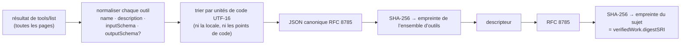

# Ce que dit une étiquette — et ce qu’elle ne dit pas

> 🌐 [English](labels.md) · [Русский](labels.ru.md) · [Español](labels.es.md) · **Français** · [中文](labels.zh.md)

Chaque étiquette émise par HISTOR est une étiquette [MTL/1](https://github.com/alexar76/aicom/blob/main/awr/adoption/mcp-trust-label/PROFILE.md) :
un `VerificationVerdict` AWR/2 autonome, signé par le `did:key` du journal, dont la signature se
contrôle hors ligne avec n’importe quel vérificateur AWR/2. HISTOR est, à notre connaissance, le
premier émetteur de ce profil face à de vrais serveurs.

## Le sujet

Une étiquette porte sur la paire **(identité du serveur, ensemble d’outils annoncé)** — pas sur le
code, ni sur le paquet, ni sur l’éditeur. Le sujet est un descripteur de serveur MCP (MCP Server
Descriptor) :

```json
{
  "mtl": "1",
  "server": { "name": "io.example/weather", "registry": "urn:awr:mtl:1:registry:registry.modelcontextprotocol.io" },
  "toolSet": { "count": 2, "names": ["get_weather", "list_cities"], "digestSRI": "sha256-…" },
  "artifact": { "transport": "streamable-http", "endpoint": "https://example.com/mcp" }
}
```

Le descripteur ne porte aucun horodatage et, dans HISTOR, aucune version : un serveur inchangé
produit chaque jour la même empreinte (digest) de sujet, si bien que détecter un changement revient
à comparer deux empreintes. (Une montée de version au registre avec des outils identiques ne doit
pas se lire comme « les définitions ont changé ».)



Un ensemble d’outils qui contient un nombre fractionnaire où que ce soit dans ses schémas n’a **pas
d’empreinte calculable** sous MTL/1 : deux implémentations pourraient le sérialiser différemment.
L’étiquette ne porte alors aucune empreinte et indique `inconclusive` avec `MTL-NUM-001`, plutôt que
de s’engager sur des octets que personne d’autre ne peut reproduire.

## Les quatre méthodes

| Méthode | Émise | `pass` | `fail` | `inconclusive` |
|---|---|---|---|---|
| `tool-set-observation` | la première fois qu’une cible présente un ensemble d’outils | ensemble d’outils parcouru en entier, non vide, empreinte calculée | **jamais** | ensemble vide, noms en double, entrée malformée, nombre non entier |
| `tool-def-pattern-scan` | à chaque nouvelle observation, et de nouveau quand l’ensemble de motifs de WARDEN change | aucun motif ne correspond | **jamais** | une ou plusieurs correspondances, chacune listée avec son niveau |
| `tool-set-continuity` | à chaque exploration (crawl), à ≥ 20 h d’écart, dès qu’une étiquette antérieure existe | même empreinte de sujet que l’étiquette antérieure | les empreintes diffèrent | pas d’empreinte d’un des deux côtés ; l’observation actuelle a échoué |
| `name-threat-match` | à chaque nouvelle observation | nom et point de terminaison (endpoint) ne figurent dans aucun enregistrement | **jamais** | un enregistrement correspond (un signal de nommage, pas une preuve concernant le code) |

`fail` n’existe que pour la continuité, parce qu’il s’agit d’une affirmation mécanique sur deux
empreintes consignées. Une correspondance de motif ne peut pas établir qu’une définition est fautive
— l’ensemble de motifs livré signale un outil qui prend légitimement un `api_key` —, si bien que le
résultat honnête autre que `pass` est `inconclusive`, et chaque correspondance porte son niveau
WARDEN : les règles `block` peuvent refuser une connexion dans WARDEN, les règles `advise` jamais.
Les étiquettes ne portent **aucun score** : le seul nombre disponible serait un produit de constantes
des contrôles, et le publier comme un score de sécurité de 0 à 1 serait la chose la plus trompeuse
qu’une étiquette puisse faire.

## Comment l’interface web les affiche

MTL/1 §9.2 s’impose à tout registre qui affiche des étiquettes, et l’interface web comme les badges
de HISTOR lui-même s’y conforment.

| Résultat | Affiché comme | Jamais comme |
|---|---|---|
| observation `pass` | « Définitions d’outils épinglées le ‹date› » | « Vérifié », « Audité » |
| continuité `pass` | « inchangé depuis le ‹date› » | « Stable et sécurisé » |
| continuité `fail` | « les définitions d’outils ont changé le ‹date› », en ambre, avec le diff | « Compromis », « rug pull détecté » |
| analyse `inconclusive` | « N motifs correspondent — lisez la définition », neutre | « Échec », « Dangereux », rouge |
| pas d’étiquette | « non observé » + le statut | « Échec », ou classé en dessous d’un inconclusive |

## Vérifier une étiquette soi-même

```bash
curl -sS https://histor.modelmarket.dev/api/v1/labels/<label-id> -o label.json
pip install awr                                 # the AWR/2 reference implementation
python -m awr verify label.json                 # "valid": true, "profile": null (a verdict is not a receipt)

# Recompute the subject digest from the evidence, as MTL/1 §4.6 asks a registry to:
curl -sS https://histor.modelmarket.dev/api/v1/descriptors/<subject-digest> -o msd.json
python -m awr digest msd.json                    # must equal credentialSubject.verifiedWork.digestSRI
```

Les éléments de preuve cités par une étiquette sont servis par empreinte et ne changent jamais :
`/api/v1/toolsets/<sri>`, `/api/v1/descriptors/<sri>`, `/api/v1/pattern-sets/<sri>`,
`/api/v1/record-sets/<sri>`. Un consommateur devrait les mettre en cache par empreinte dès qu’il
reçoit une étiquette, pour que l’étiquette garde son sens même si HISTOR disparaît.

## Limites connues, énoncées dans chaque étiquette

La phrase `scope` de chaque étiquette se trouve à l’intérieur de la signature, si bien qu’aucun
gabarit de page ne peut l’atténuer :

- texte annoncé uniquement — aucune source lue, aucun paquet résolu, aucun outil invoqué ;
- un serveur peut servir des définitions identiques et changer de comportement ;
- un serveur peut montrer des définitions différentes à des clients différents ; un robot
  d’exploration unique ne peut pas le voir, c’est pourquoi `/check` existe et pourquoi un second
  observateur, exploité séparément, est la prochaine étape ;
- l’heure d’observation est une assertion de HISTOR ; le journal rend impossible de la modifier
  après coup, pas impossible d’avoir menti à son sujet sur le moment ;
- les points de terminaison derrière une authentification répondent 401 à HISTOR et sont consignés
  comme non observés.
