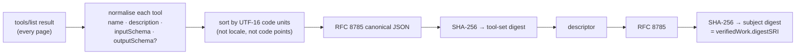

# What a label says — and what it does not

> 🌐 **English** · [Русский](labels.ru.md) · [Español](labels.es.md) · [Français](labels.fr.md) · [中文](labels.zh.md)

Every label HISTOR issues is an [MTL/1](https://github.com/alexar76/aicom/blob/main/awr/adoption/mcp-trust-label/PROFILE.md)
label: a standalone AWR/2 `VerificationVerdict`, signed by the log's `did:key`, verifiable offline
with any AWR/2 verifier. HISTOR is, as far as we know, the first issuer of that profile against
real servers.

## The subject

A label is about the pair **(server identity, advertised tool set)** — not the code, not the
package, not the publisher. The subject is an MCP Server Descriptor:

```json
{
  "mtl": "1",
  "server": { "name": "io.example/weather", "registry": "urn:awr:mtl:1:registry:registry.modelcontextprotocol.io" },
  "toolSet": { "count": 2, "names": ["get_weather", "list_cities"], "digestSRI": "sha256-…" },
  "artifact": { "transport": "streamable-http", "endpoint": "https://example.com/mcp" }
}
```

The descriptor carries no time and, in HISTOR, no version: an unchanged server produces the same
subject digest every day, so detecting a change is comparing two digests. (A registry version bump
with identical tools must not read as "definitions changed".)



A tool set with a fractional number anywhere in its schemas is **not digestible** under MTL/1:
two implementations may serialise it differently. The label then carries no digest and says
`inconclusive` with `MTL-NUM-001`, rather than committing to bytes nobody else can reproduce.

## The four methods

| Method | Issued | `pass` | `fail` | `inconclusive` |
|---|---|---|---|---|
| `tool-set-observation` | first time a target shows a tool set | tool set drained, non-empty, digested | **never** | empty set, duplicate names, malformed entry, non-integer number |
| `tool-def-pattern-scan` | with every new observation, and again when WARDEN's pattern set changes | no pattern matched | **never** | one or more matches, each listed with its tier |
| `tool-set-continuity` | each crawl (≥ 20 h apart) once a prior label exists | same subject digest as the prior label | the digests differ | no digest on one side; the current observation failed |
| `name-threat-match` | with every new observation | name and endpoint on no record | **never** | a record matched (a naming signal, not evidence about code) |

`fail` exists only for continuity, because it is a mechanical statement about two committed digests.
A pattern match cannot establish that a definition is wrong — the shipped pattern set flags a tool
that legitimately takes an `api_key` — so the honest non-`pass` outcome is `inconclusive`, and every
match carries its WARDEN tier: `block` rules can refuse a connection in WARDEN, `advise` rules never
do. Labels carry **no score**: the only number available would be a product of gate constants, and
publishing it as a 0–1 safety score would be the most misleading thing a label could do.

## How the desk renders them

MTL/1 §9.2 binds any registry that displays labels, and HISTOR's own desk and badges follow it.

| Outcome | Rendered as | Never as |
|---|---|---|
| observation `pass` | "Tool definitions pinned ‹date›" | Verified, Audited |
| continuity `pass` | "unchanged since ‹date›" | Stable and secure |
| continuity `fail` | "tool definitions changed ‹date›", amber, with the diff | Compromised, rug pull detected |
| scan `inconclusive` | "N patterns matched — read the definition", neutral | Failed, Dangerous, red |
| no label | "not observed" + the status | Failed, or ranked below an inconclusive |

## Verifying a label yourself

```bash
curl -sS https://histor.modelmarket.dev/api/v1/labels/<label-id> -o label.json
pip install awr                                 # the AWR/2 reference implementation
python -m awr verify label.json                 # "valid": true, "profile": null (a verdict is not a receipt)

# Recompute the subject digest from the evidence, as MTL/1 §4.6 asks a registry to:
curl -sS https://histor.modelmarket.dev/api/v1/descriptors/<subject-digest> -o msd.json
python -m awr digest msd.json                    # must equal credentialSubject.verifiedWork.digestSRI
```

The evidence a label cites is served by digest and never changes: `/api/v1/toolsets/<sri>`,
`/api/v1/descriptors/<sri>`, `/api/v1/pattern-sets/<sri>`, `/api/v1/record-sets/<sri>`. A consumer
should cache them by digest when it receives a label, so the label keeps its meaning even if HISTOR
disappears.

## Known limits, stated inside every label

Each label's `scope` sentence is inside the signature, so no page template can soften it:

- advertised text only — no source read, no package resolved, no tool invoked;
- a server can serve identical definitions and change behaviour;
- a server can show different clients different definitions; a single crawler cannot see that,
  which is why `/check` exists and why a second, separately operated observer is the next step;
- observation time is HISTOR's assertion; the log makes it impossible to change afterwards, not
  impossible to have lied about at the time;
- endpoints behind authentication answer 401 to HISTOR and are recorded as not observed.
