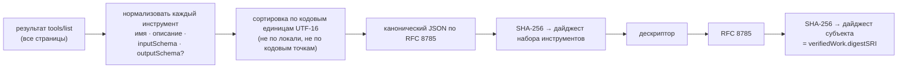

# Что говорит метка — и чего она не говорит

> 🌐 [English](labels.md) · **Русский** · [Español](labels.es.md) · [Français](labels.fr.md) · [中文](labels.zh.md)

Каждая метка, которую выпускает HISTOR, — метка [MTL/1](https://github.com/alexar76/aicom/blob/main/awr/adoption/mcp-trust-label/PROFILE.md):
самостоятельный `VerificationVerdict` AWR/2, подписанный `did:key` журнала и пригодный для
офлайн-проверки любым верификатором AWR/2. Насколько нам известно, HISTOR — первый эмиттер
(выпускающая сторона) этого профиля, работающий с реальными серверами.

## Субъект

Метка говорит о паре **(идентичность сервера, объявленный набор инструментов)** — не о коде, не о
пакете и не об издателе. Субъект — MCP Server Descriptor (дескриптор MCP-сервера):

```json
{
  "mtl": "1",
  "server": { "name": "io.example/weather", "registry": "urn:awr:mtl:1:registry:registry.modelcontextprotocol.io" },
  "toolSet": { "count": 2, "names": ["get_weather", "list_cities"], "digestSRI": "sha256-…" },
  "artifact": { "transport": "streamable-http", "endpoint": "https://example.com/mcp" }
}
```

В дескрипторе нет времени, а в HISTOR — и версии: неизменившийся сервер каждый день даёт один и тот
же дайджест субъекта, поэтому обнаружить изменение — значит сравнить два дайджеста. (Повышение
версии в реестре при тех же инструментах не должно читаться как «определения изменились».)



Набор инструментов, в схемах которого где-либо встречается дробное число, по MTL/1 **не
хэшируется**: две реализации могут сериализовать его по-разному. Тогда метка не несёт дайджеста и
говорит `inconclusive` с `MTL-NUM-001`, а не фиксирует байты, которые никто другой не сможет воспроизвести.

## Четыре метода

| Метод | Когда выпускается | `pass` | `fail` | `inconclusive` |
|---|---|---|---|---|
| `tool-set-observation` | когда цель впервые показывает набор инструментов | набор прочитан со всех страниц, не пуст, дайджест вычислен | **никогда** | пустой набор, повторяющиеся имена, некорректная запись, нецелое число |
| `tool-def-pattern-scan` | с каждым новым наблюдением и повторно, когда меняется набор шаблонов WARDEN | ни один шаблон не совпал | **никогда** | одно или несколько совпадений, каждое с указанием своего уровня |
| `tool-set-continuity` | при каждом обходе (с интервалом ≥ 20 ч), если уже есть прежняя метка | тот же дайджест субъекта, что у прежней метки | дайджесты различаются | с одной из сторон нет дайджеста; текущее наблюдение не удалось |
| `name-threat-match` | с каждым новым наблюдением | имени и эндпоинта нет ни в одной записи | **никогда** | совпала запись (сигнал об имени, а не свидетельство о коде) |

`fail` есть только у непрерывности, потому что это механическое утверждение о двух зафиксированных
дайджестах. Совпадение шаблона не может установить, что определение неправильное, — поставляемый
набор шаблонов отмечает инструмент, который вполне законно принимает `api_key`, — поэтому честный
исход, отличный от `pass`, — `inconclusive`, и у каждого совпадения указан его уровень в WARDEN:
правила `block` в WARDEN могут отказать в подключении, правила `advise` — никогда. **Баллов у меток
нет**: единственным доступным числом было бы произведение констант гейтов, и опубликовать его как
«оценку безопасности» от 0 до 1 — самое вводящее в заблуждение, что метка могла бы сделать.

## Как их отображает веб-интерфейс

MTL/1 §9.2 обязателен для любого реестра, который показывает метки, и собственные веб-интерфейс и
бейджи HISTOR ему следуют.

| Исход | Отображается как | Никогда как |
|---|---|---|
| наблюдение `pass` | «Определения инструментов закреплены ‹дата›» | «Проверено», «Проверено аудитом» |
| непрерывность `pass` | «без изменений с ‹даты›» | «Стабильно и безопасно» |
| непрерывность `fail` | «определения инструментов изменились ‹дата›», янтарным, с диффом | «Скомпрометирован», «обнаружен rug pull» |
| сканирование `inconclusive` | «совпало шаблонов: N — прочитайте определение», нейтрально | «Не пройдено», «Опасно», красным |
| метки нет | «не наблюдался» + статус | «Не пройдено» или ниже inconclusive в рейтинге |

## Как верифицировать метку самостоятельно

```bash
curl -sS https://histor.modelmarket.dev/api/v1/labels/<label-id> -o label.json
pip install awr                                 # the AWR/2 reference implementation
python -m awr verify label.json                 # "valid": true, "profile": null (a verdict is not a receipt)

# Recompute the subject digest from the evidence, as MTL/1 §4.6 asks a registry to:
curl -sS https://histor.modelmarket.dev/api/v1/descriptors/<subject-digest> -o msd.json
python -m awr digest msd.json                    # must equal credentialSubject.verifiedWork.digestSRI
```

Свидетельства, на которые ссылается метка, отдаются по дайджесту и никогда не меняются:
`/api/v1/toolsets/<sri>`, `/api/v1/descriptors/<sri>`, `/api/v1/pattern-sets/<sri>`,
`/api/v1/record-sets/<sri>`. Потребителю стоит кэшировать их по дайджесту сразу при получении
метки — тогда метка сохранит свой смысл, даже если HISTOR исчезнет.

## Известные ограничения, записанные в каждой метке

Фраза `scope` каждой метки находится под подписью, поэтому никакой шаблон страницы не может её смягчить:

- только объявленный текст — исходники не читаются, пакеты не разрешаются, инструменты не вызываются;
- сервер может отдавать прежние определения и при этом изменить поведение;
- сервер может показывать разным клиентам разные определения; один обходчик этого не увидит —
  поэтому и существует `/check`, а следующим шагом станет второй наблюдатель под управлением другой стороны;
- время наблюдения — утверждение HISTOR; журнал делает невозможным изменить его задним числом, но
  не делает невозможной ложь в момент записи;
- эндпоинты за аутентификацией отвечают HISTOR кодом 401 и записываются как не наблюдавшиеся.
