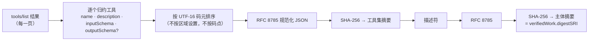

# 标签说明什么——以及不说明什么

> 🌐 [English](labels.md) · [Русский](labels.ru.md) · [Español](labels.es.md) · [Français](labels.fr.md) · **中文**

HISTOR 签发的每个标签都是 [MTL/1](https://github.com/alexar76/aicom/blob/main/awr/adoption/mcp-trust-label/PROFILE.md)
标签：一份独立的 AWR/2 `VerificationVerdict`，由日志的 `did:key` 签名，任何 AWR/2 验证方都可以离线
验证。据我们所知，HISTOR 是第一个针对真实服务器签发该一致性档次（profile）标签的签发方。

## 主体

标签所针对的是这一对：**（服务器身份，公布的工具集）**——不是代码，不是软件包，也不是发布者。主体是
一个 MCP 服务器描述符（MCP Server Descriptor）：

```json
{
  "mtl": "1",
  "server": { "name": "io.example/weather", "registry": "urn:awr:mtl:1:registry:registry.modelcontextprotocol.io" },
  "toolSet": { "count": 2, "names": ["get_weather", "list_cities"], "digestSRI": "sha256-…" },
  "artifact": { "transport": "streamable-http", "endpoint": "https://example.com/mcp" }
}
```

描述符不含时间，在 HISTOR 中也不含版本：未变更的服务器每天都产生相同的主体摘要，因此检测变更就是比较
两个摘要。（注册表中的版本号升级如果工具完全相同，就不能被读作“定义已变更”。）



如果工具集的 schema 中任何位置出现小数，它在 MTL/1 下就**无法计算摘要**：两种实现可能以不同方式
序列化它。此时标签不含摘要，给出 `inconclusive` 和 `MTL-NUM-001`，而不是承诺一串别人无法复现的字节。

## 四种方法

| 方法 | 签发时机 | `pass` | `fail` | `inconclusive` |
|---|---|---|---|---|
| `tool-set-observation` | 目标首次呈现某个工具集时 | 工具集已翻完所有分页、非空、已计算摘要 | **从不** | 空集、名称重复、条目格式错误、非整数数字 |
| `tool-def-pattern-scan` | 每次有新观测时，以及 WARDEN 模式集变更时再次签发 | 没有匹配任何模式 | **从不** | 一项或多项匹配，每项列出其级别 |
| `tool-set-continuity` | 已有前一个标签后，每次抓取时（间隔 ≥ 20 小时） | 主体摘要与前一个标签相同 | 两个摘要不同 | 某一方没有摘要；当前观测失败 |
| `name-threat-match` | 每次有新观测时 | 名称和端点不在任何记录上 | **从不** | 匹配到一条记录（这是命名上的信号，不是关于代码的证据） |

`fail` 只存在于连续性方法中，因为它是关于两个已承诺摘要的机械陈述。模式匹配无法认定某个定义有问题
——随包发布的模式集甚至会标记一个合理地接收 `api_key` 的工具——因此诚实的非 `pass` 结果是
`inconclusive`，并且每项匹配都带有其 WARDEN 级别：`block` 规则在 WARDEN 中可以拒绝连接，`advise`
规则从不会。标签**不含评分**：唯一能得到的数字只是门控常量的乘积，而把它当作 0–1 的安全评分发布，
将是标签所能做的最具误导性的事。

## 网页端如何呈现

MTL/1 §9.2 约束任何展示标签的注册表，HISTOR 自己的网页端和徽章也遵守它。

| 结果 | 呈现为 | 绝不呈现为 |
|---|---|---|
| 观测 `pass` | “工具定义已固定 ‹日期›” | “已验证”“已审计” |
| 连续性 `pass` | “自 ‹日期› 起未变更” | “稳定且安全” |
| 连续性 `fail` | “工具定义已变更 ‹日期›”，琥珀色，附差异 | “已被攻破”“检测到 rug pull” |
| 扫描 `inconclusive` | “匹配 N 个模式——请阅读定义”，中性色 | “失败”“危险”、红色 |
| 无标签 | “未观测” + 状态 | “失败”，或排在 inconclusive 之后 |

## 自行验证标签

```bash
curl -sS https://histor.modelmarket.dev/api/v1/labels/<label-id> -o label.json
pip install awr                                 # the AWR/2 reference implementation
python -m awr verify label.json                 # "valid": true, "profile": null (a verdict is not a receipt)

# Recompute the subject digest from the evidence, as MTL/1 §4.6 asks a registry to:
curl -sS https://histor.modelmarket.dev/api/v1/descriptors/<subject-digest> -o msd.json
python -m awr digest msd.json                    # must equal credentialSubject.verifiedWork.digestSRI
```

标签引用的证据按摘要提供，且永不改变：`/api/v1/toolsets/<sri>`、`/api/v1/descriptors/<sri>`、
`/api/v1/pattern-sets/<sri>`、`/api/v1/record-sets/<sri>`。消费方在收到标签时应按摘要缓存这些证据，
这样即使 HISTOR 消失，标签也不会失去意义。

## 已知局限，写在每个标签之内

每个标签的 `scope` 语句都在签名范围之内，因此任何页面模板都无法将其弱化：

- 只针对公布的文本——不读取源码，不解析软件包，不调用工具；
- 服务器可以提供完全相同的定义，同时改变行为；
- 服务器可以向不同客户端展示不同的定义；单个抓取程序看不到这一点，这正是 `/check` 存在的原因，
  也是下一步要设立第二个独立运营的观测方的原因；
- 观测时间是 HISTOR 的断言；日志让它事后无法更改，但不能保证它在当时没有说谎；
- 需要鉴权的端点会向 HISTOR 返回 401，并被记录为未观测。
