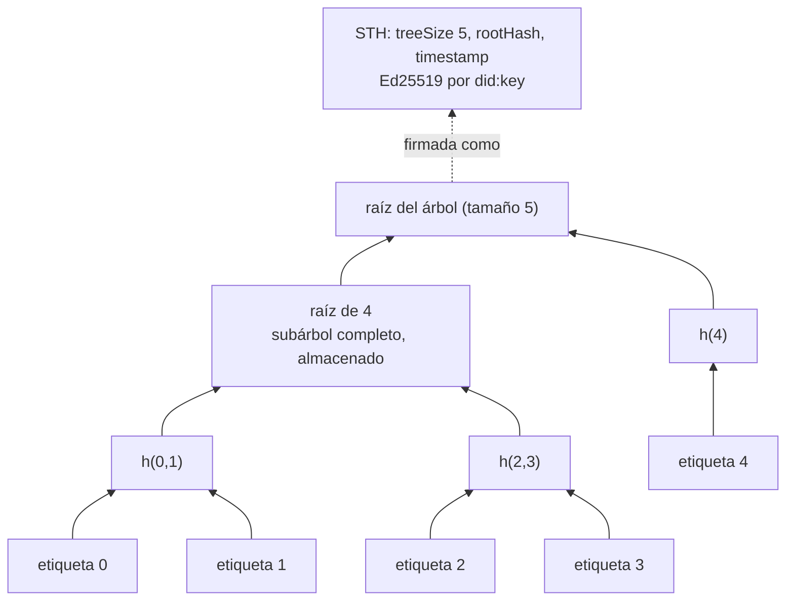
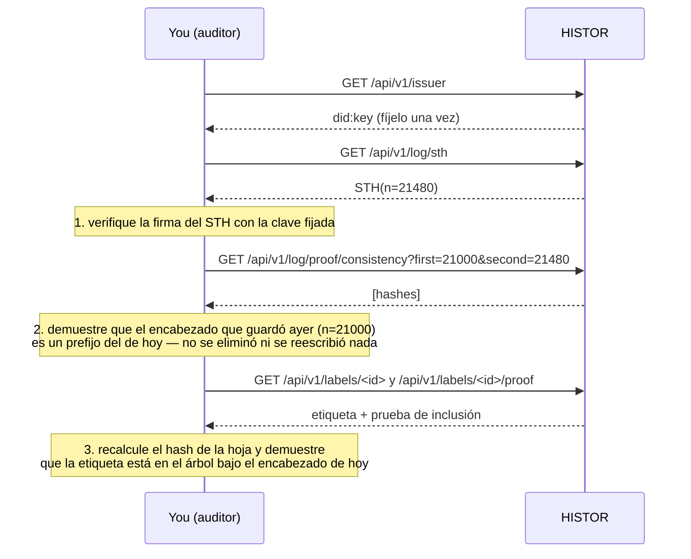

# Auditar el registro

> 🌐 [English](log.md) · [Русский](log.ru.md) · **Español** · [Français](log.fr.md) · [中文](log.zh.md)

Un registro de transparencia solo vale algo si un lector que no confía en su operador puede
comprobarlo. Esta página es esa comprobación, de principio a fin, sin nada más que la clave pública
del registro.

## El árbol

El registro de HISTOR es un árbol de Merkle exactamente como lo define [RFC 9162](https://www.rfc-editor.org/rfc/rfc9162)
(Certificate Transparency v2). Cada etiqueta es una hoja, en orden de emisión, para siempre.

```
leaf hash = SHA-256(0x00 ‖ JCS(label document))
node hash = SHA-256(0x01 ‖ left ‖ right)
```

La entrada de la hoja es la forma canónica RFC 8785 de la etiqueta firmada que usted descarga de
`/api/v1/labels/<id>`, así que cualquiera que tenga una etiqueta puede recalcular el hash de su hoja
sin preguntar a nadie.



HISTOR solo almacena subárboles completos; cada raíz y cada prueba se calcula a partir de, como
máximo, log₂ n de ellos. Nada de una hoja puede cambiar sin que cambien todas las raíces que tiene
por encima.

## El encabezado de árbol firmado

Tras cada rastreo, HISTOR firma un encabezado sobre el árbol tal como está en ese momento: el
encabezado de árbol firmado (STH).

```json
{
  "type": "histor.sth/v1",
  "log": "did:key:z6Mk…",
  "treeSize": 21480,
  "rootHash": "fe3dcf88209e9b0e…",
  "timestamp": "2026-09-23T09:13:04Z",
  "signature": { "alg": "Ed25519", "verificationMethod": "did:key:z6Mk…#z6Mk…", "value": "<base64url>" }
}
```

La firma es Ed25519 sobre los bytes RFC 8785 de todos los miembros excepto `signature`. La clave es
la que contiene el `did:key` (multicodec `0xed01` + 32 bytes), la misma que firma cada etiqueta.
`type` está dentro de los bytes firmados, así que una firma sobre una etiqueta o sobre una respuesta
de `/check` nunca puede hacerse pasar por un encabezado de árbol.

## Tres preguntas, tres pruebas



| Pregunta | Prueba | Endpoint |
|---|---|---|
| ¿Firmó esto el registro? | Ed25519 sobre el STH | `/api/v1/log/sth`, `/api/v1/log/sth/<size>` |
| ¿Solo ha añadido desde la última vez que miré? | prueba de consistencia, RFC 9162 §2.1.4 | `/api/v1/log/proof/consistency?first=&second=` |
| ¿Está esta etiqueta en el registro? | prueba de inclusión, RFC 9162 §2.1.3 | `/api/v1/labels/<id>/proof` o `/api/v1/log/proof/inclusion?leaf_index=&tree_size=` |

## Hacerlo

El paquete incluye un auditor que no necesita base de datos, ni claves, ni configuración: es un
extraño para el registro, y de eso se trata:

```bash
pip install "git+https://github.com/alexar76/histor"   # or, in a checkout: uv run --project . python -m histor audit …
python -m histor audit https://histor.modelmarket.dev --state ~/.histor/sth.json
python -m histor audit https://histor.modelmarket.dev --state ~/.histor/sth.json --label urn:uuid:…
```

Verifica el encabezado con la clave del registro, demuestra la consistencia con el encabezado que
guardó la última vez (y se niega a continuar si el registro se encogió, reescribió una raíz con el
mismo tamaño o cambió de clave), opcionalmente demuestra la inclusión de una etiqueta y guarda el
nuevo encabezado. El código de salida 0 significa que todas las comprobaciones pasaron. Ejecútelo
desde cron en una máquina que usted controle y será un testigo.

El panel hace lo mismo en su navegador, en la [página del registro](https://histor.modelmarket.dev/log):
«Guardar este encabezado en este navegador» lo almacena localmente, y en la siguiente visita demuestra
la consistencia frente a él con WebCrypto, en su navegador, contra la clave del registro. El código que
lo hace es `docs/landing/assets/desk.js`, unas cien líneas legibles, así que puede comprobar qué comprueba.

## Lo que el registro no demuestra

- **Tiempo.** `timestamp` y el `observedAt` de cada etiqueta son afirmaciones de HISTOR. El registro
  hace imposible cambiarlas después, no imposible que fueran erróneas cuando se escribieron.
- **Completitud.** Un servidor que no figura en el registro de MCP, o que responde 401, no está en el registro de transparencia.
- **Una sola vista para todos.** Un registro podría mostrar árboles distintos a lectores distintos. La
  defensa es el intercambio entre auditores (gossip): comparar los encabezados que recibieron. Publique
  los suyos; un segundo observador, operado por separado, que firme conjuntamente los encabezados es
  el siguiente paso de la hoja de ruta.
