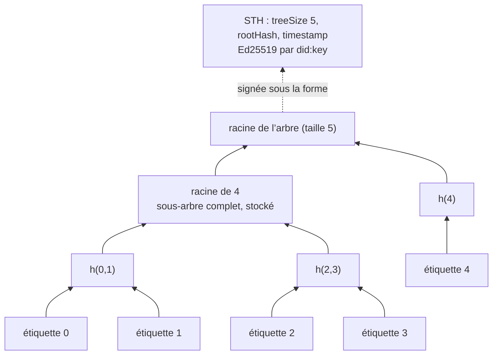
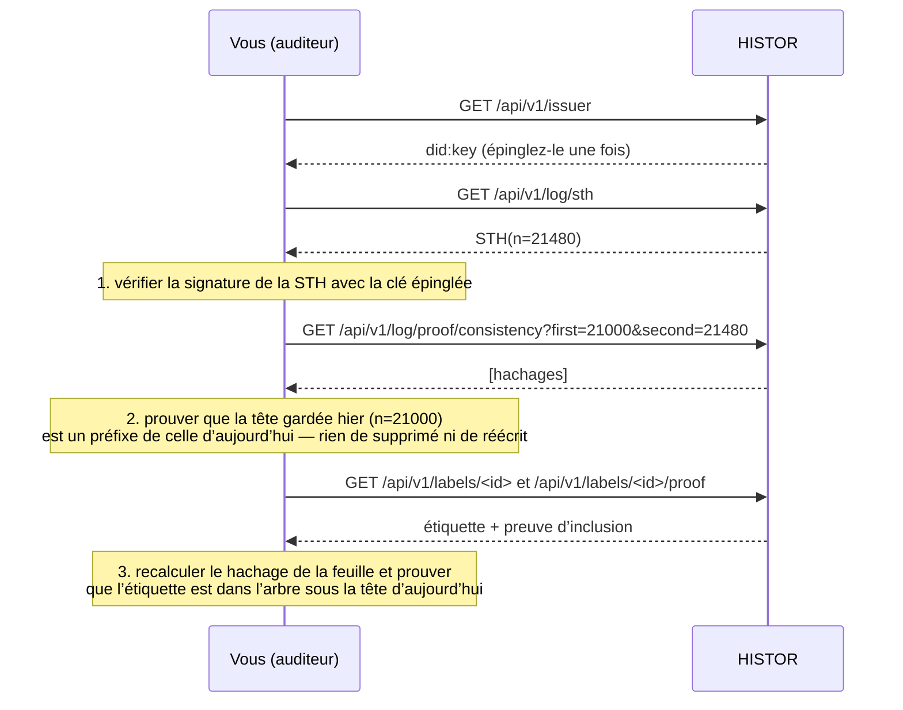

# Auditer le journal

> 🌐 [English](log.md) · [Русский](log.ru.md) · [Español](log.es.md) · **Français** · [中文](log.zh.md)

Un journal de transparence ne vaut quelque chose que si un lecteur qui ne fait pas confiance à son
opérateur peut le contrôler. Cette page est ce contrôle, de bout en bout, avec rien d’autre que la
clé publique du journal.

## L’arbre

Le journal de HISTOR est un arbre de Merkle exactement tel que le définit la [RFC 9162](https://www.rfc-editor.org/rfc/rfc9162)
(Certificate Transparency v2). Chaque étiquette est une feuille, dans l’ordre d’émission, pour toujours.

```
leaf hash = SHA-256(0x00 ‖ JCS(label document))
node hash = SHA-256(0x01 ‖ left ‖ right)
```

L’entrée de la feuille est la forme canonique RFC 8785 de l’étiquette signée que vous téléchargez
depuis `/api/v1/labels/<id>` : quiconque détient une étiquette peut donc recalculer le hachage de sa
feuille sans rien demander à personne.



HISTOR ne stocke que les sous-arbres complets ; chaque racine et chaque preuve se calcule à partir
d’au plus log₂ n d’entre eux. Rien dans une feuille ne peut changer sans changer chaque racine
au-dessus d’elle.

## La tête d’arbre signée

Après chaque exploration (crawl), HISTOR signe une tête portant sur l’arbre tel qu’il est à cet
instant — la tête d’arbre signée (STH) :

```json
{
  "type": "histor.sth/v1",
  "log": "did:key:z6Mk…",
  "treeSize": 21480,
  "rootHash": "fe3dcf88209e9b0e…",
  "timestamp": "2026-09-23T09:13:04Z",
  "signature": { "alg": "Ed25519", "verificationMethod": "did:key:z6Mk…#z6Mk…", "value": "<base64url>" }
}
```

La signature est une signature Ed25519 sur les octets RFC 8785 de tous les membres sauf `signature`.
La clé est celle que contient le `did:key` (multicodec `0xed01` + 32 octets), la même clé qui signe
chaque étiquette. `type` fait partie des octets signés : une signature portant sur une étiquette ou
sur une réponse `/check` ne peut donc jamais passer pour une tête d’arbre.

## Trois questions, trois preuves



| Question | Preuve | Point de terminaison (endpoint) |
|---|---|---|
| Le journal a-t-il signé ceci ? | Ed25519 sur la STH | `/api/v1/log/sth`, `/api/v1/log/sth/<size>` |
| N’a-t-il fait qu’ajouter depuis ma dernière visite ? | preuve de cohérence, RFC 9162 §2.1.4 | `/api/v1/log/proof/consistency?first=&second=` |
| Cette étiquette est-elle dans le journal ? | preuve d’inclusion, RFC 9162 §2.1.3 | `/api/v1/labels/<id>/proof` ou `/api/v1/log/proof/inclusion?leaf_index=&tree_size=` |

## En pratique

Le paquet fournit un auditeur qui n’a besoin ni de base de données, ni de clés, ni de configuration
— c’est un étranger pour le journal, et c’est tout l’intérêt :

```bash
pip install "git+https://github.com/alexar76/histor"   # or, in a checkout: uv run --project . python -m histor audit …
python -m histor audit https://histor.modelmarket.dev --state ~/.histor/sth.json
python -m histor audit https://histor.modelmarket.dev --state ~/.histor/sth.json --label urn:uuid:…
```

Il vérifie la tête avec la clé du journal, prouve la cohérence avec la tête qu’il a enregistrée la
dernière fois (et refuse si le journal a rétréci, a réécrit une racine pour une même taille ou a
changé de clé), prouve éventuellement l’inclusion d’une étiquette, puis enregistre la nouvelle tête.
Un code de sortie 0 signifie que tous les contrôles ont réussi. Lancez-le depuis cron sur une
machine que vous contrôlez, et vous devenez un témoin.

L’interface web fait de même dans votre navigateur, sur la [page Journal](https://histor.modelmarket.dev/log) :
« Garder cette tête » stocke la tête localement, et la visite suivante prouve la cohérence par
rapport à elle avec WebCrypto, dans votre navigateur, avec la clé du journal. Le code qui s’en charge
est `docs/landing/assets/desk.js`, une centaine de lignes lisibles : vous pouvez donc contrôler ce
qu’il contrôle.

## Ce que le journal ne prouve pas

- **Le temps.** `timestamp` et le `observedAt` de chaque étiquette sont des assertions de HISTOR. Le
  journal rend impossible de les modifier après coup, pas impossible qu’ils aient été faux au moment
  de leur écriture.
- **L’exhaustivité.** Un serveur absent du registre, ou qui répond 401, n’est pas dans le journal.
- **Une même vue pour tous.** Un journal pourrait montrer des arbres différents à des lecteurs
  différents. La parade, c’est le *gossip* : des auditeurs qui comparent les têtes qu’ils ont reçues.
  Publiez la vôtre ; un second observateur, exploité séparément et cosignant les têtes, est la
  prochaine étape de la feuille de route.
