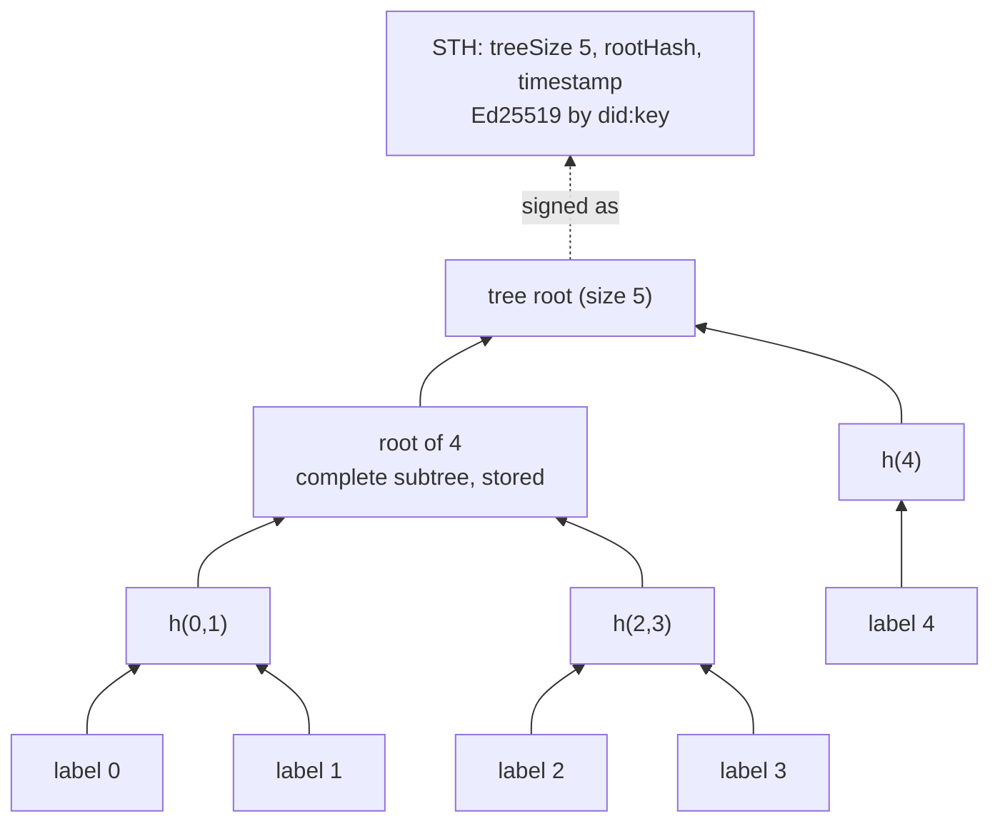
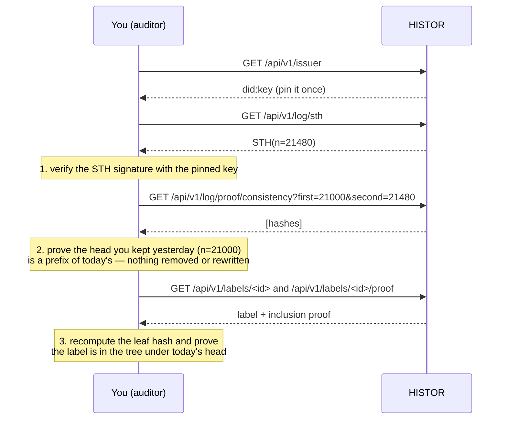

# Auditing the log

> 🌐 **English** · [Русский](log.ru.md) · [Español](log.es.md) · [Français](log.fr.md) · [中文](log.zh.md)

A transparency log is only worth something if a reader who does not trust its operator can check
it. This page is that check, end to end, with nothing but the log's public key.

## The tree

HISTOR's log is a Merkle tree exactly as [RFC 9162](https://www.rfc-editor.org/rfc/rfc9162)
(Certificate Transparency v2) defines it. Every label is one leaf, in issue order, forever.

```
leaf hash = SHA-256(0x00 ‖ JCS(label document))
node hash = SHA-256(0x01 ‖ left ‖ right)
```

The leaf input is the RFC 8785 canonical form of the signed label you download from
`/api/v1/labels/<id>`, so anyone holding a label can recompute its leaf hash without asking.



HISTOR stores only complete subtrees; every root and proof is computed from at most log₂ n of
them. Nothing about a leaf can change without changing every root above it.

## The signed tree head

After every crawl HISTOR signs a head over the tree as it now stands:

```json
{
  "type": "histor.sth/v1",
  "log": "did:key:z6Mk…",
  "treeSize": 21480,
  "rootHash": "fe3dcf88209e9b0e…",
  "timestamp": "2026-09-23T09:13:04Z",
  "signature": { "alg": "Ed25519", "verificationMethod": "did:key:z6Mk…#z6Mk…", "value": "<base64url>" }
}
```

The signature is Ed25519 over the RFC 8785 bytes of every member except `signature`. The key is
the one inside the `did:key` (multicodec `0xed01` + 32 bytes), the same key that signs every label.
`type` is inside the signed bytes, so a signature over a label or a `/check` answer can never be
passed off as a tree head.

## Three questions, three proofs



| Question | Proof | Endpoint |
|---|---|---|
| Did the log sign this? | Ed25519 over the STH | `/api/v1/log/sth`, `/api/v1/log/sth/<size>` |
| Did it only append since I last looked? | consistency proof, RFC 9162 §2.1.4 | `/api/v1/log/proof/consistency?first=&second=` |
| Is this label in the log? | inclusion proof, RFC 9162 §2.1.3 | `/api/v1/labels/<id>/proof` or `/api/v1/log/proof/inclusion?leaf_index=&tree_size=` |

## Doing it

The package ships an auditor that needs no database, no keys and no configuration — it is a
stranger to the log, which is the point:

```bash
pip install "git+https://github.com/alexar76/histor"   # or, in a checkout: uv run --project . python -m histor audit …
python -m histor audit https://histor.modelmarket.dev --state ~/.histor/sth.json
python -m histor audit https://histor.modelmarket.dev --state ~/.histor/sth.json --label urn:uuid:…
```

It verifies the head against the log key, proves consistency with the head it saved last time
(and refuses if the log shrank, rewrote a root at the same size, or changed its key), optionally
proves one label's inclusion, and saves the new head. Exit status 0 means every check passed.
Run it from cron on a machine you control, and you are a witness.

The desk does the same in your browser on the [Log page](https://histor.modelmarket.dev/log):
"Keep this head" stores the head locally, and the next visit proves consistency against it with
WebCrypto, in your browser, against the log's key. The code that does it is `docs/landing/assets/desk.js`,
about a hundred readable lines, so you can check what it checks.

## What the log does not prove

- **Time.** `timestamp` and every label's `observedAt` are HISTOR's assertions. The log makes them
  impossible to change afterwards, not impossible to have been wrong when written.
- **Completeness.** A server that is not in the registry, or answers 401, is not in the log.
- **One view for everyone.** A log could show different trees to different readers. The defence
  is gossip: auditors comparing the heads they received. Publish yours; a second, separately
  operated observer co-signing heads is the next step on the roadmap.
