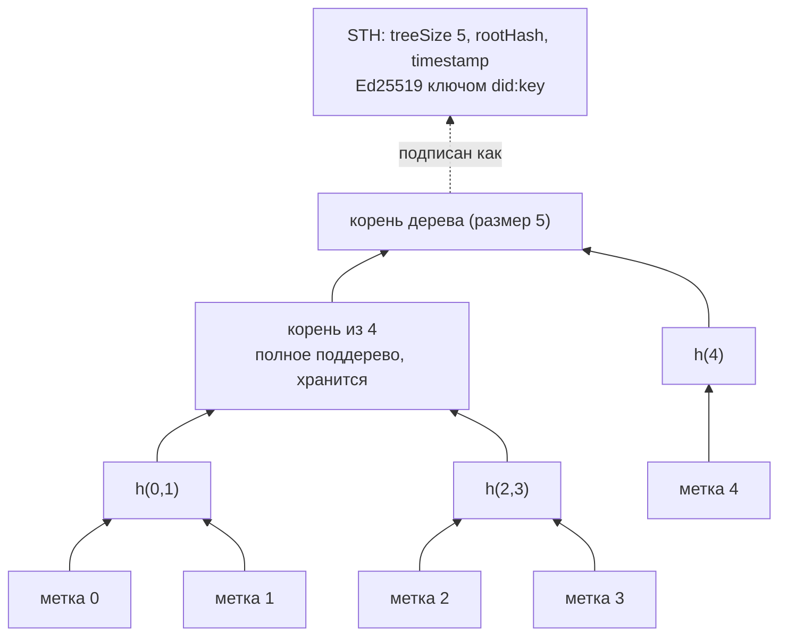
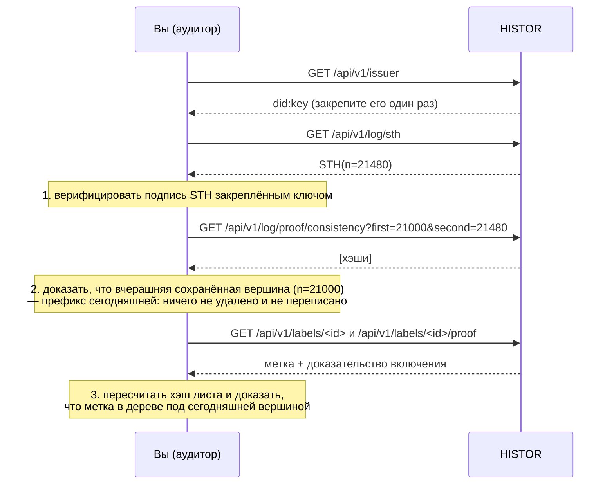

# Аудит журнала

> 🌐 [English](log.md) · **Русский** · [Español](log.es.md) · [Français](log.fr.md) · [中文](log.zh.md)

Журнал прозрачности чего-то стоит, только если его может проверить читатель, который не доверяет
оператору. Эта страница и есть такая проверка — от начала до конца, и нужен для неё только открытый ключ журнала.

## Дерево

Журнал HISTOR — дерево Меркла ровно в том виде, как его определяет [RFC 9162](https://www.rfc-editor.org/rfc/rfc9162)
(Certificate Transparency v2). Каждая метка — один лист, в порядке выпуска, навсегда.

```
leaf hash = SHA-256(0x00 ‖ JCS(label document))
node hash = SHA-256(0x01 ‖ left ‖ right)
```

Вход листа — каноническая форма RFC 8785 подписанной метки, которую вы скачиваете с
`/api/v1/labels/<id>`, так что любой, у кого есть метка, может пересчитать хэш её листа, ни у кого не спрашивая.



HISTOR хранит только полные поддеревья; любой корень и любое доказательство вычисляются не более
чем из log₂ n из них. Ничто в листе не может измениться, не изменив каждый корень над ним.

## Подписанная вершина дерева (STH)

После каждого обхода HISTOR подписывает вершину дерева в его текущем состоянии:

```json
{
  "type": "histor.sth/v1",
  "log": "did:key:z6Mk…",
  "treeSize": 21480,
  "rootHash": "fe3dcf88209e9b0e…",
  "timestamp": "2026-09-23T09:13:04Z",
  "signature": { "alg": "Ed25519", "verificationMethod": "did:key:z6Mk…#z6Mk…", "value": "<base64url>" }
}
```

Подпись — Ed25519 над байтами RFC 8785 всех членов, кроме `signature`. Ключ — тот, что внутри
`did:key` (multicodec `0xed01` + 32 байта), тот же ключ, которым подписана каждая метка.
`type` входит в подписанные байты, поэтому подпись под меткой или под ответом `/check` невозможно
выдать за вершину дерева.

## Три вопроса — три доказательства



| Вопрос | Доказательство | Эндпоинт |
|---|---|---|
| Это подписал журнал? | Ed25519 над STH | `/api/v1/log/sth`, `/api/v1/log/sth/<size>` |
| С моего прошлого визита в журнал только добавляли? | доказательство согласованности, RFC 9162 §2.1.4 | `/api/v1/log/proof/consistency?first=&second=` |
| Есть ли эта метка в журнале? | доказательство включения, RFC 9162 §2.1.3 | `/api/v1/labels/<id>/proof` или `/api/v1/log/proof/inclusion?leaf_index=&tree_size=` |

## Как это сделать

В пакет входит аудитор, которому не нужны ни база, ни ключи, ни конфигурация: для журнала он
посторонний, в этом и смысл:

```bash
pip install "git+https://github.com/alexar76/histor"   # or, in a checkout: uv run --project . python -m histor audit …
python -m histor audit https://histor.modelmarket.dev --state ~/.histor/sth.json
python -m histor audit https://histor.modelmarket.dev --state ~/.histor/sth.json --label urn:uuid:…
```

Он верифицирует вершину по ключу журнала, доказывает согласованность с вершиной, сохранённой в
прошлый раз (и отказывает, если журнал уменьшился, переписал корень при том же размере или сменил
ключ), по желанию доказывает включение одной метки и сохраняет новую вершину. Код выхода 0
означает, что все проверки прошли. Запускайте его из cron на машине, которую контролируете, — и вы свидетель.

Веб-интерфейс делает то же самое в вашем браузере на [странице журнала](https://histor.modelmarket.dev/log):
кнопка «Сохранить эту вершину в браузере» сохраняет вершину локально, а при следующем визите
страница доказывает согласованность с ней через WebCrypto — в вашем браузере, по ключу журнала.
Код, который это делает, — `docs/landing/assets/desk.js`, около сотни читаемых строк, так что
можно проверить, что именно он проверяет.

## Чего журнал не доказывает

- **Время.** `timestamp` и `observedAt` каждой метки — утверждения HISTOR. Журнал делает
  невозможным изменить их задним числом, но не исключает, что они были неверны в момент записи.
- **Полнота.** Сервера, которого нет в реестре или который отвечает 401, нет и в журнале.
- **Одно представление для всех.** Журнал мог бы показывать разным читателям разные деревья. Защита
  от этого — gossip: аудиторы сравнивают полученные вершины. Публикуйте свою; следующий шаг в
  дорожной карте — второй наблюдатель под управлением другой стороны, который соподписывает вершины.
