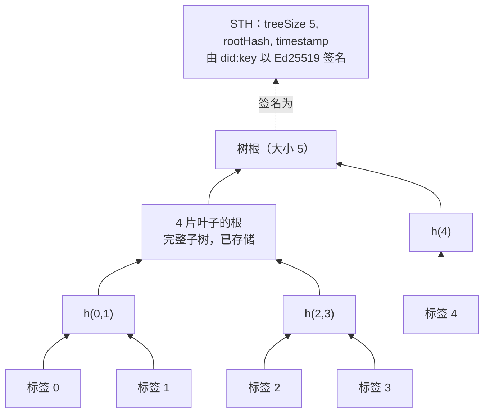
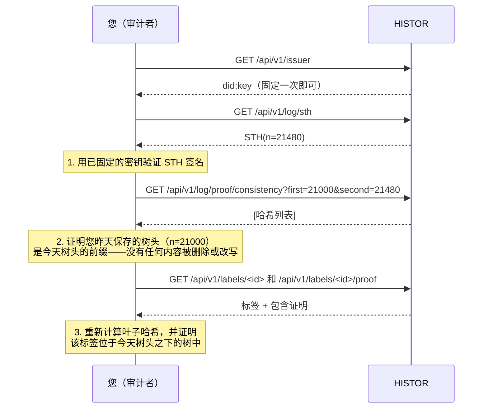

# 审计日志

> 🌐 [English](log.md) · [Русский](log.ru.md) · [Español](log.es.md) · [Français](log.fr.md) · **中文**

透明日志只有在不信任其运营方的读者也能核查它时，才有价值。本页就是这项核查，从头到尾，只需要日志的
公钥。

## 树

HISTOR 的日志是一棵严格按 [RFC 9162](https://www.rfc-editor.org/rfc/rfc9162)
（Certificate Transparency v2）定义的默克尔树。每个标签是一片叶子，按签发顺序排列，永久保留。

```
leaf hash = SHA-256(0x00 ‖ JCS(label document))
node hash = SHA-256(0x01 ‖ left ‖ right)
```

叶子输入是您从 `/api/v1/labels/<id>` 下载的签名标签的 RFC 8785 规范化形式，因此任何持有标签的人都
可以自行重新计算其叶子哈希，无需询问任何人。



HISTOR 只存储完整子树；每个根和每个证明最多由其中 log₂ n 个计算得出。叶子的任何内容一旦改变，
它上方的每个根都会随之改变。

## 签名树头

每次抓取之后，HISTOR 都会对树的当前状态签发一个签名树头（STH）：

```json
{
  "type": "histor.sth/v1",
  "log": "did:key:z6Mk…",
  "treeSize": 21480,
  "rootHash": "fe3dcf88209e9b0e…",
  "timestamp": "2026-09-23T09:13:04Z",
  "signature": { "alg": "Ed25519", "verificationMethod": "did:key:z6Mk…#z6Mk…", "value": "<base64url>" }
}
```

签名是对除 `signature` 之外所有成员的 RFC 8785 字节计算的 Ed25519 签名。密钥就是 `did:key` 里的那把
（multicodec `0xed01` + 32 字节），与签名每个标签的是同一把密钥。`type` 位于签名字节之内，因此针对
标签或 `/check` 应答的签名永远无法冒充树头。

## 三个问题，三种证明



| 问题 | 证明 | 端点 |
|---|---|---|
| 这是日志签的吗？ | 对 STH 的 Ed25519 签名 | `/api/v1/log/sth`、`/api/v1/log/sth/<size>` |
| 自我上次查看以来，它是否只做过追加？ | 一致性证明，RFC 9162 §2.1.4 | `/api/v1/log/proof/consistency?first=&second=` |
| 这个标签在日志中吗？ | 包含证明，RFC 9162 §2.1.3 | `/api/v1/labels/<id>/proof` 或 `/api/v1/log/proof/inclusion?leaf_index=&tree_size=` |

## 动手操作

软件包自带一个审计程序，它不需要数据库、不需要密钥，也不需要任何配置——它对日志而言是个陌生人，
而这正是关键所在：

```bash
pip install "git+https://github.com/alexar76/histor"   # or, in a checkout: uv run --project . python -m histor audit …
python -m histor audit https://histor.modelmarket.dev --state ~/.histor/sth.json
python -m histor audit https://histor.modelmarket.dev --state ~/.histor/sth.json --label urn:uuid:…
```

它用日志密钥验证树头，证明与上次保存的树头一致（如果日志缩小了、在同一大小下改写了根，或者更换了
密钥，则拒绝），可选地证明某个标签的包含性，然后保存新的树头。退出状态为 0 表示每项检查都通过了。
在您自己控制的机器上用 cron 运行它，您就成了一名见证者。

网页端在[日志页面](https://histor.modelmarket.dev/log)上，在您的浏览器里做同样的事：“在此浏览器中
保存这个树头”会把树头存在本地，下次访问时用 WebCrypto、在您的浏览器中、以日志的密钥证明与它的
一致性。实现这一点的代码是 `docs/landing/assets/desk.js`，大约一百行可读的代码，所以您可以核查它
究竟核查了什么。

## 日志不能证明什么

- **时间。** `timestamp` 和每个标签的 `observedAt` 都是 HISTOR 的断言。日志让它们事后无法更改，
  但不能保证它们在写下时没有出错。
- **完整性。** 不在注册表中、或返回 401 的服务器，不在日志中。
- **所有人看到同一视图。** 日志可能向不同读者展示不同的树。防御手段是 gossip：审计者互相比对各自
  收到的树头。请公开您收到的树头；由第二个独立运营的观测方为树头联署，是路线图上的下一步。
