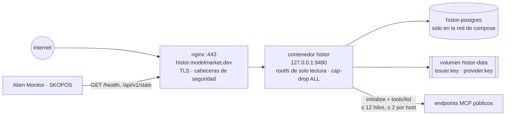
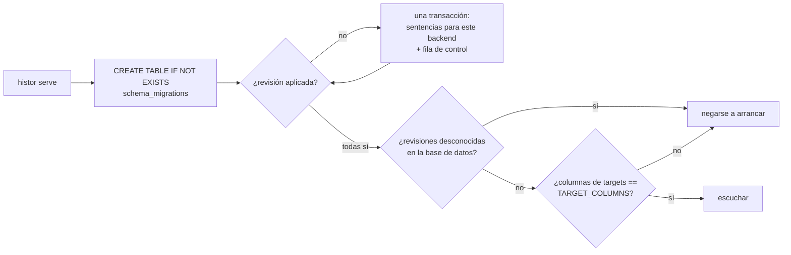
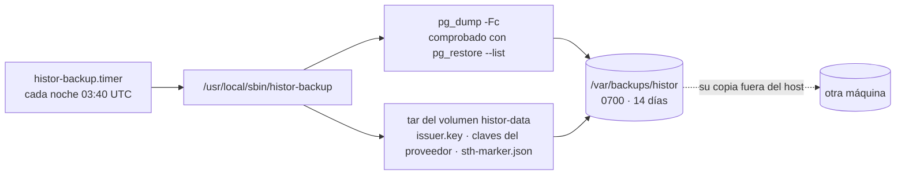

# Operaciones

> 🌐 [English](operations.md) · [Русский](operations.ru.md) · **Español** · [Français](operations.fr.md) · [中文](operations.zh.md)

## Topología



## Despliegue

Desde la raíz del monorepo, en un portátil:

```bash
./scripts/deploy_histor.sh --remote admin-vps   # sincroniza histor/ en /opt/histor y despliega allí
```

`.env` nunca se copia desde un portátil: el host conserva el suyo. La primera ejecución lo crea (token de operador y
contraseña de Postgres aleatorios, modo 0600, solo se imprimen los nombres); las siguientes nunca lo reescriben. El
script etiqueta la imagen en marcha como `histor-histor:prev`, construye e inicia la nueva y restaura la anterior si
`/health` no responde. Instala el vhost de nginx desde `deploy/nginx/histor.modelmarket.dev.conf` (dentro del
satélite), emite el certificado con certbot si no existe, instala el temporizador de copias nocturnas (véase «Copias
de seguridad») y, si había un rastreo en curso al empezar, lo reinicia; con lotes pierde como máximo un lote.

## Configuración

| Variable | Valor por defecto | Notas |
|---|---|---|
| `HISTOR_PROFILE` | `dev` | `prod` aplica fail-closed (denegar por defecto) si faltan las tres siguientes |
| `HISTOR_DATABASE_URL` | vacío (SQLite) | prod: `postgresql://…` — obligatorio |
| `HISTOR_OPERATOR_TOKEN` | vacío | prod: ≥ 24 caracteres; protege `/api/v1/admin/*` |
| `HISTOR_PUBLIC_BASE` | `http://127.0.0.1:9490` | prod: `https://…`; se usa en insignias, feed y federación |
| `HISTOR_CRAWL_INTERVAL_S` | `86400` | `0` = solo a petición del operador |
| `HISTOR_CRAWL_ON_START` | `1` | `0`: una instancia nueva espera un intervalo antes de su primer rastreo |
| `HISTOR_CRAWL_WORKERS` / `_PER_HOST` / `_TIMEOUT_S` | `12` / `2` / `20` | cortesía: un host con 2 000 endpoints nunca recibe más de dos conexiones a la vez |
| `HISTOR_CRAWL_LIMIT` | `0` | dev: observar solo los primeros N endpoints |
| `HISTOR_CRAWL_BATCH` | `400` | endpoints que se observan, escanean y guardan juntos; un reinicio pierde como máximo un lote, y el panel muestra el progreso a medida que se guardan los lotes |
| `HISTOR_OPT_OUT` | vacío | hosts o prefijos de URL excluidos a petición, más `opt-out.txt` en el volumen de datos |
| `HISTOR_CHECK_RATE_PER_MIN` / `_SCAN_RATE_PER_HOUR` | `30` / `20` | por dirección de cliente |
| `HISTOR_TRUSTED_PROXIES` | `127.0.0.1,::1` | el archivo compose añade `172.16.0.0/12`: el proxy de Docker se conecta desde la puerta de enlace del bridge |
| `HISTOR_PQC` | `0` | `1`: firmas de federación híbridas Ed25519 + ML-DSA-65 |
| `HISTOR_ALLOW_PRIVATE_TARGETS` | `0` | solo para pruebas; se rechaza con `prod` |

## Migraciones



```bash
docker compose exec histor python -m histor migrate status   # backend=postgresql applied=[1, 2] pending=[]
docker compose exec histor python -m histor migrate up
```

Para añadir una revisión, agréguela al final de `MIGRATIONS` en `histor/migrations.py` —nunca edite
una ya publicada— y actualice `TARGET_COLUMNS` en el mismo cambio si afecta a `targets`. La suite de
pruebas aplica la lista completa a SQLite, y también a Postgres cuando `HISTOR_TEST_DATABASE_URL` está definida.

## Copias de seguridad

El registro es el producto y la clave del emisor es su identidad: una clave nueva es un registro nuevo, y toda
prueba de consistencia contra el `did:key` anterior falla por diseño.



`deploy_histor.sh` instala el temporizador; ejecute `sudo histor-backup` a mano cuando quiera. Las copias locales
sobreviven a un volumen perdido o a una restauración fallida, no a la pérdida del host: copie `/var/backups/histor`
también a otro sitio.

**Restauración** en un host nuevo: despliegue una vez (crea un registro vacío y una clave), detenga el servicio,
restaure las dos mitades y vuelva a iniciarlo. La clave y la base de datos deben ser de la MISMA noche:

```bash
docker compose -p histor stop histor
docker compose -p histor exec -T histor-postgres pg_restore -U histor -d histor --clean --if-exists < histor-<stamp>.dump
mkdir -p /tmp/histor-keys && tar -xf keys-<stamp>.tar -C /tmp/histor-keys && docker cp /tmp/histor-keys/data/. histor-histor-1:/data/
docker compose -p histor start histor
```

## La clave y el registro van juntos

En cada arranque HISTOR comprueba que la clave del volumen de datos es la que firmó el registro de la base de datos,
y que la base no es más antigua que el encabezado de árbol más reciente firmado por esa clave (`sth-marker.json`,
junto a la clave). Se niega a arrancar, indicando el motivo, cuando:

- falta `issuer.key` pero el registro ya tiene etiquetas: una clave nueva empezaría un segundo registro sobre el árbol antiguo;
- la clave no es la del registro (`meta.issuer_did`);
- el encabezado más reciente de la base es menor que el del marcador o distinto: una restauración antigua o un
  reinicio, con los que la misma clave firmaría una segunda historia.

Corrija la causa (restaure la clave o la base correspondiente de la misma noche). Empiece un registro nuevo solo a
propósito: aparte la base Y la clave con el marcador, juntas.

## Monitorización

- `/health` — `crawl_running`, `last_crawl_error` (se lee de la tabla runs, así que un rastreo fallido o interrumpido
  sobrevive a un reinicio), `tree_size`.
- `/api/v1/stats` → `crawl.progress` mientras hay un rastreo; `lastRun.error` después de uno fallido.
- `/api/v1/badges/sth` se vuelve ámbar cuando el encabezado más reciente tiene más de dos intervalos de rastreo: el rastreador se detuvo.
- Alien Monitor dibuja HISTOR como un nodo del grupo de seguridad con datos de `/api/v1/stats`; un último rastreo
  fallido o interrumpido lo pone en rojo.
- El rastreo diario tarda entre 1 y 2 horas con la cortesía por defecto (≈20 000 endpoints, unos pocos hosts con miles cada uno).

## Ser un buen rastreador

HISTOR se identifica (`User-Agent: histor/<version> (+https://histor.modelmarket.dev/#crawler; read-only: initialize + tools/list)`),
envía tres mensajes JSON-RPC por endpoint y día, nunca llama a una herramienta, no sigue redirecciones y mantiene como
máximo dos conexiones por host. Una observación tiene un único plazo para todas las peticiones y páginas, y el conjunto
de herramientas se limita a 3 MiB y 5 000 herramientas.

Un operador que quiera dejar fuera su endpoint lo pide en un issue. Añada el host (que cubre sus subdominios) o un
prefijo de URL a `HISTOR_OPT_OUT` (separados por comas) o a `opt-out.txt` en el volumen de datos (uno por línea,
comentarios con `#`), que se vuelve a leer en cada rastreo. El endpoint sigue listado como no intentado con el motivo
`operator-opt-out`, en lugar de desaparecer sin más; las etiquetas que ya están en el registro se quedan, porque el
registro solo crece.
