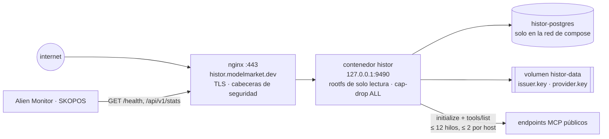
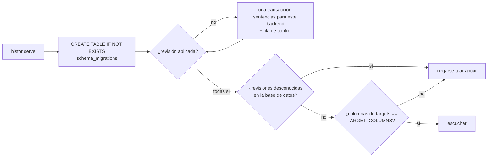
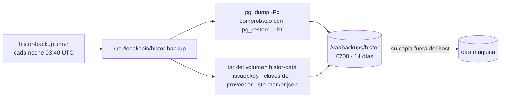

# Operaciones

> 🌐 [English](operations.md) · [Русский](operations.ru.md) · **Español** · [Français](operations.fr.md) · [中文](operations.zh.md)

## Topología


```mermaid
flowchart LR
    NET(("internet")) --> NGINX["nginx :443<br/>histor.modelmarket.dev<br/>TLS · cabeceras de seguridad"]
    NGINX --> APP["contenedor histor<br/>127.0.0.1:9490<br/>rootfs de solo lectura · cap-drop ALL"]
    APP --> PG[("histor-postgres<br/>solo en la red de compose")]
    APP --> VOL[["volumen histor-data<br/>issuer.key · provider.key"]]
    APP -- "initialize + tools/list<br/>≤ 12 hilos, ≤ 2 por host" --> MCP["endpoints MCP públicos"]
    MON["Alien Monitor · SKOPOS"] -- "GET /health, /api/v1/stats" --> NGINX
```

## Despliegue

Desde la raíz del monorepo, en un portátil:

```bash
./scripts/deploy_histor.sh --remote admin-vps   # sincroniza histor/ en /opt/histor y despliega allí
```

`.env` nunca se copia desde un portátil: el host conserva el suyo. La primera ejecución lo crea (token de operador y
contraseña de Postgres aleatorios, modo 0600, solo se imprimen los nombres); las siguientes nunca lo reescriben. El
script etiqueta la imagen en marcha como `histor-histor:prev`, construye e inicia la nueva y restaura la anterior si
`/health` no responde. Instala el vhost de nginx desde `deploy/nginx/histor.modelmarket.dev.conf` (dentro del
satélite), emite el certificado con certbot si no existe, instala el temporizador de copias nocturnas (véase «Copias
de seguridad») y, si había un rastreo en curso al empezar, lo reinicia; con lotes pierde como máximo un lote.

## Configuración

| Variable | Valor por defecto | Notas |
|---|---|---|
| `HISTOR_PROFILE` | `dev` | `prod` aplica fail-closed (denegar por defecto) si faltan las tres siguientes |
| `HISTOR_DATABASE_URL` | vacío (SQLite) | prod: `postgresql://…` — obligatorio |
| `HISTOR_OPERATOR_TOKEN` | vacío | prod: ≥ 24 caracteres; protege `/api/v1/admin/*` |
| `HISTOR_PUBLIC_BASE` | `http://127.0.0.1:9490` | prod: `https://…`; se usa en insignias, feed y federación |
| `HISTOR_CRAWL_INTERVAL_S` | `86400` | `0` = solo a petición del operador |
| `HISTOR_CRAWL_ON_START` | `1` | `0`: una instancia nueva espera un intervalo antes de su primer rastreo |
| `HISTOR_CRAWL_WORKERS` / `_PER_HOST` / `_TIMEOUT_S` | `12` / `2` / `20` | cortesía: un host con 2 000 endpoints nunca recibe más de dos conexiones a la vez |
| `HISTOR_CRAWL_LIMIT` | `0` | dev: observar solo los primeros N endpoints |
| `HISTOR_CRAWL_BATCH` | `400` | endpoints que se observan, escanean y guardan juntos; un reinicio pierde como máximo un lote, y el panel muestra el progreso a medida que se guardan los lotes |
| `HISTOR_OPT_OUT` | vacío | hosts o prefijos de URL excluidos a petición, más `opt-out.txt` en el volumen de datos |
| `HISTOR_CHECK_RATE_PER_MIN` / `_SCAN_RATE_PER_HOUR` | `30` / `20` | por dirección de cliente |
| `HISTOR_TRUSTED_PROXIES` | `127.0.0.1,::1` | el archivo compose añade `172.16.0.0/12`: el proxy de Docker se conecta desde la puerta de enlace del bridge |
| `HISTOR_PQC` | `0` | `1`: firmas de federación híbridas Ed25519 + ML-DSA-65 |
| `HISTOR_RECEIPT_ISSUERS` | vacío (cerrado) | `did:key` separados por comas cuyos anclajes de recibos de trabajo acepta el registro de recibos (`/api/v1/receipts/*`). El DID de un hub se toma del `issuer` de cualquiera de sus recibos reales. Un emisor aún no listado recibe un rechazo reintentable, así que su hub mantiene el anclaje en cola hasta que lo añada. `docker-compose.yml` debe reenviarla, como cada variable que nombra |
| `HISTOR_ALLOW_PRIVATE_TARGETS` | `0` | solo para pruebas; se rechaza con `prod` |
| `HISTOR_CLASSIFIER_MODEL` | vacío | id del modelo OpenRouter (p. ej. `deepseek/deepseek-chat`, `minimax/minimax-m1`). Desactivado salvo que se fijen modelo, clave y presupuesto |
| `HISTOR_OPENROUTER_API_KEY` | vacío | clave de OpenRouter (o `OPENROUTER_API_KEY`); permanece en el `.env` del host, no en la imagen |
| `HISTOR_CLASSIFIER_MAX_PER_CRAWL` | `0` | tope de llamadas de pago por rastreo. `0` lo desactiva; solo cuentan conjuntos distintos (uno compartido o ya evaluado se reutiliza gratis) |
| `HISTOR_CLASSIFIER_BASE_URL` / `_TIMEOUT_S` / `_MAX_TOOLS` | `https://openrouter.ai/api/v1` / `30` / `60` | el clasificador semántico e independiente del idioma; su veredicto es informativo y nunca entra en el registro firmado |

## Migraciones


```mermaid
flowchart LR
    START["histor serve"] --> BOOK["CREATE TABLE IF NOT EXISTS<br/>schema_migrations"]
    BOOK --> LOOP{"¿revisión aplicada?"}
    LOOP -- "no" --> TX["una transacción:<br/>sentencias para este backend<br/>+ fila de control"]
    TX --> LOOP
    LOOP -- "todas sí" --> FUT{"¿revisiones desconocidas<br/>en la base de datos?"}
    FUT -- "sí" --> STOP["negarse a arrancar"]
    FUT -- "no" --> CONTRACT{"¿columnas de targets ==<br/>TARGET_COLUMNS?"}
    CONTRACT -- "no" --> STOP
    CONTRACT -- "sí" --> SERVE["escuchar"]
```

```bash
docker compose exec histor python -m histor migrate status   # backend=postgresql applied=[1, 2, 3] pending=[]
docker compose exec histor python -m histor migrate up
```

Para añadir una revisión, agréguela al final de `MIGRATIONS` en `histor/migrations.py` —nunca edite
una ya publicada— y actualice `TARGET_COLUMNS` en el mismo cambio si afecta a `targets`. La suite de
pruebas aplica la lista completa a SQLite, y también a Postgres cuando `HISTOR_TEST_DATABASE_URL` está definida.

## Copias de seguridad

El registro es el producto y la clave del emisor es su identidad: una clave nueva es un registro nuevo, y toda
prueba de consistencia contra el `did:key` anterior falla por diseño.


```mermaid
flowchart LR
    T["histor-backup.timer<br/>cada noche 03:40 UTC"] --> S["/usr/local/sbin/histor-backup"]
    S --> D["pg_dump -Fc<br/>comprobado con pg_restore --list"]
    S --> K["tar del volumen histor-data<br/>issuer.key · claves del proveedor · sth-marker.json"]
    D --> B[("/var/backups/histor<br/>0700 · 14 días")]
    K --> B
    B -. "su copia fuera del host" .-> O[("otra máquina")]
```

`deploy_histor.sh` instala el temporizador; ejecute `sudo histor-backup` a mano cuando quiera. Las copias locales
sobreviven a un volumen perdido o a una restauración fallida, no a la pérdida del host: copie `/var/backups/histor`
también a otro sitio.

**Restauración** en un host nuevo: despliegue una vez (crea un registro vacío y una clave), detenga el servicio,
restaure las dos mitades y vuelva a iniciarlo. La clave y la base de datos deben ser de la MISMA noche:

```bash
docker compose -p histor stop histor
docker compose -p histor exec -T histor-postgres pg_restore -U histor -d histor --clean --if-exists < histor-<stamp>.dump
mkdir -p /tmp/histor-keys && tar -xf keys-<stamp>.tar -C /tmp/histor-keys && docker cp /tmp/histor-keys/data/. histor-histor-1:/data/
docker compose -p histor start histor
```

## La clave y el registro van juntos

En cada arranque HISTOR comprueba que la clave del volumen de datos es la que firmó el registro de la base de datos,
y que la base no es más antigua que el encabezado de árbol más reciente firmado por esa clave (`sth-marker.json`,
junto a la clave). Se niega a arrancar, indicando el motivo, cuando:

- falta `issuer.key` pero el registro ya tiene etiquetas: una clave nueva empezaría un segundo registro sobre el árbol antiguo;
- la clave no es la del registro (`meta.issuer_did`);
- el encabezado más reciente de la base es menor que el del marcador o distinto: una restauración antigua o un
  reinicio, con los que la misma clave firmaría una segunda historia.

Corrija la causa (restaure la clave o la base correspondiente de la misma noche). Empiece un registro nuevo solo a
propósito: aparte la base Y la clave con el marcador, juntas.

## Monitorización

- `/health` — `crawl_running`, `last_crawl_error` (se lee de la tabla runs, así que un rastreo fallido o interrumpido
  sobrevive a un reinicio), `tree_size`.
- `/api/v1/stats` → `crawl.progress` mientras hay un rastreo; `lastRun.error` después de uno fallido.
- `/api/v1/badges/sth` se vuelve ámbar cuando el encabezado más reciente tiene más de dos intervalos de rastreo: el rastreador se detuvo.
- Alien Monitor dibuja HISTOR como un nodo del grupo de seguridad con datos de `/api/v1/stats`; un último rastreo
  fallido o interrumpido lo pone en rojo.
- El rastreo diario tarda entre 1 y 2 horas con la cortesía por defecto (≈20 000 endpoints, unos pocos hosts con miles cada uno).

## Ser un buen rastreador

HISTOR se identifica (`User-Agent: histor/<version> (+https://histor.modelmarket.dev/#crawler; read-only: initialize + tools/list)`),
envía tres mensajes JSON-RPC por endpoint y día, nunca llama a una herramienta, no sigue redirecciones y mantiene como
máximo dos conexiones por host. Una observación tiene un único plazo para todas las peticiones y páginas, y el conjunto
de herramientas se limita a 3 MiB y 5 000 herramientas.

Un operador que quiera dejar fuera su endpoint lo pide en un issue. Añada el host (que cubre sus subdominios) o un
prefijo de URL a `HISTOR_OPT_OUT` (separados por comas) o a `opt-out.txt` en el volumen de datos (uno por línea,
comentarios con `#`), que se vuelve a leer en cada rastreo. El endpoint sigue listado como no intentado con el motivo
`operator-opt-out`, en lugar de desaparecer sin más; las etiquetas que ya están en el registro se quedan, porque el
registro solo crece.

## Sandbox de paquetes

La mayoría de los servidores MCP que la gente usa son paquetes de npm o PyPI que su cliente arranca en su propia máquina (`npx -y …`, `uvx …`): no hay ningún endpoint al que conectarse. HISTOR los observa en otro host que instala el paquete y lo arranca bajo [gVisor](https://gvisor.dev), un kernel escrito en espacio de usuario: el paquete habla con gVisor, no con el kernel del host. gVisor es código abierto de Google bajo la [licencia Apache 2.0](https://github.com/google/gvisor/blob/master/LICENSE); HISTOR lo ejecuta, no lo distribuye.

**Qué hace una observación** (`histor/sandbox/histor_observe.py`, solo biblioteca estándar):

1. Instalación, bajo gVisor: npm con `--ignore-scripts`, pip con `--only-binary=:all:`; no se ejecuta código del paquete. Un paquete de PyPI que solo publica un sdist se reporta como `no-wheel` y nunca se construye.
2. Ejecución, bajo el runtime de trazas de gVisor (`runsc-trace`): una red interna sin ruta hacia fuera cuyo único resolvedor es el registro DNS del observador, raíz y paquete de solo lectura, `/tmp` un tmpfs de 64 MB, un uid sin privilegios, sin capabilities ni nuevos privilegios, 512 MB de memoria sin swap, una CPU, 256 procesos, sin más entorno que `PATH`/`HOME`. HOME contiene credenciales señuelo (claves SSH, tokens de nube, de registros y de Git, una wallet, historial de shell) y el directorio de trabajo un `.env` señuelo. El observador habla MCP por stdin/stdout: `initialize`, `tools/list` y después cada una de hasta 15 herramientas una vez con argumentos canario construidos a partir de su esquema (una dirección en `histor-trap.invalid`, una ruta a una nota señuelo) —dentro del sandbox, sin actuar sobre nada real— y luego mata el contenedor. Los scripts de instalación de npm, omitidos al instalar, se ejecutan antes por separado, también con trazas.
3. Respuesta: la versión, su hash de integridad, el digest de la imagen, un estado (`ok`, `exited` —casi siempre un servidor que necesita una clave o una ruta para arrancar—, `install-failed`, `no-entry-point`, `no-wheel`, `timeout`, `protocol`) y las herramientas.

Si `runsc` no está registrado como runtime de Docker, se niega a ejecutar en lugar de recurrir a `runc`.

**Comportamiento.** gVisor escribe su propia traza de la ejecución (`execve`, `connect`, `open`/`openat`) fuera del sandbox, así que el paquete no puede ocultarla ni falsificarla; el registro DNS anota cada nombre consultado y responde con una dirección única de 198.18.0.0/15 que no lleva a ninguna parte, de modo que cada intento de conexión se ve junto con el nombre para el que era. Por fase —scripts de instalación, arranque, llamadas canario— la observación informa de los programas lanzados, los nombres consultados y las direcciones marcadas, los señuelos abiertos y las escrituras que persistirían fuera del sandbox (`.bashrc`, `authorized_keys`, …). La actividad del proceso de entrada en la fase de scripts es la del propio npm y se descarta; las conexiones loopback también. La instalación añade el runtime `runsc-trace`, la red interna `histor-observe` (10.231.0.0/24), una regla de firewall que solo le deja llegar al resolvedor, `CAP_NET_BIND_SERVICE` para el servicio y un temporizador que borra las trazas leídas. HISTOR vuelve a ejecutar una versión cuando su observador es anterior a `HISTOR_SANDBOX_OBSERVER` (2 = comportamiento).

**Qué versiones.** Una versión publicada en npm o PyPI no puede cambiar, así que cada versión se observa una vez. Cada rastreo pregunta a los registros por la última versión (es barato) y ejecuta el sandbox solo para las versiones que no ha visto, como mucho `HISTOR_SANDBOX_MAX_PER_CRAWL` (300): primero las versiones nuevas de paquetes ya observados —ahí es donde una descripción de herramienta cambiada llega a todos los que ejecutan el paquete sin fijar versión—, después los paquetes nunca observados. Un fallo del propio sandbox se registra como error interno de HISTOR y no emite ninguna etiqueta sobre el paquete.

**Preparar el host del sandbox** (Ubuntu 24.04, Docker):

```bash
# gVisor desde el repositorio apt firmado de Google, fijado a una versión
curl -fsSL https://gvisor.dev/archive.key | gpg --dearmor -o /usr/share/keyrings/gvisor-archive-keyring.gpg
#   huella 6F1D F85E 3A71 C249 18E7  27D5 6FC6 D554 E32B D943 (The gVisor Authors)
echo "deb [arch=amd64 signed-by=/usr/share/keyrings/gvisor-archive-keyring.gpg] https://storage.googleapis.com/gvisor/releases 20261005 main" \
  > /etc/apt/sources.list.d/gvisor.list
apt-get update && apt-get install -y runsc
runsc install && systemctl reload docker      # recargar, no reiniciar: los contenedores siguen en marcha

# el observador: usuario, red, imágenes, TLS, token, unidad systemd, regla de firewall solo para el host de HISTOR
HISTOR_CALLER_IP=<IP del host de HISTOR> ./histor/sandbox/install.sh
```

`install.sh` imprime el SHA-256 del certificado y termina con una autocomprobación que debe decir `"gvisor":true` (el kernel de dentro es `4.19.0-gvisor`). El token se genera una vez en `/etc/histor-sandbox.env` y nunca se imprime; cópialo al `.env` del host de HISTOR sin mostrarlo. En el host de HISTOR:

```bash
HISTOR_SANDBOX_URL=https://<host del sandbox>:9443
HISTOR_SANDBOX_TOKEN=<de /etc/histor-sandbox.env>
HISTOR_SANDBOX_CERT_SHA256=<impreso por install.sh>
```

HISTOR fija el certificado: comprueba la huella antes de enviar un solo byte, token incluido. Dos trampas encontradas al montarlo: en una red de Docker definida por el usuario, gVisor no llega al DNS integrado de Docker (`127.0.0.11`), así que la fase de instalación recibe su propio `resolv.conf`; y el `--memory-swap` por defecto de Docker duplica el límite de memoria: una reserva de 900 MB pasaba en un contenedor de 512 MB hasta que el swap se igualó a la memoria. Registros: `journalctl -u histor-sandbox`.

**Rendimiento.** `HISTOR_SANDBOX_SLOTS` en `/etc/histor-sandbox.env` (2 por defecto) es cuántos paquetes ejecuta a la vez el host del sandbox; cada uno ocupa hasta 1 GB al instalarse y 512 MB al ejecutarse. Pon `HISTOR_SANDBOX_CONCURRENCY` de HISTOR al mismo número. `HISTOR_SANDBOX_MAX_PER_CRAWL` limita las versiones que ejecuta un rastreo. Una observación completa tarda 13–60 s, así que tres huecos procesan unos 500 paquetes por hora.
