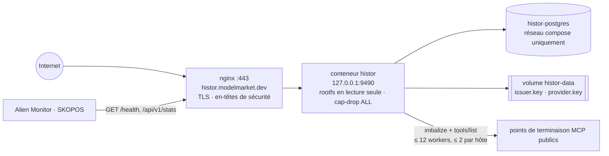
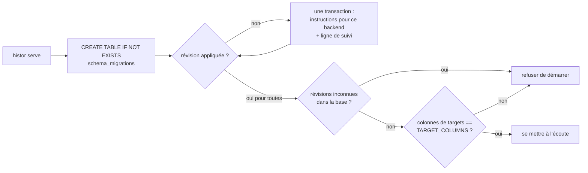
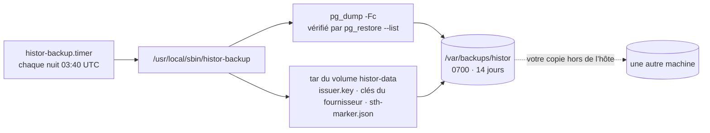

# Exploitation

> 🌐 [English](operations.md) · [Русский](operations.ru.md) · [Español](operations.es.md) · **Français** · [中文](operations.zh.md)

## Topologie



## Déploiement

Depuis la racine du monorepo, sur un portable :

```bash
./scripts/deploy_histor.sh --remote admin-vps   # synchronise histor/ vers /opt/histor, puis déploie là-bas
```

`.env` n’est jamais copié depuis un portable : l’hôte garde le sien. La première exécution le crée (jeton d’opérateur
et mot de passe Postgres aléatoires, mode 0600, seuls les noms sont affichés) ; les suivantes ne le réécrivent jamais.
Le script étiquette l’image en service `histor-histor:prev`, construit et démarre la nouvelle, et remet la précédente
si `/health` ne répond pas. Il installe le vhost nginx depuis `deploy/nginx/histor.modelmarket.dev.conf` (dans le
satellite), émet le certificat avec certbot s’il n’existe pas, installe le minuteur de sauvegarde nocturne (voir
« Sauvegardes ») et, si une exploration tournait au démarrage, la relance ; avec les lots, elle perd au plus un lot.

## Configuration

| Variable | Défaut | Remarques |
|---|---|---|
| `HISTOR_PROFILE` | `dev` | `prod` refuse de démarrer sans les trois suivantes (fail-closed, refus par défaut) |
| `HISTOR_DATABASE_URL` | vide (SQLite) | prod : `postgresql://…` — obligatoire |
| `HISTOR_OPERATOR_TOKEN` | vide | prod : ≥ 24 caractères ; protège `/api/v1/admin/*` |
| `HISTOR_PUBLIC_BASE` | `http://127.0.0.1:9490` | prod : `https://…` ; utilisé dans les badges, le flux, la fédération |
| `HISTOR_CRAWL_INTERVAL_S` | `86400` | `0` = uniquement à la demande de l’opérateur |
| `HISTOR_CRAWL_ON_START` | `1` | `0` : une instance neuve attend un intervalle avant sa première exploration (crawl) |
| `HISTOR_CRAWL_WORKERS` / `_PER_HOST` / `_TIMEOUT_S` | `12` / `2` / `20` | politesse : un hôte qui porte 2 000 points de terminaison (endpoints) n’est jamais sollicité plus de deux fois à la fois |
| `HISTOR_CRAWL_LIMIT` | `0` | dev : n’observer que les N premiers points de terminaison |
| `HISTOR_CRAWL_BATCH` | `400` | points de terminaison observés, analysés et enregistrés ensemble ; un redémarrage perd au plus un lot, et le bureau affiche la progression à mesure que les lots sont enregistrés |
| `HISTOR_OPT_OUT` | vide | hôtes ou préfixes d’URL exclus à la demande, plus `opt-out.txt` sur le volume de données |
| `HISTOR_CHECK_RATE_PER_MIN` / `_SCAN_RATE_PER_HOUR` | `30` / `20` | par adresse client |
| `HISTOR_TRUSTED_PROXIES` | `127.0.0.1,::1` | le fichier compose ajoute `172.16.0.0/12` : le proxy de Docker se connecte depuis la passerelle du bridge |
| `HISTOR_PQC` | `0` | `1` : signatures de fédération hybrides Ed25519 + ML-DSA-65 |
| `HISTOR_ALLOW_PRIVATE_TARGETS` | `0` | tests uniquement ; refusé sous `prod` |
| `HISTOR_CLASSIFIER_MODEL` | vide | id du modèle OpenRouter (p. ex. `deepseek/deepseek-chat`, `minimax/minimax-m1`). Désactivé tant que modèle, clé et budget ne sont pas tous définis |
| `HISTOR_OPENROUTER_API_KEY` | vide | clé OpenRouter (ou `OPENROUTER_API_KEY`) ; reste dans le `.env` de l'hôte, jamais dans l'image |
| `HISTOR_CLASSIFIER_MAX_PER_CRAWL` | `0` | plafond d'appels payants par passage. `0` le désactive ; seuls les ensembles distincts comptent (un ensemble partagé ou déjà jugé est réutilisé sans frais) |
| `HISTOR_CLASSIFIER_BASE_URL` / `_TIMEOUT_S` / `_MAX_TOOLS` | `https://openrouter.ai/api/v1` / `30` / `60` | le classifieur sémantique, indépendant de la langue ; son verdict est indicatif et n'entre jamais dans le journal signé |

## Migrations



```bash
docker compose exec histor python -m histor migrate status   # backend=postgresql applied=[1, 2, 3] pending=[]
docker compose exec histor python -m histor migrate up
```

Pour ajouter une révision, complétez la liste `MIGRATIONS` dans `histor/migrations.py` — ne modifiez
jamais une révision livrée — et mettez à jour `TARGET_COLUMNS` dans le même changement si elle touche
`targets`. La suite de tests applique la liste entière à SQLite, et à Postgres quand
`HISTOR_TEST_DATABASE_URL` est défini.

## Sauvegardes

Le journal est le produit, et la clé de l’émetteur est son identité : une nouvelle clé, c’est un nouveau journal, et
toute preuve de cohérence contre l’ancien `did:key` échoue par conception.



`deploy_histor.sh` installe le minuteur ; lancez `sudo histor-backup` à la main quand vous voulez. Les copies locales
survivent à un volume perdu ou à une restauration ratée, pas à la perte de l’hôte : copiez aussi `/var/backups/histor`
ailleurs.

**Restauration** sur un nouvel hôte : déployez une fois (cela crée un journal vide et une clé), arrêtez le service,
restaurez les deux moitiés, puis redémarrez. La clé et la base doivent venir de la MÊME nuit :

```bash
docker compose -p histor stop histor
docker compose -p histor exec -T histor-postgres pg_restore -U histor -d histor --clean --if-exists < histor-<stamp>.dump
mkdir -p /tmp/histor-keys && tar -xf keys-<stamp>.tar -C /tmp/histor-keys && docker cp /tmp/histor-keys/data/. histor-histor-1:/data/
docker compose -p histor start histor
```

## La clé et le journal vont ensemble

À chaque démarrage, HISTOR vérifie que la clé du volume de données est celle qui a signé le journal de la base, et
que la base n’est pas plus ancienne que la tête d’arbre la plus récente signée par cette clé (`sth-marker.json`, à
côté de la clé). Il refuse de démarrer, en donnant la raison, quand :

- `issuer.key` manque alors que le journal contient déjà des étiquettes : une nouvelle clé commencerait un second journal sur l’ancien arbre ;
- la clé n’est pas celle du journal (`meta.issuer_did`) ;
- la tête la plus récente de la base est plus petite que celle du marqueur, ou différente : une restauration périmée
  ou une remise à zéro, avec laquelle la même clé signerait une seconde histoire.

Corrigez la cause (restaurez la clé ou la base correspondante de la même nuit). Ne commencez un nouveau journal que
volontairement : mettez de côté la base ET la clé avec le marqueur, ensemble.

## Supervision

- `/health` — `crawl_running`, `last_crawl_error` (lu dans la table runs : une exploration échouée ou interrompue
  survit à un redémarrage), `tree_size`.
- `/api/v1/stats` → `crawl.progress` pendant une exploration ; `lastRun.error` après un échec.
- `/api/v1/badges/sth` passe à l’ambre quand la tête la plus récente a plus de deux intervalles d’exploration : le robot s’est arrêté.
- Alien Monitor dessine HISTOR comme un nœud du groupe sécurité, alimenté par `/api/v1/stats` ; une dernière
  exploration échouée ou interrompue le fait passer au rouge.
- L’exploration quotidienne prend environ 1 à 2 heures avec la courtoisie par défaut (≈20 000 points de terminaison,
  quelques hôtes en portant des milliers chacun).

## Être un robot d’exploration courtois

HISTOR s’identifie (`User-Agent: histor/<version> (+https://histor.modelmarket.dev/#crawler; read-only: initialize + tools/list)`),
envoie trois messages JSON-RPC par point de terminaison et par jour, n’appelle jamais d’outil, ne suit aucune
redirection et garde au plus deux connexions par hôte. Une observation a une seule échéance pour toutes les requêtes et
pages, et l’ensemble d’outils est plafonné à 3 Mio et 5 000 outils.

Un exploitant qui veut que son point de terminaison soit exclu le demande dans une issue. Ajoutez l’hôte (qui couvre
ses sous-domaines) ou un préfixe d’URL à `HISTOR_OPT_OUT` (séparés par des virgules) ou à `opt-out.txt` sur le volume
de données (un par ligne, commentaires avec `#`), relu à chaque exploration. Le point de terminaison reste listé comme
non tenté avec la raison `operator-opt-out`, au lieu de disparaître en silence ; les étiquettes déjà dans le journal
restent, car le journal ne fait que croître.
