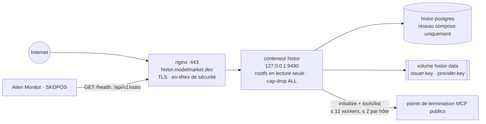
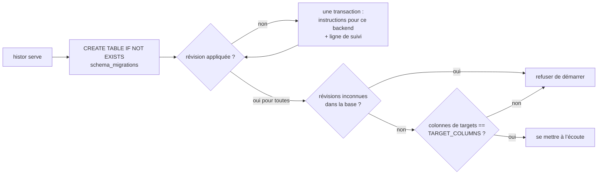
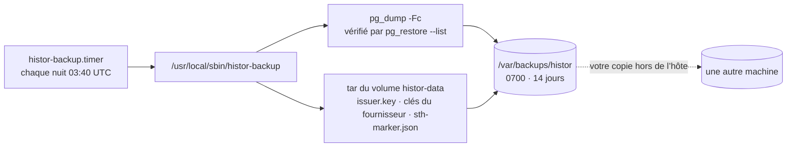

# Exploitation

> 🌐 [English](operations.md) · [Русский](operations.ru.md) · [Español](operations.es.md) · **Français** · [中文](operations.zh.md)

## Topologie


```mermaid
flowchart LR
    NET(("Internet")) --> NGINX["nginx :443<br/>histor.modelmarket.dev<br/>TLS · en-têtes de sécurité"]
    NGINX --> APP["conteneur histor<br/>127.0.0.1:9490<br/>rootfs en lecture seule · cap-drop ALL"]
    APP --> PG[("histor-postgres<br/>réseau compose uniquement")]
    APP --> VOL[["volume histor-data<br/>issuer.key · provider.key"]]
    APP -- "initialize + tools/list<br/>≤ 12 workers, ≤ 2 par hôte" --> MCP["points de terminaison MCP publics"]
    MON["Alien Monitor · SKOPOS"] -- "GET /health, /api/v1/stats" --> NGINX
```

## Déploiement

Depuis la racine du monorepo, sur un portable :

```bash
./scripts/deploy_histor.sh --remote admin-vps   # synchronise histor/ vers /opt/histor, puis déploie là-bas
```

`.env` n’est jamais copié depuis un portable : l’hôte garde le sien. La première exécution le crée (jeton d’opérateur
et mot de passe Postgres aléatoires, mode 0600, seuls les noms sont affichés) ; les suivantes ne le réécrivent jamais.
Le script étiquette l’image en service `histor-histor:prev`, construit et démarre la nouvelle, et remet la précédente
si `/health` ne répond pas. Il installe le vhost nginx depuis `deploy/nginx/histor.modelmarket.dev.conf` (dans le
satellite), émet le certificat avec certbot s’il n’existe pas, installe le minuteur de sauvegarde nocturne (voir
« Sauvegardes ») et, si une exploration tournait au démarrage, la relance ; avec les lots, elle perd au plus un lot.

## Configuration

| Variable | Défaut | Remarques |
|---|---|---|
| `HISTOR_PROFILE` | `dev` | `prod` refuse de démarrer sans les trois suivantes (fail-closed, refus par défaut) |
| `HISTOR_DATABASE_URL` | vide (SQLite) | prod : `postgresql://…` — obligatoire |
| `HISTOR_OPERATOR_TOKEN` | vide | prod : ≥ 24 caractères ; protège `/api/v1/admin/*` |
| `HISTOR_PUBLIC_BASE` | `http://127.0.0.1:9490` | prod : `https://…` ; utilisé dans les badges, le flux, la fédération |
| `HISTOR_CRAWL_INTERVAL_S` | `86400` | `0` = uniquement à la demande de l’opérateur |
| `HISTOR_CRAWL_ON_START` | `1` | `0` : une instance neuve attend un intervalle avant sa première exploration (crawl) |
| `HISTOR_CRAWL_WORKERS` / `_PER_HOST` / `_TIMEOUT_S` | `12` / `2` / `20` | politesse : un hôte qui porte 2 000 points de terminaison (endpoints) n’est jamais sollicité plus de deux fois à la fois |
| `HISTOR_CRAWL_LIMIT` | `0` | dev : n’observer que les N premiers points de terminaison |
| `HISTOR_CRAWL_BATCH` | `400` | points de terminaison observés, analysés et enregistrés ensemble ; un redémarrage perd au plus un lot, et le bureau affiche la progression à mesure que les lots sont enregistrés |
| `HISTOR_OPT_OUT` | vide | hôtes ou préfixes d’URL exclus à la demande, plus `opt-out.txt` sur le volume de données |
| `HISTOR_CHECK_RATE_PER_MIN` / `_SCAN_RATE_PER_HOUR` | `30` / `20` | par adresse client |
| `HISTOR_TRUSTED_PROXIES` | `127.0.0.1,::1` | le fichier compose ajoute `172.16.0.0/12` : le proxy de Docker se connecte depuis la passerelle du bridge |
| `HISTOR_PQC` | `0` | `1` : signatures de fédération hybrides Ed25519 + ML-DSA-65 |
| `HISTOR_RECEIPT_ISSUERS` | vide (fermé) | `did:key` séparés par des virgules dont le journal des reçus accepte les ancrages de reçus de travail (`/api/v1/receipts/*`). Le DID d'un hub se lit dans l'`issuer` de l'un de ses reçus réels. Un émetteur pas encore listé reçoit un refus réessayable : son hub garde l'ancrage en file jusqu'à ce que vous l'ajoutiez. `docker-compose.yml` doit la transmettre, comme chaque variable qu'il nomme |
| `HISTOR_ALLOW_PRIVATE_TARGETS` | `0` | tests uniquement ; refusé sous `prod` |
| `HISTOR_CLASSIFIER_MODEL` | vide | id du modèle OpenRouter (p. ex. `deepseek/deepseek-chat`, `minimax/minimax-m1`). Désactivé tant que modèle, clé et budget ne sont pas tous définis |
| `HISTOR_OPENROUTER_API_KEY` | vide | clé OpenRouter (ou `OPENROUTER_API_KEY`) ; reste dans le `.env` de l'hôte, jamais dans l'image |
| `HISTOR_CLASSIFIER_MAX_PER_CRAWL` | `0` | plafond d'appels payants par passage. `0` le désactive ; seuls les ensembles distincts comptent (un ensemble partagé ou déjà jugé est réutilisé sans frais) |
| `HISTOR_CLASSIFIER_BASE_URL` / `_TIMEOUT_S` / `_MAX_TOOLS` | `https://openrouter.ai/api/v1` / `30` / `60` | le classifieur sémantique, indépendant de la langue ; son verdict est indicatif et n'entre jamais dans le journal signé |

## Migrations


```mermaid
flowchart LR
    START["histor serve"] --> BOOK["CREATE TABLE IF NOT EXISTS<br/>schema_migrations"]
    BOOK --> LOOP{"révision appliquée ?"}
    LOOP -- "non" --> TX["une transaction :<br/>instructions pour ce backend<br/>+ ligne de suivi"]
    TX --> LOOP
    LOOP -- "oui pour toutes" --> FUT{"révisions inconnues<br/>dans la base ?"}
    FUT -- "oui" --> STOP["refuser de démarrer"]
    FUT -- "non" --> CONTRACT{"colonnes de targets ==<br/>TARGET_COLUMNS ?"}
    CONTRACT -- "non" --> STOP
    CONTRACT -- "oui" --> SERVE["se mettre à l’écoute"]
```

```bash
docker compose exec histor python -m histor migrate status   # backend=postgresql applied=[1, 2, 3] pending=[]
docker compose exec histor python -m histor migrate up
```

Pour ajouter une révision, complétez la liste `MIGRATIONS` dans `histor/migrations.py` — ne modifiez
jamais une révision livrée — et mettez à jour `TARGET_COLUMNS` dans le même changement si elle touche
`targets`. La suite de tests applique la liste entière à SQLite, et à Postgres quand
`HISTOR_TEST_DATABASE_URL` est défini.

## Sauvegardes

Le journal est le produit, et la clé de l’émetteur est son identité : une nouvelle clé, c’est un nouveau journal, et
toute preuve de cohérence contre l’ancien `did:key` échoue par conception.


```mermaid
flowchart LR
    T["histor-backup.timer<br/>chaque nuit 03:40 UTC"] --> S["/usr/local/sbin/histor-backup"]
    S --> D["pg_dump -Fc<br/>vérifié par pg_restore --list"]
    S --> K["tar du volume histor-data<br/>issuer.key · clés du fournisseur · sth-marker.json"]
    D --> B[("/var/backups/histor<br/>0700 · 14 jours")]
    K --> B
    B -. "votre copie hors de l’hôte" .-> O[("une autre machine")]
```

`deploy_histor.sh` installe le minuteur ; lancez `sudo histor-backup` à la main quand vous voulez. Les copies locales
survivent à un volume perdu ou à une restauration ratée, pas à la perte de l’hôte : copiez aussi `/var/backups/histor`
ailleurs.

**Restauration** sur un nouvel hôte : déployez une fois (cela crée un journal vide et une clé), arrêtez le service,
restaurez les deux moitiés, puis redémarrez. La clé et la base doivent venir de la MÊME nuit :

```bash
docker compose -p histor stop histor
docker compose -p histor exec -T histor-postgres pg_restore -U histor -d histor --clean --if-exists < histor-<stamp>.dump
mkdir -p /tmp/histor-keys && tar -xf keys-<stamp>.tar -C /tmp/histor-keys && docker cp /tmp/histor-keys/data/. histor-histor-1:/data/
docker compose -p histor start histor
```

## La clé et le journal vont ensemble

À chaque démarrage, HISTOR vérifie que la clé du volume de données est celle qui a signé le journal de la base, et
que la base n’est pas plus ancienne que la tête d’arbre la plus récente signée par cette clé (`sth-marker.json`, à
côté de la clé). Il refuse de démarrer, en donnant la raison, quand :

- `issuer.key` manque alors que le journal contient déjà des étiquettes : une nouvelle clé commencerait un second journal sur l’ancien arbre ;
- la clé n’est pas celle du journal (`meta.issuer_did`) ;
- la tête la plus récente de la base est plus petite que celle du marqueur, ou différente : une restauration périmée
  ou une remise à zéro, avec laquelle la même clé signerait une seconde histoire.

Corrigez la cause (restaurez la clé ou la base correspondante de la même nuit). Ne commencez un nouveau journal que
volontairement : mettez de côté la base ET la clé avec le marqueur, ensemble.

## Supervision

- `/health` — `crawl_running`, `last_crawl_error` (lu dans la table runs : une exploration échouée ou interrompue
  survit à un redémarrage), `tree_size`.
- `/api/v1/stats` → `crawl.progress` pendant une exploration ; `lastRun.error` après un échec.
- `/api/v1/badges/sth` passe à l’ambre quand la tête la plus récente a plus de deux intervalles d’exploration : le robot s’est arrêté.
- Alien Monitor dessine HISTOR comme un nœud du groupe sécurité, alimenté par `/api/v1/stats` ; une dernière
  exploration échouée ou interrompue le fait passer au rouge.
- L’exploration quotidienne prend environ 1 à 2 heures avec la courtoisie par défaut (≈20 000 points de terminaison,
  quelques hôtes en portant des milliers chacun).

## Être un robot d’exploration courtois

HISTOR s’identifie (`User-Agent: histor/<version> (+https://histor.modelmarket.dev/#crawler; read-only: initialize + tools/list)`),
envoie trois messages JSON-RPC par point de terminaison et par jour, n’appelle jamais d’outil, ne suit aucune
redirection et garde au plus deux connexions par hôte. Une observation a une seule échéance pour toutes les requêtes et
pages, et l’ensemble d’outils est plafonné à 3 Mio et 5 000 outils.

Un exploitant qui veut que son point de terminaison soit exclu le demande dans une issue. Ajoutez l’hôte (qui couvre
ses sous-domaines) ou un préfixe d’URL à `HISTOR_OPT_OUT` (séparés par des virgules) ou à `opt-out.txt` sur le volume
de données (un par ligne, commentaires avec `#`), relu à chaque exploration. Le point de terminaison reste listé comme
non tenté avec la raison `operator-opt-out`, au lieu de disparaître en silence ; les étiquettes déjà dans le journal
restent, car le journal ne fait que croître.

## Bac à sable des paquets

La plupart des serveurs MCP qu’on utilise sont des paquets npm ou PyPI que le client lance sur la machine même de l’utilisateur (`npx -y …`, `uvx …`) : il n’y a aucun point de terminaison à contacter. HISTOR les observe sur un autre hôte qui installe le paquet et le lance sous [gVisor](https://gvisor.dev), un noyau écrit en espace utilisateur : le paquet parle à gVisor, pas au noyau de l’hôte. gVisor est un logiciel libre de Google sous [licence Apache 2.0](https://github.com/google/gvisor/blob/master/LICENSE) ; HISTOR l’exécute, il ne le distribue pas.

**Ce que fait une observation** (`histor/sandbox/histor_observe.py`, bibliothèque standard seulement) :

1. Installation, sous gVisor : npm avec `--ignore-scripts`, pip avec `--only-binary=:all:` — aucun code du paquet ne s’exécute. Un paquet PyPI qui ne publie qu’un sdist est signalé `no-wheel`, jamais construit.
2. Exécution, sous le runtime de traçage de gVisor (`runsc-trace`) : un réseau interne sans route vers l’extérieur dont le seul résolveur est le journal DNS de l’observateur, racine et paquet en lecture seule, `/tmp` un tmpfs de 64 Mo, un uid sans privilèges, sans capabilities ni nouveaux privilèges, 512 Mo de mémoire sans swap, un CPU, 256 processus, aucun environnement hormis `PATH`/`HOME`. HOME contient des identifiants leurres (clés SSH, jetons cloud, de registres et Git, un portefeuille, un historique shell) et le répertoire de travail un `.env` leurre. L’observateur parle MCP par stdin/stdout : `initialize`, `tools/list`, puis chacun d’au plus 15 outils une fois avec des arguments canaris construits d’après son schéma (une adresse sur `histor-trap.invalid`, un chemin vers une note leurre) — dans le bac à sable, sans agir sur rien de réel — puis tue le conteneur. Les scripts d’installation npm, sautés à l’installation, s’exécutent d’abord à part, eux aussi tracés.
3. Réponse : la version, son empreinte d’intégrité, l’empreinte de l’image, un statut (`ok`, `exited` — le plus souvent un serveur qui a besoin d’une clé ou d’un chemin pour démarrer —, `install-failed`, `no-entry-point`, `no-wheel`, `timeout`, `protocol`) et les outils.

Si `runsc` n’est pas un runtime Docker, il refuse de s’exécuter plutôt que de se rabattre sur `runc`.

**Comportement.** gVisor écrit lui-même la trace de l’exécution (`execve`, `connect`, `open`/`openat`) hors du bac à sable : le paquet ne peut ni la cacher ni la falsifier ; le journal DNS note chaque nom demandé et répond par une adresse unique de 198.18.0.0/15 qui ne mène nulle part, si bien que chaque tentative de connexion est vue avec le nom visé. Par phase — scripts d’installation, démarrage, appels canaris — l’observation rapporte les programmes lancés, les noms demandés et les adresses composées, les leurres ouverts et les écritures qui survivraient hors du bac à sable (`.bashrc`, `authorized_keys`, …). L’activité du processus d’entrée dans la phase des scripts est celle de npm lui-même et est écartée, de même que les connexions loopback. L’installation ajoute le runtime `runsc-trace`, le réseau interne `histor-observe` (10.231.0.0/24), une règle de pare-feu qui ne lui laisse joindre que le résolveur, `CAP_NET_BIND_SERVICE` pour le service et une minuterie qui efface les traces lues. HISTOR relance une version quand son observateur est antérieur à `HISTOR_SANDBOX_OBSERVER` (2 = comportement).

**Quelles versions.** Une version publiée sur npm ou PyPI ne peut pas changer : chaque version est observée une fois. Chaque exploration demande aux registres la dernière version (c’est peu coûteux) et ne lance le bac à sable que pour les versions jamais vues, au plus `HISTOR_SANDBOX_MAX_PER_CRAWL` (300) : d’abord les nouvelles versions de paquets déjà observés — c’est là qu’une description d’outil modifiée atteint tous ceux qui lancent le paquet sans version fixée —, puis les paquets jamais observés. Une panne du bac à sable lui-même est enregistrée comme erreur interne d’HISTOR et n’émet aucune étiquette sur le paquet.

**Préparer l’hôte du bac à sable** (Ubuntu 24.04, Docker) :

```bash
# gVisor depuis le dépôt apt signé de Google, figé sur une version
curl -fsSL https://gvisor.dev/archive.key | gpg --dearmor -o /usr/share/keyrings/gvisor-archive-keyring.gpg
#   empreinte 6F1D F85E 3A71 C249 18E7  27D5 6FC6 D554 E32B D943 (The gVisor Authors)
echo "deb [arch=amd64 signed-by=/usr/share/keyrings/gvisor-archive-keyring.gpg] https://storage.googleapis.com/gvisor/releases 20261005 main" \
  > /etc/apt/sources.list.d/gvisor.list
apt-get update && apt-get install -y runsc
runsc install && systemctl reload docker      # un rechargement, pas un redémarrage : les conteneurs restent en marche

# l’observateur : utilisateur, réseau, images, TLS, jeton, unité systemd, règle de pare-feu pour le seul hôte d’HISTOR
HISTOR_CALLER_IP=<IP de l’hôte HISTOR> ./histor/sandbox/install.sh
```

`install.sh` affiche le SHA-256 du certificat et se termine par un auto-test qui doit indiquer `"gvisor":true` (le noyau à l’intérieur est `4.19.0-gvisor`). Le jeton est généré une fois dans `/etc/histor-sandbox.env` et jamais affiché ; copiez-le dans le `.env` de l’hôte HISTOR sans l’afficher. Sur l’hôte HISTOR :

```bash
HISTOR_SANDBOX_URL=https://<hôte du bac à sable>:9443
HISTOR_SANDBOX_TOKEN=<depuis /etc/histor-sandbox.env>
HISTOR_SANDBOX_CERT_SHA256=<affiché par install.sh>
```

HISTOR épingle le certificat : il vérifie l’empreinte avant d’envoyer le moindre octet, jeton compris. Deux pièges rencontrés pendant la mise en place : sur un réseau Docker défini par l’utilisateur, gVisor n’atteint pas le DNS intégré de Docker (`127.0.0.11`), donc l’étape d’installation reçoit son propre `resolv.conf` ; et le `--memory-swap` par défaut de Docker double la limite mémoire — une allocation de 900 Mo passait dans un conteneur de 512 Mo jusqu’à ce que le swap soit fixé égal à la mémoire. Journaux : `journalctl -u histor-sandbox`.

**Débit.** `HISTOR_SANDBOX_SLOTS` dans `/etc/histor-sandbox.env` (2 par défaut) est le nombre de paquets que l’hôte du bac à sable exécute à la fois ; chacun prend jusqu’à 1 Go pendant l’installation et 512 Mo pendant l’exécution. Réglez `HISTOR_SANDBOX_CONCURRENCY` d’HISTOR sur le même nombre. `HISTOR_SANDBOX_MAX_PER_CRAWL` plafonne les versions exécutées par exploration. Une observation complète prend 13 à 60 s : trois emplacements traitent environ 500 paquets par heure.
