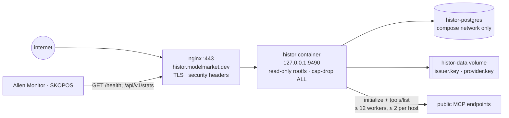
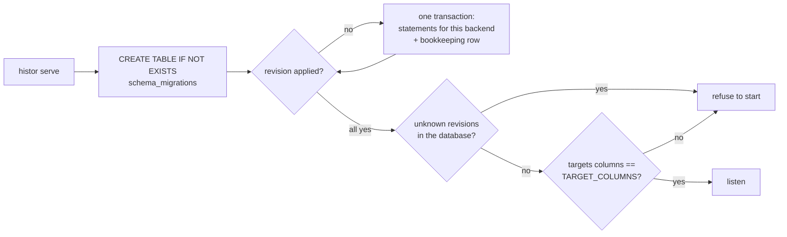
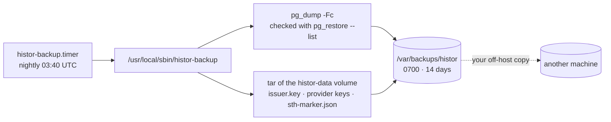

# Operations

> 🌐 **English** · [Русский](operations.ru.md) · [Español](operations.es.md) · [Français](operations.fr.md) · [中文](operations.zh.md)

## Topology



## Deploy

From the monorepo root, on a laptop:

```bash
./scripts/deploy_histor.sh --remote admin-vps   # syncs histor/ to /opt/histor, then deploys there
```

`.env` is never copied from a laptop: the host keeps its own. The first run creates it (random operator
token and Postgres password, mode 0600, printed by name only); later runs never rewrite it. The script
tags the running image as `histor-histor:prev`, builds and starts the new one, and puts the previous image
back if `/health` does not answer. It installs the nginx vhost from `deploy/nginx/histor.modelmarket.dev.conf`
(inside the satellite), issues the certificate with certbot if none exists, installs the nightly backup
timer (see Backups), and — if a crawl was running when it started — restarts that crawl, which with batching
loses at most one batch.

## Configuration

| Variable | Default | Notes |
|---|---|---|
| `HISTOR_PROFILE` | `dev` | `prod` fails closed without the next three |
| `HISTOR_DATABASE_URL` | empty (SQLite) | prod: `postgresql://…` — required |
| `HISTOR_OPERATOR_TOKEN` | empty | prod: ≥ 24 characters; guards `/api/v1/admin/*` |
| `HISTOR_PUBLIC_BASE` | `http://127.0.0.1:9490` | prod: `https://…`; used in badges, feed, federation |
| `HISTOR_CRAWL_INTERVAL_S` | `86400` | `0` = only on operator request |
| `HISTOR_CRAWL_ON_START` | `1` | `0`: a fresh instance waits one interval before its first crawl |
| `HISTOR_CRAWL_WORKERS` / `_PER_HOST` / `_TIMEOUT_S` | `12` / `2` / `20` | politeness: a host with 2 000 endpoints is never hit more than twice at once |
| `HISTOR_CRAWL_LIMIT` | `0` | dev: observe only the first N endpoints |
| `HISTOR_CRAWL_BATCH` | `400` | endpoints observed, scanned and saved together; a restart loses at most one batch, and the desk shows progress as batches land |
| `HISTOR_OPT_OUT` | empty | hosts or URL prefixes left out on request, plus `opt-out.txt` on the data volume |
| `HISTOR_CHECK_RATE_PER_MIN` / `_SCAN_RATE_PER_HOUR` | `30` / `20` | per client address |
| `HISTOR_TRUSTED_PROXIES` | `127.0.0.1,::1` | the compose file adds `172.16.0.0/12`: Docker's proxy dials from the bridge gateway |
| `HISTOR_PQC` | `0` | `1`: hybrid Ed25519 + ML-DSA-65 federation signatures |
| `HISTOR_ALLOW_PRIVATE_TARGETS` | `0` | tests only; refused under `prod` |
| `HISTOR_CLASSIFIER_MODEL` | empty | OpenRouter model id (e.g. `deepseek/deepseek-chat`, `minimax/minimax-m1`). Off unless this, a key and a budget are all set |
| `HISTOR_OPENROUTER_API_KEY` | empty | OpenRouter key (or `OPENROUTER_API_KEY`); stays in the host `.env`, never in the image |
| `HISTOR_CLASSIFIER_MAX_PER_CRAWL` | `0` | paid-call ceiling per crawl. `0` disables the classifier; distinct tool sets only (a shared or already-judged set is reused free) |
| `HISTOR_CLASSIFIER_MODEL` / `_BASE_URL` / `_TIMEOUT_S` / `_MAX_TOOLS` | — / `https://openrouter.ai/api/v1` / `30` / `60` | the meaning-based, language-independent classifier; its verdict is advisory and never enters the signed log |

## Migrations



```bash
docker compose exec histor python -m histor migrate status   # backend=postgresql applied=[1, 2, 3] pending=[]
docker compose exec histor python -m histor migrate up
```

Add a revision by appending to `MIGRATIONS` in `histor/migrations.py` — never edit a shipped one —
and update `TARGET_COLUMNS` in the same change if it touches `targets`. The test suite applies the
whole list to SQLite, and to Postgres when `HISTOR_TEST_DATABASE_URL` is set.

## Backups

The log is the product, and the issuer key is its identity: a new key is a new log, and every
consistency check against the old `did:key` fails by design.



`deploy_histor.sh` installs the timer; run `sudo histor-backup` by hand any time. The local copies survive a
dropped volume or a botched restore, not the loss of the host — copy `/var/backups/histor` somewhere else too.

**Restore** onto a fresh host: deploy once (it creates an empty log and a key), stop the service, restore both
halves, start it again. The key and the database must come from the SAME backup night:

```bash
docker compose -p histor stop histor
docker compose -p histor exec -T histor-postgres pg_restore -U histor -d histor --clean --if-exists < histor-<stamp>.dump
mkdir -p /tmp/histor-keys && tar -xf keys-<stamp>.tar -C /tmp/histor-keys && docker cp /tmp/histor-keys/data/. histor-histor-1:/data/
docker compose -p histor start histor
```

## The key and the log belong together

At every start HISTOR checks that the key on the data volume is the one the database's log was signed with,
and that the database is not older than the newest tree head that key has signed (`sth-marker.json`, next to
the key). It refuses to start, with the reason, when:

- `issuer.key` is missing but the log already holds labels — a new key would start a second log over the old tree;
- the key is not the log's key (`meta.issuer_did`);
- the database's newest head is smaller than, or differs from, the one the marker records — a stale restore or a
  reset, which would make the same key sign a second history.

Fix the cause (restore the matching key or database from the same backup night). Start a new log only on
purpose: move the database AND the key and marker aside, together.

## Monitoring

- `/health` — `crawl_running`, `last_crawl_error` (read from the runs table, so a failed or interrupted crawl
  survives a restart), `tree_size`.
- `/api/v1/stats` → `crawl.progress` while a crawl runs; `lastRun.error` after one fails.
- `/api/v1/badges/sth` turns amber when the newest head is older than two crawl intervals: the crawler stopped.
- Alien Monitor draws HISTOR as a node in the security group, fed by `/api/v1/stats`; a failed or interrupted
  last run turns it red.
- The daily crawl takes about 1–2 hours at the default politeness (≈20 k endpoints, a few hosts carrying
  thousands each).

## Being a good crawler

HISTOR identifies itself (`User-Agent: histor/<version> (+https://histor.modelmarket.dev/#crawler; read-only: initialize + tools/list)`),
sends three JSON-RPC messages per endpoint per day, never calls a tool, follows no redirects and keeps at most
two connections per host. One observation has one deadline across every request and page, and the tool set is
capped at 3 MiB and 5 000 tools.

An operator who wants their endpoint left out says so in an issue. Add the host (which covers its subdomains) or
a URL prefix to `HISTOR_OPT_OUT` (comma-separated) or to `opt-out.txt` on the data volume (one per line, `#`
comments), which is re-read at every crawl. The endpoint stays listed as not attempted with the reason
`operator-opt-out`, rather than silently dropped; labels already in the log stay, because the log only grows.
