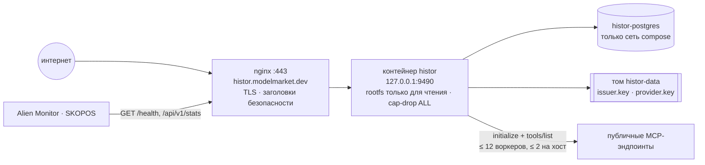
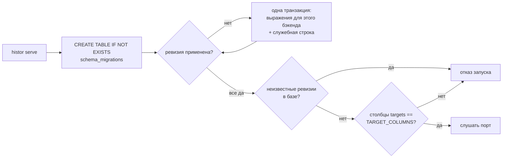
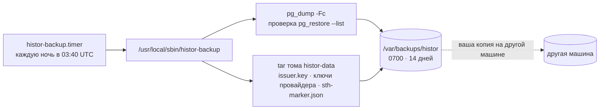

# Эксплуатация

> 🌐 [English](operations.md) · **Русский** · [Español](operations.es.md) · [Français](operations.fr.md) · [中文](operations.zh.md)

## Топология



## Деплой

Из корня монорепозитория, с ноутбука:

```bash
./scripts/deploy_histor.sh --remote admin-vps   # синхронизирует histor/ в /opt/histor и деплоит там
```

`.env` никогда не копируется с ноутбука: у хоста он свой. Первый запуск создаёт его (случайные токен оператора и
пароль Postgres, права 0600, выводятся только имена); последующие запуски его не переписывают. Скрипт помечает
работающий образ как `histor-histor:prev`, собирает и запускает новый и возвращает прежний, если `/health` не
отвечает. Он ставит vhost nginx из `deploy/nginx/histor.modelmarket.dev.conf` (внутри сателлита), получает
сертификат через certbot, если его нет, ставит ночной таймер резервного копирования (см. «Резервные копии») и —
если в момент запуска шёл обход — перезапускает этот обход; с партиями он теряет не больше одной партии.

## Конфигурация

| Переменная | По умолчанию | Примечания |
|---|---|---|
| `HISTOR_PROFILE` | `dev` | при `prod` без следующих трёх сервис не запускается: fail-closed (отказ по умолчанию) |
| `HISTOR_DATABASE_URL` | пусто (SQLite) | prod: `postgresql://…` — обязательно |
| `HISTOR_OPERATOR_TOKEN` | пусто | prod: ≥ 24 символов; защищает `/api/v1/admin/*` |
| `HISTOR_PUBLIC_BASE` | `http://127.0.0.1:9490` | prod: `https://…`; используется в бейджах, ленте, федерации |
| `HISTOR_CRAWL_INTERVAL_S` | `86400` | `0` = только по запросу оператора |
| `HISTOR_CRAWL_ON_START` | `1` | `0`: новый экземпляр ждёт один интервал до первого обхода |
| `HISTOR_CRAWL_WORKERS` / `_PER_HOST` / `_TIMEOUT_S` | `12` / `2` / `20` | вежливость: хост с 2 000 эндпоинтов никогда не получает больше двух запросов одновременно |
| `HISTOR_CRAWL_LIMIT` | `0` | dev: наблюдать только первые N эндпоинтов |
| `HISTOR_CRAWL_BATCH` | `400` | эндпоинты, которые наблюдаются, сканируются и сохраняются вместе; перезапуск теряет не больше одной партии, а деск показывает прогресс по мере сохранения партий |
| `HISTOR_OPT_OUT` | пусто | хосты или префиксы URL, исключённые по просьбе владельцев, плюс `opt-out.txt` на томе данных |
| `HISTOR_CHECK_RATE_PER_MIN` / `_SCAN_RATE_PER_HOUR` | `30` / `20` | на адрес клиента |
| `HISTOR_TRUSTED_PROXIES` | `127.0.0.1,::1` | compose-файл добавляет `172.16.0.0/12`: прокси Docker подключается со шлюза моста |
| `HISTOR_PQC` | `0` | `1`: гибридные подписи федерации Ed25519 + ML-DSA-65 |
| `HISTOR_ALLOW_PRIVATE_TARGETS` | `0` | только для тестов; при `prod` отклоняется |

## Миграции



```bash
docker compose exec histor python -m histor migrate status   # backend=postgresql applied=[1, 2] pending=[]
docker compose exec histor python -m histor migrate up
```

Чтобы добавить ревизию, допишите её в конец `MIGRATIONS` в `histor/migrations.py` — выпущенные
никогда не редактируйте — и, если она затрагивает `targets`, обновите `TARGET_COLUMNS` в том же
изменении. Набор тестов применяет весь список к SQLite, а к Postgres — когда задана `HISTOR_TEST_DATABASE_URL`.

## Резервные копии

Журнал — это и есть продукт, а ключ издателя — его личность: новый ключ означает новый журнал, и любая проверка
согласованности со старым `did:key` по замыслу проваливается.



Таймер ставит `deploy_histor.sh`; вручную — `sudo histor-backup` в любой момент. Локальные копии переживут
потерянный том или неудачное восстановление, но не потерю хоста — копируйте `/var/backups/histor` и в другое место.

**Восстановление** на новый хост: один раз задеплойте (появятся пустой журнал и ключ), остановите сервис,
восстановите обе половины и запустите снова. Ключ и база должны быть из ОДНОЙ ночи:

```bash
docker compose -p histor stop histor
docker compose -p histor exec -T histor-postgres pg_restore -U histor -d histor --clean --if-exists < histor-<stamp>.dump
mkdir -p /tmp/histor-keys && tar -xf keys-<stamp>.tar -C /tmp/histor-keys && docker cp /tmp/histor-keys/data/. histor-histor-1:/data/
docker compose -p histor start histor
```

## Ключ и журнал неразделимы

При каждом старте HISTOR проверяет, что ключ на томе данных — тот, которым подписан журнал в базе, и что база не
старше новейшей вершины дерева, подписанной этим ключом (`sth-marker.json` рядом с ключом). Он отказывается
стартовать и называет причину, если:

- `issuer.key` нет, а в журнале уже есть метки — новый ключ начал бы второй журнал поверх старого дерева;
- ключ не является ключом журнала (`meta.issuer_did`);
- новейшая вершина в базе меньше записанной в маркере или отличается от неё — устаревшее восстановление или сброс,
  при котором тот же ключ подписал бы вторую историю.

Устраните причину (восстановите подходящий ключ или базу из той же ночи). Новый журнал начинайте только
намеренно: уберите в сторону базу И ключ с маркером — вместе.

## Мониторинг

- `/health` — `crawl_running`, `last_crawl_error` (читается из таблицы runs, поэтому неудачный или прерванный обход
  переживает перезапуск), `tree_size`.
- `/api/v1/stats` → `crawl.progress`, пока идёт обход; `lastRun.error` после неудачного.
- `/api/v1/badges/sth` становится янтарным, когда новейшей вершине больше двух интервалов обхода: обходчик остановился.
- Alien Monitor рисует HISTOR узлом в группе безопасности по данным `/api/v1/stats`; неудачный или прерванный
  последний обход окрашивает его в красный.
- Ежедневный обход занимает около 1–2 часов при вежливости по умолчанию (≈20 тыс. эндпоинтов, несколько хостов
  держат по тысяче и больше).

## Как быть вежливым обходчиком

HISTOR представляется (`User-Agent: histor/<version> (+https://histor.modelmarket.dev/#crawler; read-only: initialize + tools/list)`),
отправляет три JSON-RPC-сообщения на эндпоинт в день, никогда не вызывает инструменты, не выполняет редиректы и
держит не больше двух соединений на хост. У одного наблюдения один дедлайн на все запросы и страницы, а набор
инструментов ограничен 3 МиБ и 5 000 инструментов.

Владелец, который не хочет, чтобы его эндпоинт опрашивали, пишет об этом в issue. Добавьте хост (он покрывает и
поддомены) или префикс URL в `HISTOR_OPT_OUT` (через запятую) или в `opt-out.txt` на томе данных (по одному в строке,
комментарии через `#`); файл перечитывается при каждом обходе. Эндпоинт остаётся в списке как не опрошенный с
причиной `operator-opt-out`, а не исчезает молча; метки, уже попавшие в журнал, остаются — журнал только растёт.
