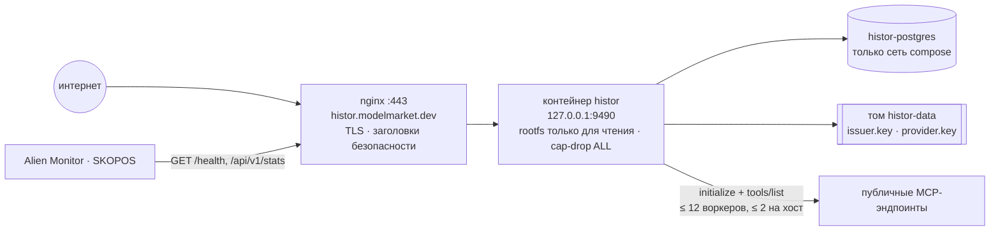
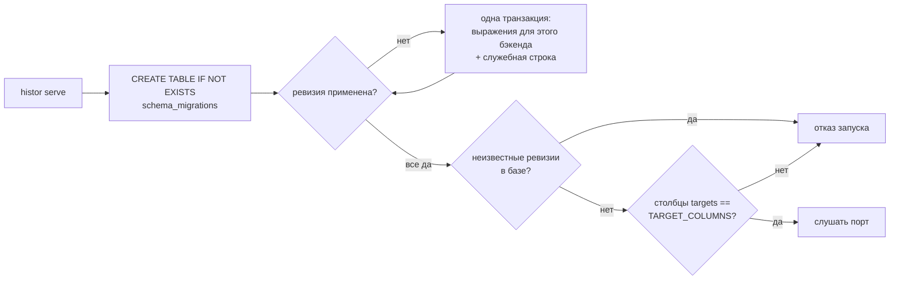
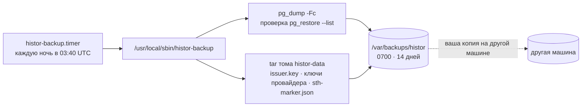

# Эксплуатация

> 🌐 [English](operations.md) · **Русский** · [Español](operations.es.md) · [Français](operations.fr.md) · [中文](operations.zh.md)

## Топология


```mermaid
flowchart LR
    NET(("интернет")) --> NGINX["nginx :443<br/>histor.modelmarket.dev<br/>TLS · заголовки безопасности"]
    NGINX --> APP["контейнер histor<br/>127.0.0.1:9490<br/>rootfs только для чтения · cap-drop ALL"]
    APP --> PG[("histor-postgres<br/>только сеть compose")]
    APP --> VOL[["том histor-data<br/>issuer.key · provider.key"]]
    APP -- "initialize + tools/list<br/>≤ 12 воркеров, ≤ 2 на хост" --> MCP["публичные MCP-эндпоинты"]
    MON["Alien Monitor · SKOPOS"] -- "GET /health, /api/v1/stats" --> NGINX
```

## Деплой

Из корня монорепозитория, с ноутбука:

```bash
./scripts/deploy_histor.sh --remote admin-vps   # синхронизирует histor/ в /opt/histor и деплоит там
```

`.env` никогда не копируется с ноутбука: у хоста он свой. Первый запуск создаёт его (случайные токен оператора и
пароль Postgres, права 0600, выводятся только имена); последующие запуски его не переписывают. Скрипт помечает
работающий образ как `histor-histor:prev`, собирает и запускает новый и возвращает прежний, если `/health` не
отвечает. Он ставит vhost nginx из `deploy/nginx/histor.modelmarket.dev.conf` (внутри сателлита), получает
сертификат через certbot, если его нет, ставит ночной таймер резервного копирования (см. «Резервные копии») и —
если в момент запуска шёл обход — перезапускает этот обход; с партиями он теряет не больше одной партии.

## Конфигурация

| Переменная | По умолчанию | Примечания |
|---|---|---|
| `HISTOR_PROFILE` | `dev` | при `prod` без следующих трёх сервис не запускается: fail-closed (отказ по умолчанию) |
| `HISTOR_DATABASE_URL` | пусто (SQLite) | prod: `postgresql://…` — обязательно |
| `HISTOR_OPERATOR_TOKEN` | пусто | prod: ≥ 24 символов; защищает `/api/v1/admin/*` |
| `HISTOR_PUBLIC_BASE` | `http://127.0.0.1:9490` | prod: `https://…`; используется в бейджах, ленте, федерации |
| `HISTOR_CRAWL_INTERVAL_S` | `86400` | `0` = только по запросу оператора |
| `HISTOR_CRAWL_ON_START` | `1` | `0`: новый экземпляр ждёт один интервал до первого обхода |
| `HISTOR_CRAWL_WORKERS` / `_PER_HOST` / `_TIMEOUT_S` | `12` / `2` / `20` | вежливость: хост с 2 000 эндпоинтов никогда не получает больше двух запросов одновременно |
| `HISTOR_CRAWL_LIMIT` | `0` | dev: наблюдать только первые N эндпоинтов |
| `HISTOR_CRAWL_BATCH` | `400` | эндпоинты, которые наблюдаются, сканируются и сохраняются вместе; перезапуск теряет не больше одной партии, а деск показывает прогресс по мере сохранения партий |
| `HISTOR_OPT_OUT` | пусто | хосты или префиксы URL, исключённые по просьбе владельцев, плюс `opt-out.txt` на томе данных |
| `HISTOR_CHECK_RATE_PER_MIN` / `_SCAN_RATE_PER_HOUR` | `30` / `20` | на адрес клиента |
| `HISTOR_TRUSTED_PROXIES` | `127.0.0.1,::1` | compose-файл добавляет `172.16.0.0/12`: прокси Docker подключается со шлюза моста |
| `HISTOR_PQC` | `0` | `1`: гибридные подписи федерации Ed25519 + ML-DSA-65 |
| `HISTOR_RECEIPT_ISSUERS` | пусто (закрыто) | через запятую — `did:key`, чьи якоря рабочих квитанций принимает журнал квитанций (`/api/v1/receipts/*`). DID хаба берётся из поля `issuer` любой его живой квитанции. Ещё не внесённый издатель получает отказ, который можно повторить, поэтому хаб держит якорь в очереди, пока вы его не добавите. `docker-compose.yml` должен пробрасывать переменную, как и любую из перечисленных в нём |
| `HISTOR_ALLOW_PRIVATE_TARGETS` | `0` | только для тестов; при `prod` отклоняется |
| `HISTOR_CLASSIFIER_MODEL` | пусто | id модели OpenRouter (напр. `deepseek/deepseek-chat`, `minimax/minimax-m1`). Выключен, пока не заданы модель, ключ и бюджет |
| `HISTOR_OPENROUTER_API_KEY` | пусто | ключ OpenRouter (или `OPENROUTER_API_KEY`); остаётся в `.env` хоста, не в образе |
| `HISTOR_CLASSIFIER_MAX_PER_CRAWL` | `0` | потолок платных вызовов за обход. `0` — выключено; считаются только различные наборы (общий или уже оценённый переиспользуется бесплатно) |
| `HISTOR_CLASSIFIER_BASE_URL` / `_TIMEOUT_S` / `_MAX_TOOLS` | `https://openrouter.ai/api/v1` / `30` / `60` | смысловой языконезависимый классификатор; вердикт справочный и не попадает в подписанный лог |

## Миграции


```mermaid
flowchart LR
    START["histor serve"] --> BOOK["CREATE TABLE IF NOT EXISTS<br/>schema_migrations"]
    BOOK --> LOOP{"ревизия применена?"}
    LOOP -- "нет" --> TX["одна транзакция:<br/>выражения для этого бэкенда<br/>+ служебная строка"]
    TX --> LOOP
    LOOP -- "все да" --> FUT{"неизвестные ревизии<br/>в базе?"}
    FUT -- "да" --> STOP["отказ запуска"]
    FUT -- "нет" --> CONTRACT{"столбцы targets ==<br/>TARGET_COLUMNS?"}
    CONTRACT -- "нет" --> STOP
    CONTRACT -- "да" --> SERVE["слушать порт"]
```

```bash
docker compose exec histor python -m histor migrate status   # backend=postgresql applied=[1, 2, 3] pending=[]
docker compose exec histor python -m histor migrate up
```

Чтобы добавить ревизию, допишите её в конец `MIGRATIONS` в `histor/migrations.py` — выпущенные
никогда не редактируйте — и, если она затрагивает `targets`, обновите `TARGET_COLUMNS` в том же
изменении. Набор тестов применяет весь список к SQLite, а к Postgres — когда задана `HISTOR_TEST_DATABASE_URL`.

## Резервные копии

Журнал — это и есть продукт, а ключ издателя — его личность: новый ключ означает новый журнал, и любая проверка
согласованности со старым `did:key` по замыслу проваливается.


```mermaid
flowchart LR
    T["histor-backup.timer<br/>каждую ночь в 03:40 UTC"] --> S["/usr/local/sbin/histor-backup"]
    S --> D["pg_dump -Fc<br/>проверка pg_restore --list"]
    S --> K["tar тома histor-data<br/>issuer.key · ключи провайдера · sth-marker.json"]
    D --> B[("/var/backups/histor<br/>0700 · 14 дней")]
    K --> B
    B -. "ваша копия на другой машине" .-> O[("другая машина")]
```

Таймер ставит `deploy_histor.sh`; вручную — `sudo histor-backup` в любой момент. Локальные копии переживут
потерянный том или неудачное восстановление, но не потерю хоста — копируйте `/var/backups/histor` и в другое место.

**Восстановление** на новый хост: один раз задеплойте (появятся пустой журнал и ключ), остановите сервис,
восстановите обе половины и запустите снова. Ключ и база должны быть из ОДНОЙ ночи:

```bash
docker compose -p histor stop histor
docker compose -p histor exec -T histor-postgres pg_restore -U histor -d histor --clean --if-exists < histor-<stamp>.dump
mkdir -p /tmp/histor-keys && tar -xf keys-<stamp>.tar -C /tmp/histor-keys && docker cp /tmp/histor-keys/data/. histor-histor-1:/data/
docker compose -p histor start histor
```

## Ключ и журнал неразделимы

При каждом старте HISTOR проверяет, что ключ на томе данных — тот, которым подписан журнал в базе, и что база не
старше новейшей вершины дерева, подписанной этим ключом (`sth-marker.json` рядом с ключом). Он отказывается
стартовать и называет причину, если:

- `issuer.key` нет, а в журнале уже есть метки — новый ключ начал бы второй журнал поверх старого дерева;
- ключ не является ключом журнала (`meta.issuer_did`);
- новейшая вершина в базе меньше записанной в маркере или отличается от неё — устаревшее восстановление или сброс,
  при котором тот же ключ подписал бы вторую историю.

Устраните причину (восстановите подходящий ключ или базу из той же ночи). Новый журнал начинайте только
намеренно: уберите в сторону базу И ключ с маркером — вместе.

## Мониторинг

- `/health` — `crawl_running`, `last_crawl_error` (читается из таблицы runs, поэтому неудачный или прерванный обход
  переживает перезапуск), `tree_size`.
- `/api/v1/stats` → `crawl.progress`, пока идёт обход; `lastRun.error` после неудачного.
- `/api/v1/badges/sth` становится янтарным, когда новейшей вершине больше двух интервалов обхода: обходчик остановился.
- Alien Monitor рисует HISTOR узлом в группе безопасности по данным `/api/v1/stats`; неудачный или прерванный
  последний обход окрашивает его в красный.
- Ежедневный обход занимает около 1–2 часов при вежливости по умолчанию (≈20 тыс. эндпоинтов, несколько хостов
  держат по тысяче и больше).

## Как быть вежливым обходчиком

HISTOR представляется (`User-Agent: histor/<version> (+https://histor.modelmarket.dev/#crawler; read-only: initialize + tools/list)`),
отправляет три JSON-RPC-сообщения на эндпоинт в день, никогда не вызывает инструменты, не выполняет редиректы и
держит не больше двух соединений на хост. У одного наблюдения один дедлайн на все запросы и страницы, а набор
инструментов ограничен 3 МиБ и 5 000 инструментов.

Владелец, который не хочет, чтобы его эндпоинт опрашивали, пишет об этом в issue. Добавьте хост (он покрывает и
поддомены) или префикс URL в `HISTOR_OPT_OUT` (через запятую) или в `opt-out.txt` на томе данных (по одному в строке,
комментарии через `#`); файл перечитывается при каждом обходе. Эндпоинт остаётся в списке как не опрошенный с
причиной `operator-opt-out`, а не исчезает молча; метки, уже попавшие в журнал, остаются — журнал только растёт.

## Песочница для пакетов

Большинство MCP-серверов, которыми пользуются люди, — пакеты npm или PyPI, которые клиент запускает на их собственной машине (`npx -y …`, `uvx …`): подключаться не к чему. HISTOR читает их на отдельном хосте, который ставит пакет и запускает его под [gVisor](https://gvisor.dev) — ядром, написанным в пространстве пользователя, так что пакет говорит с gVisor, а не с ядром хоста. gVisor — открытый проект Google под [лицензией Apache 2.0](https://github.com/google/gvisor/blob/master/LICENSE); HISTOR его запускает, но не распространяет.

**Что делает одно наблюдение** (`histor/sandbox/histor_observe.py`, только стандартная библиотека):

1. Установка, под gVisor: npm с `--ignore-scripts`, pip с `--only-binary=:all:` — код пакета не выполняется. Пакет PyPI, у которого есть только sdist, отмечается как `no-wheel` и никогда не собирается.
2. Запуск, под gVisor в режиме трассировки (`runsc-trace`): внутренняя сеть без маршрута наружу, единственный DNS — логгер наблюдателя; корень и пакет только для чтения, `/tmp` — tmpfs на 64 МБ, непривилегированный uid, без capabilities и без повышения привилегий, 512 МБ памяти без swap, один CPU, 256 процессов, в окружении только `PATH`/`HOME`. В HOME лежат приманки (SSH-ключи, токены облаков, реестров и Git, кошелёк, история shell), в рабочей папке — приманка `.env`. Наблюдатель говорит по MCP через stdin/stdout: `initialize`, `tools/list`, затем каждый из не более чем 15 инструментов один раз с подставными аргументами, собранными по его схеме (адрес на `histor-trap.invalid`, путь к заметке-приманке), — внутри песочницы, ни на что настоящее не действуя, — и убивает контейнер. Установочные скрипты npm, пропущенные при установке, сначала выполняются отдельно, тоже под трассировкой.
3. Ответ: версия, её хеш целостности, хеш образа, статус (`ok`, `exited` — чаще всего серверу для старта нужен ключ или путь, —, `install-failed`, `no-entry-point`, `no-wheel`, `timeout`, `protocol`) и инструменты.

Если `runsc` не зарегистрирован в Docker, наблюдатель отказывается работать, а не переходит на обычный `runc`.

**Поведение.** gVisor сам пишет трассу запуска (`execve`, `connect`, `open`/`openat`) вне песочницы, поэтому пакет не может её скрыть или подделать; DNS-логгер записывает каждое запрошенное имя и отвечает уникальным адресом из 198.18.0.0/15, который никуда не ведёт, — так каждая попытка соединения видна вместе с именем, ради которого она была. По фазам — установочные скрипты, запуск, вызовы с подставными аргументами — наблюдение сообщает: запущенные программы, запрошенные имена и адреса, открытые приманки и записи, которые пережили бы песочницу (`.bashrc`, `authorized_keys`, …). Активность входного процесса контейнера на шаге установочных скриптов — это сам npm, она отбрасывается; соединения с loopback тоже. Установка добавляет runtime `runsc-trace`, внутреннюю сеть `histor-observe` (10.231.0.0/24), правило файрвола, пускающее её только к резолверу, `CAP_NET_BIND_SERVICE` для службы и таймер, удаляющий прочитанные трассы. HISTOR снова запускает версию, если её наблюдал наблюдатель старше `HISTOR_SANDBOX_OBSERVER` (2 = поведение).

**Какие версии.** Опубликованную версию в npm и PyPI изменить нельзя, поэтому каждая версия читается один раз. Каждый обход спрашивает у реестров последнюю версию (это дёшево) и запускает песочницу только для версий, которых ещё не видел, не больше `HISTOR_SANDBOX_MAX_PER_CRAWL` (300): сначала новые версии уже известных пакетов — именно так изменённое описание инструмента доходит до всех, кто запускает пакет без закреплённой версии, — затем пакеты, которые ещё не читались. Сбой самой песочницы записывается как внутренняя ошибка HISTOR и не порождает метки о пакете.

**Как поставить хост песочницы** (Ubuntu 24.04, Docker):

```bash
# gVisor из подписанного apt-репозитория Google, закреплённый на одном выпуске
curl -fsSL https://gvisor.dev/archive.key | gpg --dearmor -o /usr/share/keyrings/gvisor-archive-keyring.gpg
#   отпечаток 6F1D F85E 3A71 C249 18E7  27D5 6FC6 D554 E32B D943 (The gVisor Authors)
echo "deb [arch=amd64 signed-by=/usr/share/keyrings/gvisor-archive-keyring.gpg] https://storage.googleapis.com/gvisor/releases 20261005 main" \
  > /etc/apt/sources.list.d/gvisor.list
apt-get update && apt-get install -y runsc
runsc install && systemctl reload docker      # перечитать настройки, а не перезапустить: контейнеры продолжают работать

# наблюдатель: пользователь, сеть, образы, TLS, токен, служба systemd, правило файрвола только для хоста HISTOR
HISTOR_CALLER_IP=<IP хоста HISTOR> ./histor/sandbox/install.sh
```

`install.sh` печатает SHA-256 сертификата и заканчивается самопроверкой, которая должна сказать `"gvisor":true` (ядро внутри — `4.19.0-gvisor`). Токен генерируется один раз в `/etc/histor-sandbox.env` и никогда не печатается; перенесите его в `.env` хоста HISTOR, не выводя на экран. На хосте HISTOR:

```bash
HISTOR_SANDBOX_URL=https://<хост песочницы>:9443
HISTOR_SANDBOX_TOKEN=<из /etc/histor-sandbox.env>
HISTOR_SANDBOX_CERT_SHA256=<напечатан install.sh>
```

HISTOR закрепляет сертификат: проверяет отпечаток до того, как отправит хоть байт, включая токен. Две ловушки, найденные при настройке: в пользовательской сети Docker gVisor не видит встроенный DNS Docker (`127.0.0.11`), поэтому шагу установки дан свой `resolv.conf`; а `--memory-swap` по умолчанию удваивает лимит памяти — выделение 900 МБ проходило в контейнере на 512 МБ, пока swap не приравняли к памяти. Журнал: `journalctl -u histor-sandbox`.

**Пропускная способность.** `HISTOR_SANDBOX_SLOTS` в `/etc/histor-sandbox.env` (по умолчанию 2) — сколько пакетов хост песочницы запускает одновременно; каждый занимает до 1 ГБ при установке и 512 МБ при запуске. В HISTOR задайте `HISTOR_SANDBOX_CONCURRENCY` равным этому числу. `HISTOR_SANDBOX_MAX_PER_CRAWL` ограничивает число версий за один обход. Одно наблюдение целиком занимает 13–60 с, так что три слота проходят около 500 пакетов в час.
