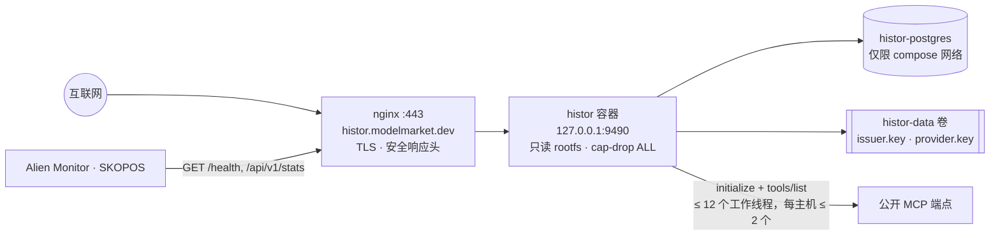
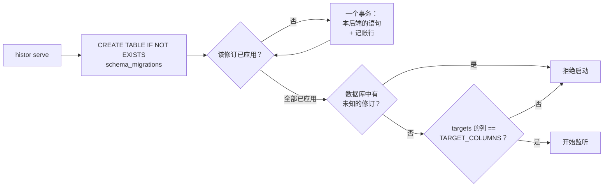
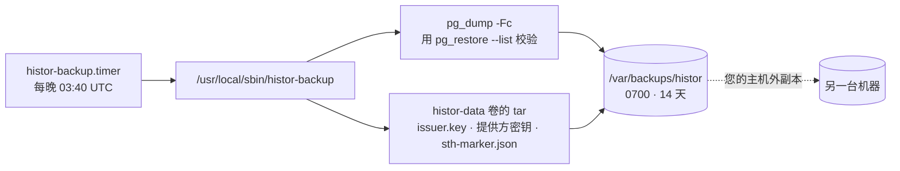

# 运维

> 🌐 [English](operations.md) · [Русский](operations.ru.md) · [Español](operations.es.md) · [Français](operations.fr.md) · **中文**

## 拓扑



## 部署

在笔记本上，从 monorepo 根目录执行：

```bash
./scripts/deploy_histor.sh --remote admin-vps   # 把 histor/ 同步到 /opt/histor，然后在那里部署
```

`.env` 从不从笔记本复制：主机保留自己的那份。首次运行会创建它（随机的运营者令牌和 Postgres 密码，权限 0600，只打印名称）；
之后的运行从不改写它。脚本会把正在运行的镜像标记为 `histor-histor:prev`，构建并启动新镜像；如果 `/health` 没有响应，就恢复旧镜像。
它从 `deploy/nginx/histor.modelmarket.dev.conf`（位于卫星仓库内）安装 nginx 虚拟主机，若没有证书则用 certbot 签发，
安装每晚备份定时器（见“备份”），并且——如果开始时有抓取正在进行——重新启动这次抓取；分批之后最多丢失一批。

## 配置

| 变量 | 默认值 | 说明 |
|---|---|---|
| `HISTOR_PROFILE` | `dev` | `prod` 在缺少以下三项时 fail-closed（默认拒绝） |
| `HISTOR_DATABASE_URL` | 空（SQLite） | prod：`postgresql://…`——必填 |
| `HISTOR_OPERATOR_TOKEN` | 空 | prod：≥ 24 个字符；保护 `/api/v1/admin/*` |
| `HISTOR_PUBLIC_BASE` | `http://127.0.0.1:9490` | prod：`https://…`；用于徽章、订阅源、联邦 |
| `HISTOR_CRAWL_INTERVAL_S` | `86400` | `0` = 仅在运营方请求时抓取 |
| `HISTOR_CRAWL_ON_START` | `1` | `0`：新实例会先等待一个间隔，再进行首次抓取 |
| `HISTOR_CRAWL_WORKERS` / `_PER_HOST` / `_TIMEOUT_S` | `12` / `2` / `20` | 礼貌策略：即使一个主机承载 2000 个端点，同一时刻也最多只被访问两次 |
| `HISTOR_CRAWL_LIMIT` | `0` | dev：只观测前 N 个端点 |
| `HISTOR_CRAWL_BATCH` | `400` | 一起观测、扫描并保存的端点数；重启最多丢失一批，面板会随着每批保存显示进度 |
| `HISTOR_OPT_OUT` | 空 | 应请求排除的主机或 URL 前缀，外加数据卷上的 `opt-out.txt` |
| `HISTOR_CHECK_RATE_PER_MIN` / `_SCAN_RATE_PER_HOUR` | `30` / `20` | 按客户端地址计算 |
| `HISTOR_TRUSTED_PROXIES` | `127.0.0.1,::1` | compose 文件追加了 `172.16.0.0/12`：Docker 的代理从网桥网关发起连接 |
| `HISTOR_PQC` | `0` | `1`：联邦签名使用 Ed25519 + ML-DSA-65 混合签名 |
| `HISTOR_ALLOW_PRIVATE_TARGETS` | `0` | 仅供测试；在 `prod` 下被拒绝 |
| `HISTOR_CLASSIFIER_MODEL` | 空 | OpenRouter 模型 id（如 `deepseek/deepseek-chat`、`minimax/minimax-m1`）。除非同时设置模型、密钥和预算，否则关闭 |
| `HISTOR_OPENROUTER_API_KEY` | 空 | OpenRouter 密钥（或 `OPENROUTER_API_KEY`）；留在主机 `.env`，不进镜像 |
| `HISTOR_CLASSIFIER_MAX_PER_CRAWL` | `0` | 每次抓取的付费调用上限。`0` 表示关闭；只计不同的工具集（共享或已判定过的免费复用） |
| `HISTOR_CLASSIFIER_BASE_URL` / `_TIMEOUT_S` / `_MAX_TOOLS` | `https://openrouter.ai/api/v1` / `30` / `60` | 基于语义、与语言无关的分类器；其判定为参考，绝不进入已签名日志 |

## 迁移



```bash
docker compose exec histor python -m histor migrate status   # backend=postgresql applied=[1, 2, 3] pending=[]
docker compose exec histor python -m histor migrate up
```

新增修订的方法是向 `histor/migrations.py` 中的 `MIGRATIONS` 追加一项——绝不修改已发布的修订——
如果它涉及 `targets`，就在同一次变更中更新 `TARGET_COLUMNS`。测试套件会把整个列表应用到 SQLite 上，
设置了 `HISTOR_TEST_DATABASE_URL` 时也会应用到 Postgres 上。

## 备份

日志就是产品，而发布者密钥就是它的身份：新密钥意味着新日志，任何针对旧 `did:key` 的一致性检查都会按设计失败。



定时器由 `deploy_histor.sh` 安装；也可随时手动运行 `sudo histor-backup`。本地副本能扛住卷丢失或恢复失误，但扛不住整台主机丢失——
请把 `/var/backups/histor` 另外复制到别处。

**在新主机上恢复**：先部署一次（会生成空日志和密钥），停止服务，恢复两部分，再启动。密钥和数据库必须来自同一晚：

```bash
docker compose -p histor stop histor
docker compose -p histor exec -T histor-postgres pg_restore -U histor -d histor --clean --if-exists < histor-<stamp>.dump
mkdir -p /tmp/histor-keys && tar -xf keys-<stamp>.tar -C /tmp/histor-keys && docker cp /tmp/histor-keys/data/. histor-histor-1:/data/
docker compose -p histor start histor
```

## 密钥与日志不可分

每次启动时，HISTOR 都会检查数据卷上的密钥是否就是签署数据库中日志的那把，以及数据库是否比该密钥签发的最新树头
（密钥旁的 `sth-marker.json`）更旧。遇到以下情况，它会拒绝启动并说明原因：

- `issuer.key` 缺失，但日志中已有标签——新密钥会在旧树上开启第二份日志；
- 密钥不是该日志的密钥（`meta.issuer_did`）；
- 数据库中最新的树头比标记记录的小，或与之不同——这是过期恢复或重置，会让同一把密钥签出第二段历史。

请排除原因（恢复同一晚的匹配密钥或数据库）。只有在确有意图时才开启新日志：把数据库和密钥连同标记一起移开。

## 监控

- `/health` —— `crawl_running`、`last_crawl_error`（从 runs 表读取，因此失败或中断的抓取在重启后仍然可见）、`tree_size`。
- `/api/v1/stats` → 抓取进行时提供 `crawl.progress`；抓取失败后提供 `lastRun.error`。
- 当最新树头超过两个抓取间隔时，`/api/v1/badges/sth` 变为琥珀色：抓取程序停了。
- Alien Monitor 以 `/api/v1/stats` 为数据，把 HISTOR 绘制为安全组中的一个节点；最近一次抓取失败或中断时它会变红。
- 在默认礼貌设置下，每日抓取约需 1–2 小时（约 2 万个端点，少数主机各承载数千个）。

## 做一个守规矩的抓取程序

HISTOR 会表明身份（`User-Agent: histor/<version> (+https://histor.modelmarket.dev/#crawler; read-only: initialize + tools/list)`），
每个端点每天发送三条 JSON-RPC 消息，从不调用工具，不跟随重定向，每个主机最多保持两个连接。一次观测的所有请求和分页共用一个截止时间，
工具集上限为 3 MiB 和 5 000 个工具。

不希望自己的端点被抓取的运营者可以提交 issue 说明。把主机（同时覆盖其子域名）或 URL 前缀加入 `HISTOR_OPT_OUT`（逗号分隔），
或写入数据卷上的 `opt-out.txt`（每行一条，`#` 开头为注释），每次抓取都会重新读取。该端点仍会以未尝试状态列出，原因为 `operator-opt-out`，
而不是被悄悄删除；已写入日志的标签会保留，因为日志只增不减。
