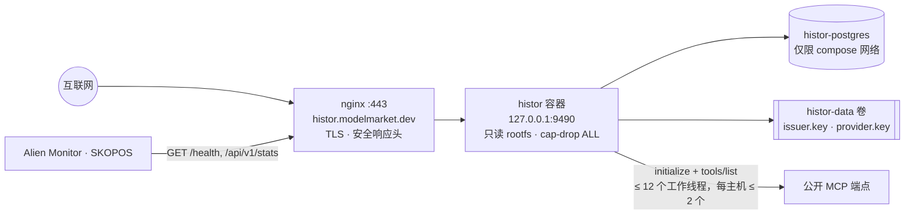
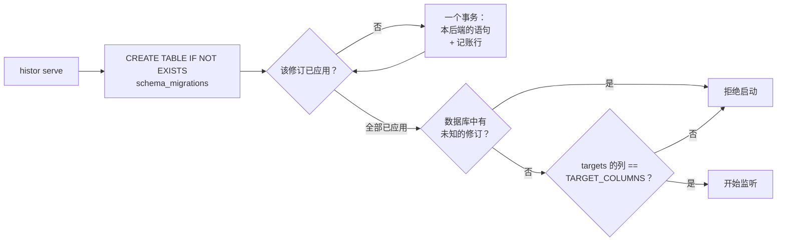
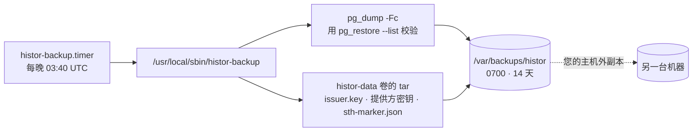

# 运维

> 🌐 [English](operations.md) · [Русский](operations.ru.md) · [Español](operations.es.md) · [Français](operations.fr.md) · **中文**

## 拓扑


```mermaid
flowchart LR
    NET(("互联网")) --> NGINX["nginx :443<br/>histor.modelmarket.dev<br/>TLS · 安全响应头"]
    NGINX --> APP["histor 容器<br/>127.0.0.1:9490<br/>只读 rootfs · cap-drop ALL"]
    APP --> PG[("histor-postgres<br/>仅限 compose 网络")]
    APP --> VOL[["histor-data 卷<br/>issuer.key · provider.key"]]
    APP -- "initialize + tools/list<br/>≤ 12 个工作线程，每主机 ≤ 2 个" --> MCP["公开 MCP 端点"]
    MON["Alien Monitor · SKOPOS"] -- "GET /health, /api/v1/stats" --> NGINX
```

## 部署

在笔记本上，从 monorepo 根目录执行：

```bash
./scripts/deploy_histor.sh --remote admin-vps   # 把 histor/ 同步到 /opt/histor，然后在那里部署
```

`.env` 从不从笔记本复制：主机保留自己的那份。首次运行会创建它（随机的运营者令牌和 Postgres 密码，权限 0600，只打印名称）；
之后的运行从不改写它。脚本会把正在运行的镜像标记为 `histor-histor:prev`，构建并启动新镜像；如果 `/health` 没有响应，就恢复旧镜像。
它从 `deploy/nginx/histor.modelmarket.dev.conf`（位于卫星仓库内）安装 nginx 虚拟主机，若没有证书则用 certbot 签发，
安装每晚备份定时器（见“备份”），并且——如果开始时有抓取正在进行——重新启动这次抓取；分批之后最多丢失一批。

## 配置

| 变量 | 默认值 | 说明 |
|---|---|---|
| `HISTOR_PROFILE` | `dev` | `prod` 在缺少以下三项时 fail-closed（默认拒绝） |
| `HISTOR_DATABASE_URL` | 空（SQLite） | prod：`postgresql://…`——必填 |
| `HISTOR_OPERATOR_TOKEN` | 空 | prod：≥ 24 个字符；保护 `/api/v1/admin/*` |
| `HISTOR_PUBLIC_BASE` | `http://127.0.0.1:9490` | prod：`https://…`；用于徽章、订阅源、联邦 |
| `HISTOR_CRAWL_INTERVAL_S` | `86400` | `0` = 仅在运营方请求时抓取 |
| `HISTOR_CRAWL_ON_START` | `1` | `0`：新实例会先等待一个间隔，再进行首次抓取 |
| `HISTOR_CRAWL_WORKERS` / `_PER_HOST` / `_TIMEOUT_S` | `12` / `2` / `20` | 礼貌策略：即使一个主机承载 2000 个端点，同一时刻也最多只被访问两次 |
| `HISTOR_CRAWL_LIMIT` | `0` | dev：只观测前 N 个端点 |
| `HISTOR_CRAWL_BATCH` | `400` | 一起观测、扫描并保存的端点数；重启最多丢失一批，面板会随着每批保存显示进度 |
| `HISTOR_OPT_OUT` | 空 | 应请求排除的主机或 URL 前缀，外加数据卷上的 `opt-out.txt` |
| `HISTOR_CHECK_RATE_PER_MIN` / `_SCAN_RATE_PER_HOUR` | `30` / `20` | 按客户端地址计算 |
| `HISTOR_TRUSTED_PROXIES` | `127.0.0.1,::1` | compose 文件追加了 `172.16.0.0/12`：Docker 的代理从网桥网关发起连接 |
| `HISTOR_PQC` | `0` | `1`：联邦签名使用 Ed25519 + ML-DSA-65 混合签名 |
| `HISTOR_RECEIPT_ISSUERS` | 空（关闭） | 逗号分隔的 `did:key` 列表，收据日志（`/api/v1/receipts/*`）只接受这些签发方的工作收据锚点。枢纽的 DID 取自其任一真实收据的 `issuer` 字段。尚未列入的签发方会收到可重试的拒绝，其枢纽会把锚点留在队列中，直到你把它加入。`docker-compose.yml` 必须转发该变量，与其中列出的其他变量一样 |
| `HISTOR_ALLOW_PRIVATE_TARGETS` | `0` | 仅供测试；在 `prod` 下被拒绝 |
| `HISTOR_CLASSIFIER_MODEL` | 空 | OpenRouter 模型 id（如 `deepseek/deepseek-chat`、`minimax/minimax-m1`）。除非同时设置模型、密钥和预算，否则关闭 |
| `HISTOR_OPENROUTER_API_KEY` | 空 | OpenRouter 密钥（或 `OPENROUTER_API_KEY`）；留在主机 `.env`，不进镜像 |
| `HISTOR_CLASSIFIER_MAX_PER_CRAWL` | `0` | 每次抓取的付费调用上限。`0` 表示关闭；只计不同的工具集（共享或已判定过的免费复用） |
| `HISTOR_CLASSIFIER_BASE_URL` / `_TIMEOUT_S` / `_MAX_TOOLS` | `https://openrouter.ai/api/v1` / `30` / `60` | 基于语义、与语言无关的分类器；其判定为参考，绝不进入已签名日志 |

## 迁移


```mermaid
flowchart LR
    START["histor serve"] --> BOOK["CREATE TABLE IF NOT EXISTS<br/>schema_migrations"]
    BOOK --> LOOP{"该修订已应用？"}
    LOOP -- "否" --> TX["一个事务：<br/>本后端的语句<br/>+ 记账行"]
    TX --> LOOP
    LOOP -- "全部已应用" --> FUT{"数据库中有<br/>未知的修订？"}
    FUT -- "是" --> STOP["拒绝启动"]
    FUT -- "否" --> CONTRACT{"targets 的列 ==<br/>TARGET_COLUMNS？"}
    CONTRACT -- "否" --> STOP
    CONTRACT -- "是" --> SERVE["开始监听"]
```

```bash
docker compose exec histor python -m histor migrate status   # backend=postgresql applied=[1, 2, 3] pending=[]
docker compose exec histor python -m histor migrate up
```

新增修订的方法是向 `histor/migrations.py` 中的 `MIGRATIONS` 追加一项——绝不修改已发布的修订——
如果它涉及 `targets`，就在同一次变更中更新 `TARGET_COLUMNS`。测试套件会把整个列表应用到 SQLite 上，
设置了 `HISTOR_TEST_DATABASE_URL` 时也会应用到 Postgres 上。

## 备份

日志就是产品，而发布者密钥就是它的身份：新密钥意味着新日志，任何针对旧 `did:key` 的一致性检查都会按设计失败。


```mermaid
flowchart LR
    T["histor-backup.timer<br/>每晚 03:40 UTC"] --> S["/usr/local/sbin/histor-backup"]
    S --> D["pg_dump -Fc<br/>用 pg_restore --list 校验"]
    S --> K["histor-data 卷的 tar<br/>issuer.key · 提供方密钥 · sth-marker.json"]
    D --> B[("/var/backups/histor<br/>0700 · 14 天")]
    K --> B
    B -. "您的主机外副本" .-> O[("另一台机器")]
```

定时器由 `deploy_histor.sh` 安装；也可随时手动运行 `sudo histor-backup`。本地副本能扛住卷丢失或恢复失误，但扛不住整台主机丢失——
请把 `/var/backups/histor` 另外复制到别处。

**在新主机上恢复**：先部署一次（会生成空日志和密钥），停止服务，恢复两部分，再启动。密钥和数据库必须来自同一晚：

```bash
docker compose -p histor stop histor
docker compose -p histor exec -T histor-postgres pg_restore -U histor -d histor --clean --if-exists < histor-<stamp>.dump
mkdir -p /tmp/histor-keys && tar -xf keys-<stamp>.tar -C /tmp/histor-keys && docker cp /tmp/histor-keys/data/. histor-histor-1:/data/
docker compose -p histor start histor
```

## 密钥与日志不可分

每次启动时，HISTOR 都会检查数据卷上的密钥是否就是签署数据库中日志的那把，以及数据库是否比该密钥签发的最新树头
（密钥旁的 `sth-marker.json`）更旧。遇到以下情况，它会拒绝启动并说明原因：

- `issuer.key` 缺失，但日志中已有标签——新密钥会在旧树上开启第二份日志；
- 密钥不是该日志的密钥（`meta.issuer_did`）；
- 数据库中最新的树头比标记记录的小，或与之不同——这是过期恢复或重置，会让同一把密钥签出第二段历史。

请排除原因（恢复同一晚的匹配密钥或数据库）。只有在确有意图时才开启新日志：把数据库和密钥连同标记一起移开。

## 监控

- `/health` —— `crawl_running`、`last_crawl_error`（从 runs 表读取，因此失败或中断的抓取在重启后仍然可见）、`tree_size`。
- `/api/v1/stats` → 抓取进行时提供 `crawl.progress`；抓取失败后提供 `lastRun.error`。
- 当最新树头超过两个抓取间隔时，`/api/v1/badges/sth` 变为琥珀色：抓取程序停了。
- Alien Monitor 以 `/api/v1/stats` 为数据，把 HISTOR 绘制为安全组中的一个节点；最近一次抓取失败或中断时它会变红。
- 在默认礼貌设置下，每日抓取约需 1–2 小时（约 2 万个端点，少数主机各承载数千个）。

## 做一个守规矩的抓取程序

HISTOR 会表明身份（`User-Agent: histor/<version> (+https://histor.modelmarket.dev/#crawler; read-only: initialize + tools/list)`），
每个端点每天发送三条 JSON-RPC 消息，从不调用工具，不跟随重定向，每个主机最多保持两个连接。一次观测的所有请求和分页共用一个截止时间，
工具集上限为 3 MiB 和 5 000 个工具。

不希望自己的端点被抓取的运营者可以提交 issue 说明。把主机（同时覆盖其子域名）或 URL 前缀加入 `HISTOR_OPT_OUT`（逗号分隔），
或写入数据卷上的 `opt-out.txt`（每行一条，`#` 开头为注释），每次抓取都会重新读取。该端点仍会以未尝试状态列出，原因为 `operator-opt-out`，
而不是被悄悄删除；已写入日志的标签会保留，因为日志只增不减。

## 软件包沙箱

人们使用的大多数 MCP 服务器是 npm 或 PyPI 软件包，由客户端在用户自己的机器上启动（`npx -y …`、`uvx …`）：没有可以连接的端点。HISTOR 在另一台主机上观察它们：该主机安装软件包，并在 [gVisor](https://gvisor.dev) 下启动它——gVisor 是一个在用户空间实现的内核，因此软件包与 gVisor 交互，而不是与主机内核交互。gVisor 是 Google 的开源项目，采用 [Apache 2.0 许可证](https://github.com/google/gvisor/blob/master/LICENSE)；HISTOR 运行它，但不分发它。

**一次观察做什么**（`histor/sandbox/histor_observe.py`，只用标准库）：

1. 安装，在 gVisor 下：npm 使用 `--ignore-scripts`，pip 使用 `--only-binary=:all:`——不执行软件包的任何代码。只发布 sdist 的 PyPI 软件包记为 `no-wheel`，从不构建。
2. 运行，在 gVisor 的跟踪运行时（`runsc-trace`）下：没有对外路由的内部网络，唯一的解析器是观察程序的 DNS 记录器；根文件系统和软件包只读，`/tmp` 为 64 MB 的 tmpfs，非特权 uid，无 capabilities、不允许提升权限，512 MB 内存且关闭 swap，一个 CPU，256 个进程，环境中只有 `PATH`/`HOME`。HOME 中放着诱饵凭据（SSH 密钥、云/注册表/Git 令牌、钱包、shell 历史），工作目录中有诱饵 `.env`。观察程序通过标准输入输出说 MCP：`initialize`、`tools/list`，然后按每个工具的 schema 构造金丝雀参数（`histor-trap.invalid` 上的地址、指向诱饵笔记的路径），对最多 15 个工具各调用一次——在沙箱内，不作用于任何真实对象——然后杀掉容器。安装时跳过的 npm 安装脚本，会先在单独的、同样被跟踪的阶段运行。
3. 应答：版本、其完整性哈希、镜像摘要、状态（`ok`；`exited`——多半是服务器启动需要密钥或路径——；`install-failed`、`no-entry-point`、`no-wheel`、`timeout`、`protocol`）以及工具。

如果 `runsc` 不是 Docker 的运行时，它拒绝运行，而不是退回到普通的 `runc`。

**行为。** gVisor 在沙箱之外自行记录运行跟踪（`execve`、`connect`、`open`/`openat`），软件包既无法隐藏也无法伪造；DNS 记录器记下每个被查询的名称，并以 198.18.0.0/15 中一个不通往任何地方的唯一地址作答，因此每次连接尝试都能和它所针对的名称一起被看到。按阶段——安装脚本、启动、金丝雀调用——观察结果报告：启动的程序、查询的名称和拨打的地址、被打开的诱饵，以及会在沙箱之外留存的写入（`.bashrc`、`authorized_keys` 等）。安装脚本阶段中容器入口进程的活动属于 npm 自身，予以丢弃；回环连接也丢弃。部署会增加 `runsc-trace` 运行时、内部网络 `histor-observe`（10.231.0.0/24）、只允许其访问解析器的防火墙规则、服务的 `CAP_NET_BIND_SERVICE`，以及删除已读跟踪的定时器。当某版本的观察程序早于 `HISTOR_SANDBOX_OBSERVER`（2 = 行为）时，HISTOR 会重新运行它。

**观察哪些版本。** npm 或 PyPI 上已发布的版本不能修改，所以每个版本只观察一次。每次抓取都向注册表查询最新版本（成本很低），只对没见过的版本运行沙箱，每次最多 `HISTOR_SANDBOX_MAX_PER_CRAWL`（300）个：先是已观察过的软件包的新版本——被修改的工具描述正是这样到达所有不固定版本运行该软件包的人——然后是从未观察过的软件包。沙箱本身的故障记为 HISTOR 的内部错误，不会签发任何关于该软件包的标签。

**准备沙箱主机**（Ubuntu 24.04，Docker）：

```bash
# 从 Google 签名的 apt 仓库安装 gVisor，固定到一个版本
curl -fsSL https://gvisor.dev/archive.key | gpg --dearmor -o /usr/share/keyrings/gvisor-archive-keyring.gpg
#   指纹 6F1D F85E 3A71 C249 18E7  27D5 6FC6 D554 E32B D943（The gVisor Authors）
echo "deb [arch=amd64 signed-by=/usr/share/keyrings/gvisor-archive-keyring.gpg] https://storage.googleapis.com/gvisor/releases 20261005 main" \
  > /etc/apt/sources.list.d/gvisor.list
apt-get update && apt-get install -y runsc
runsc install && systemctl reload docker      # 重新加载而不是重启：正在运行的容器不受影响

# 观察程序：用户、网络、镜像、TLS、令牌、systemd 单元、只放行 HISTOR 主机的防火墙规则
HISTOR_CALLER_IP=<HISTOR 主机 IP> ./histor/sandbox/install.sh
```

`install.sh` 打印证书的 SHA-256，最后运行一次自检，结果必须包含 `"gvisor":true`（容器内的内核是 `4.19.0-gvisor`）。令牌只在 `/etc/histor-sandbox.env` 中生成一次，从不打印；把它复制到 HISTOR 主机的 `.env` 时不要显示出来。在 HISTOR 主机上：

```bash
HISTOR_SANDBOX_URL=https://<沙箱主机>:9443
HISTOR_SANDBOX_TOKEN=<取自 /etc/histor-sandbox.env>
HISTOR_SANDBOX_CERT_SHA256=<由 install.sh 打印>
```

HISTOR 固定（pin）证书：在发送任何一个字节（包括令牌）之前先核对指纹。部署时遇到的两个陷阱：在用户自定义的 Docker 网络上，gVisor 访问不到 Docker 内置的 DNS（`127.0.0.11`），所以安装阶段使用自己的 `resolv.conf`；Docker 默认的 `--memory-swap` 会把内存上限翻倍——在把 swap 设为与内存相同之前，900 MB 的分配能在 512 MB 的容器中成功。日志：`journalctl -u histor-sandbox`。

**吞吐量。** `/etc/histor-sandbox.env` 中的 `HISTOR_SANDBOX_SLOTS`（默认 2）是沙箱主机同时运行的软件包数量；每个在安装时最多占用 1 GB，运行时 512 MB。把 HISTOR 的 `HISTOR_SANDBOX_CONCURRENCY` 设为相同的数。`HISTOR_SANDBOX_MAX_PER_CRAWL` 限制一次抓取运行的版本数。一次完整观察耗时 13–60 秒，因此三个槽位每小时约处理 500 个软件包。
